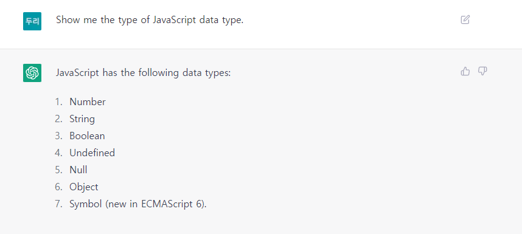
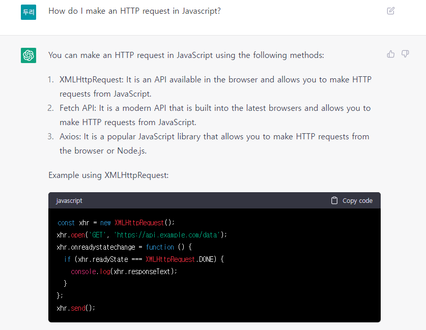
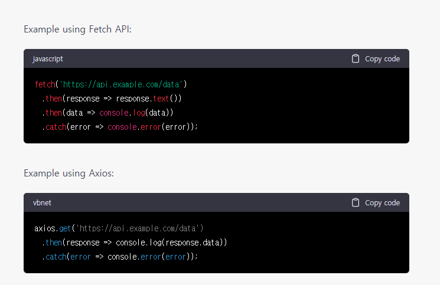
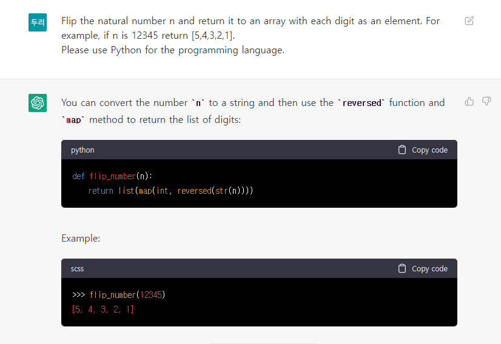
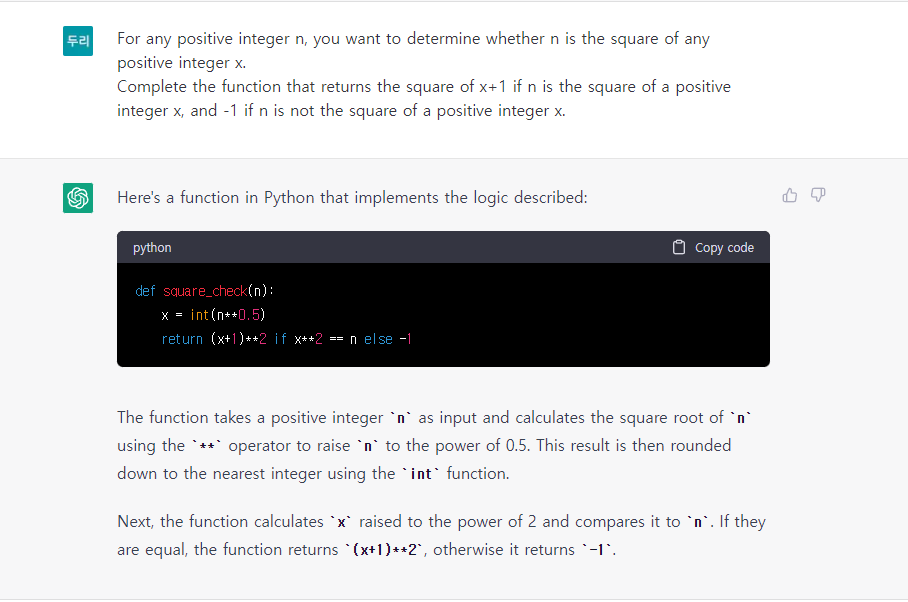
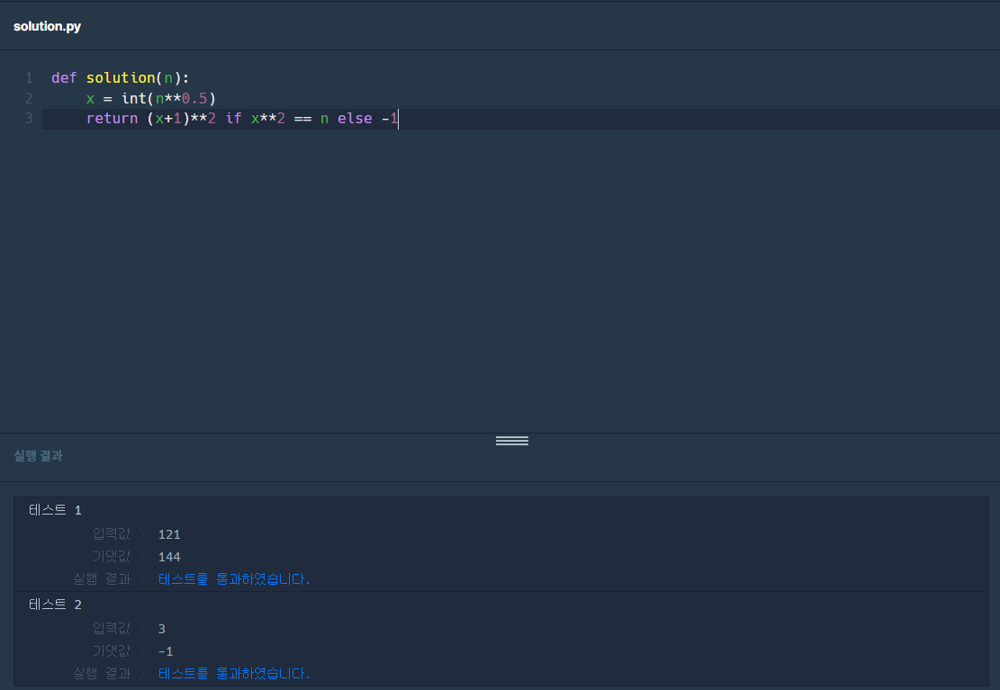
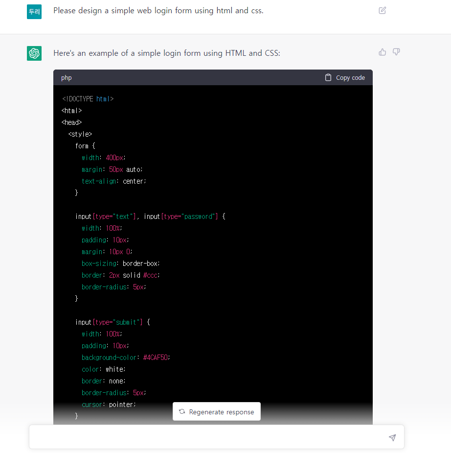
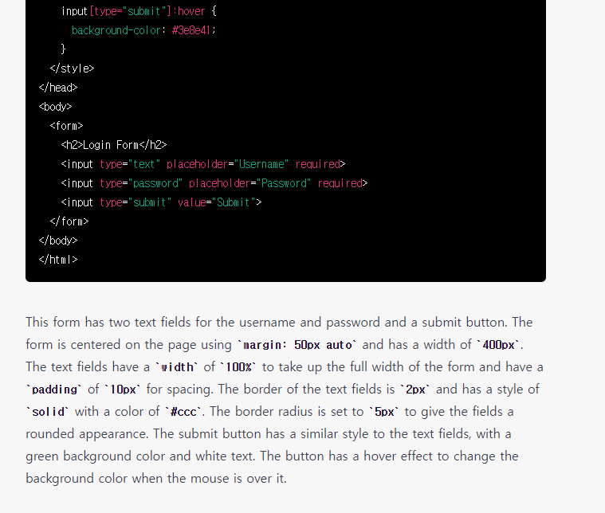
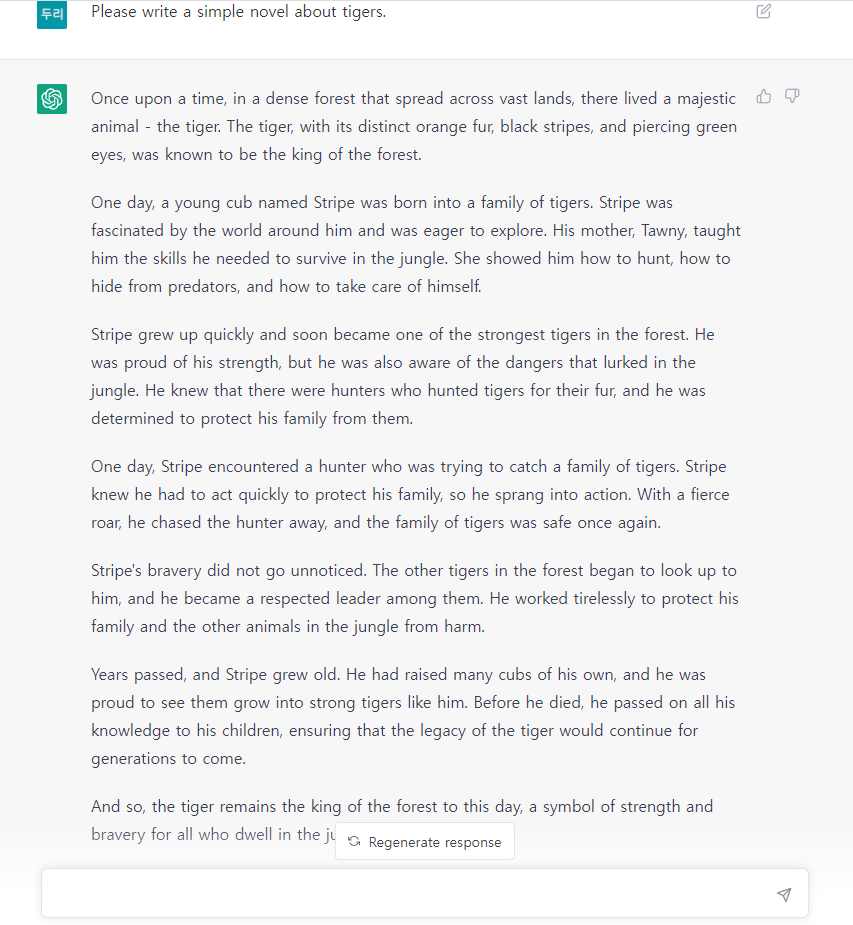

## ChatGPT

요즘은 정말 인공 지능 붐이 맞는 것 같습니다.

저는 최근 화젯거리라는 ChatGPT를 이용해 보았습니다.

일단 ChatGPT가 무엇인지 설명하겠습니다.

ChatGPT는 OpenAI가 개발한 프로토타입 대화형 인공지능 챗봇입니다.

ChatGPT는 대형 언어 모델 GPT-3의 개선판인 GPT-3.5를 기반으로 만들어졌으며,

지도학습과 강화학습을 모두 사용해 파인 튜닝되었습니다.

ChatGPT는 뉴스 기사, 공상과학 소설, 논평과 같은 모든 창작활동과

정보 검색, 코드 작성, 리뷰가 가능하며

심지어 결과물을 보면 사람이 쓴 것과 유사하여 대부분 사람들이 구별하기 어렵습니다.

## ChatGPT 이용사례

ChatGPT는 2022년 하반기에 출시되어 오래되지 않았지만

벌써 100만 명을 넘는 사용자를 확보했습니다.

몇몇 사람들은 ChatGPT를 사용하는 것이

Google을 사용하는 것보다 더 유용하다고 여기고 있습니다.

실제로, ChatGPT와 Google에 같은 질문을 했을 때

Google보다 좋은 결과가 나오기도 합니다.

또한, ChatGPT 봇을 이용하여 리눅스 터미널에서 간단한 명령어를 실행하기도 하고

도커에서 이미지를 가져오고 본인의 웹사이트로 이동하는 능력을 보이기도 했습니다.

## 사용 예제

한국어로도 사용할 수 있지만 영어가 속도가 더 빠릅니다.

또 가끔은 영어로 질문해도 속도가 느리거나 에러가 납니다.

1. 자바스크립트 데이터 타입 질문

## 

2. 자바스크립트 HTTP 통신방법

## 

## 

AJAX와 Promise 기반 Fetch와 react에서 사용을 많이 하는 Axios를 설명해줍니다.

정말 구글 상위호환 느낌이 납니다.

3. 자연수 n을 뒤집어 각 자리 숫자를 원소로 가지는 배열 형태로 리턴해주세요.
   예를들어 n이 12345이면 [5,4,3,2,1]을 리턴합니다.
   프로그래밍 언어는 파이썬을 사용해주세요.

## 

4. 임의의 양의 정수 n에 대해, n이 어떤 양의 정수 x의 제곱인지 아닌지 판단하려 합니다.
   n이 양의 정수 x의 제곱이라면 x+1의 제곱을 리턴하고, n이 양의 정수 x의 제곱이 아니라면 -1을 리턴하는 함수를 완성하세요.

## 

풀이 방법을 친절하게 알려줍니다. WOW!

설명까지 완벽하게 해주며 통과까지 완벽했습니다.

## 

5. 간단한 웹 로그인폼을 html과 css를 사용해서 디자인해줘!

## 

## 

역시 설명까지 친절합니다.

코드를 복사해 붙이고 JS 빈에서 디자인을 보겠습니다.

## 

WOW...^^ 신세계다!!!!!!

6. 마지막으로 간단한 호랑이를 이용한 소설을 만들어줘!

## 

호랑이가 소재인 간단한 이야기를 빠르게 만들어냈습니다.

## 마치면서

ChatGPT는 정말 유용하며 개발자의 관점으로 봤을 때

무서우면서 어찌 보면 엄청난 신기술이었습니다.

AI가 자신이 학습한 내용들을 짜집기 하는 느낌이고 구글 상위호환 느낌이 들었습니다.

그렇다고 정보가 다 정확한 것은 아니었습니다.

틀린 정보를 당당하게 말할 때도 있고 복잡한 계산이나 코드들은 제대로 작동하지 않고 오류가나는 것 같습니다.

앞으로는 새로 나오는 AI 기술을 얼마나 잘 활용하는지로 개발 판도가 바뀔 것 같습니다.

AI 기술이 발달하면서 개발자뿐만 아니라 모든 직업이 위험할 거라는 생각이 들었지만

이런 기술들을 거부하지 말고 수용하면서 업무에 도움이되는 방향으로 가는것이 맞다고 봅니다.

AI로인해 사라지는 직업들은 다른 직업으로 재탄생 할거라고 생각합니다.

ChatGPT비슷한 기술들은 지금은 무료지만 나중에는 유료화하지 않을까 조심스럽게 생각해봅니다.

또한 구글도 가만히 넋 놓고 있을 것 같지는 않습니다.
