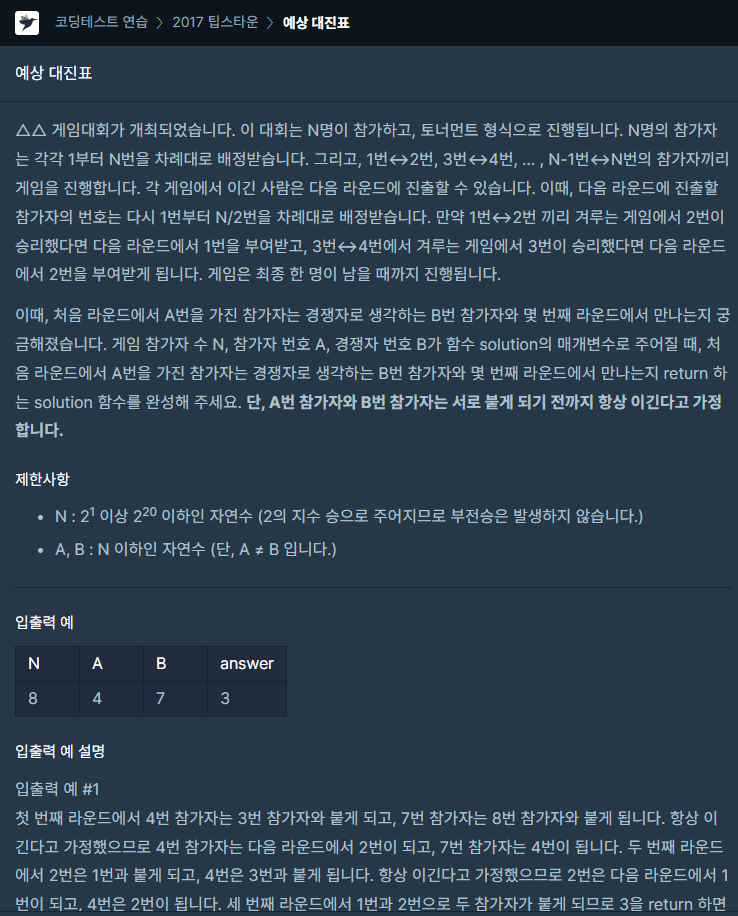

### 문제 설명

## 

여기서 핵심은 다음 라운드로 넘어갈 때 N/2로 참가자 수가 줄어드는 규칙을 발견할 수 있습니다.

저는 주어진 n에 필요성을 느끼지 못하여 사용하지 않고 문제를 해결했습니다.

제가 해결한 방식은 참가자 번호에 홀수와 짝수 여부를 구하고

짝수면 그대로 해당 번호/2 홀수면 해당 번호+1/2 하며 라운드를 카운트하였습니다.

홀수와 짝수로 구분한 이유는 다음 라운드를 갈 때 바뀌는 번호를 보면

짝수번호/2 , 홀수번호+1/2 규칙이 있기 때문입니다.

### 나의 문제 풀이

```javascript
function solution(n, a, b) {
  let answer = 0
  while (a !== b) {
    //계산 값이 같아지면 종료
    if (a % 2 === 0 && b % 2 === 0) {
      //모두 짝수일경우
      a = a / 2
      b = b / 2
    } else if (a % 2 === 0 && b % 2 !== 0) {
      //b가 홀수일 경우
      a = a / 2
      b = (b + 1) / 2
    } else if (a % 2 !== 0 && b % 2 === 0) {
      //a가 홀수일 경우
      a = (a + 1) / 2
      b = b / 2
    } else {
      //둘다 홀수일 경우
      a = (a + 1) / 2
      b = (b + 1) / 2
    }
    answer++
  }
  return answer
}
```
