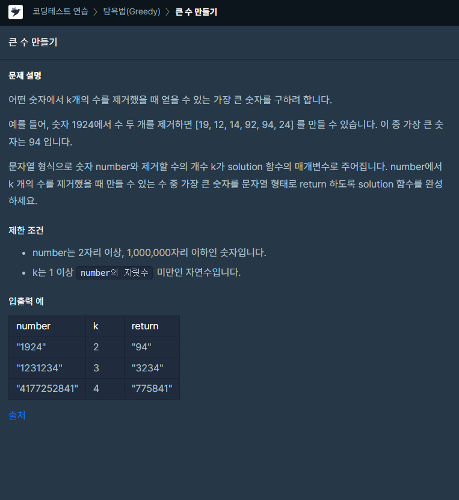

### 문제 설명

## 

### 나의 문제 풀이

```javascript
function solution(number, k) {
  let numarr = []

  for (let i = 0; i < number.length; i++) {
    while (k > 0 && numarr[numarr.length - 1] < number[i]) {
      // 현재 number의값이 이전 값보다 클경우 이전 값 삭제
      k--
      numarr.pop()
    }
    numarr.push(number[i])
  }
  numarr.splice(number.length - k, k) // 모든 숫자를 비교한 후 k가 0보다 크면 남은 k만큼 뒤에서 제거
  return numarr.join('')
}
```

저는 배열 메서드인 push와 pop을 이용하여 문제를 풀었습니다.

마지막 테스트케이스를 통과를 못해서

다른사람의 질문하기에서 힌트를 얻어 문제를 풀었습니다.

마지막 테스트케이스에 통과하는 포인트는 아래와 같은 코드였습니다.

```javascript
numarr.splice(number.length - k, k)
```

앞의 숫자가 뒤에 숫자보다 큰경우를 생각하면 풀리는 문제였습니다

```javascript
number = '4231', k = 1, return '423'
```
