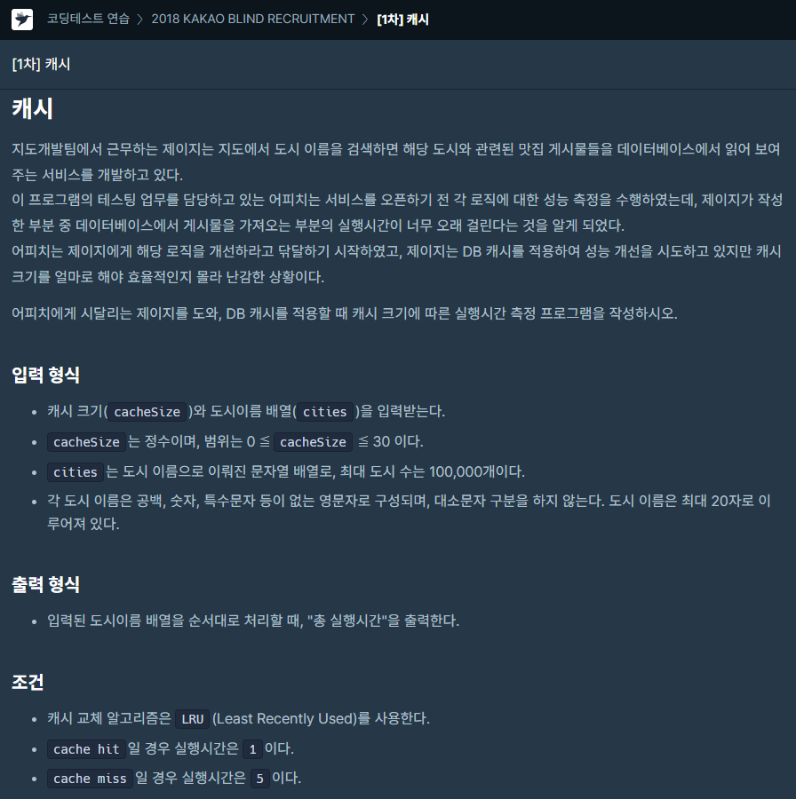
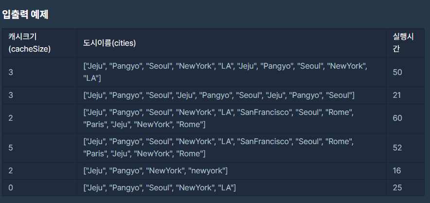
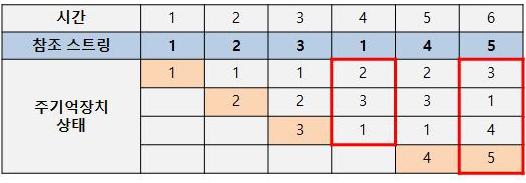

### 문제 설명

## 

## 

### LRU알고리즘이란?

우선 조건에 LRU알고리즘을 이용하라는게 포인트입니다.

LRU알고리즘은 간단하게 설명하면

가장 오랫동안 참조되지 않은 스트링을 교체하는 방법에 알고리즘입니다.

cache hit란 참조스트링이 캐시에 이미 존재할때이고

cache miss는 참조스트링이 존재하지 않을때를 말합니다.

## 

4초를 보면 원래 있었던 1이 한번 더 입력되므로 1을 참조합니다.

참조 후 오랫동안 참조하지 않은 순으로 바꾸면 2->3->1이 됩니다.

6초에는 cache size가 가득차 5가 들어갈 수 없으므로,

가장 오랫동안 참조되지 않은 2를 제거한 후 저장합니다.

### 나의 문제 풀이

처음 작성한 코드

```javascript
function solution(cacheSize, cities) {
  let time = 0
  if (cacheSize === 0) return cities.length * 5
  let CacheQueue = []
  cities = cities.map(x => x.toUpperCase())

  while (cities.length > 0) {
    if (CacheQueue.includes(cities[0])) {
      //cache hit일 경우 (존재할경우)
      CacheQueue.splice(CacheQueue.indexOf(cities[0]), 1)
      time++
    } else {
      //cache miss
      time += 5
      if (cacheSize === CacheQueue.length) CacheQueue.shift()
    }
    CacheQueue.push(cities.shift()) //이부분떄매 시간초과였던거같음 shift
  }
  return time
}
```

문제 없이 동작할줄알고 제출하였으나

11테스트케이스에서 시간초과로 95점이 나왔습니다.

문제를 계속 찾다가 CacheQueue.push(cities.shift()) 이부분에서 도시수가 많아지면

일일이 shift()를 사용해서제거하기때문에 시간이 오래걸린거같습니다.

두번째로 작성한 코드

```javascript
function solution(cacheSize, cities) {
  let time = 0
  if (cacheSize === 0) return cities.length * 5
  let CacheQueue = []
  cities = cities.map(x => x.toUpperCase())

  let i = 0
  while (cities.length > i) {
    if (CacheQueue.includes(cities[i])) {
      //cache hit일 경우 (존재할경우)
      CacheQueue.splice(CacheQueue.indexOf(cities[i]), 1)
      time++
    } else {
      //cache miss
      time += 5
      if (cacheSize === CacheQueue.length) CacheQueue.shift()
    }
    CacheQueue.push(cities[i])
    i++
  }
  return time
}
```

cities를 일일이 shift()로 처리하지않고 인덱스를 이용하여 해결했습니다.
