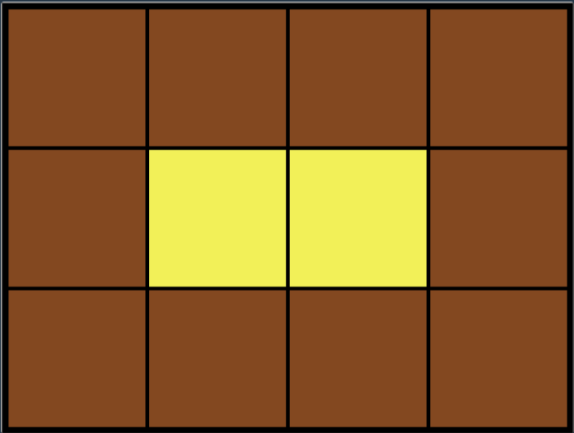
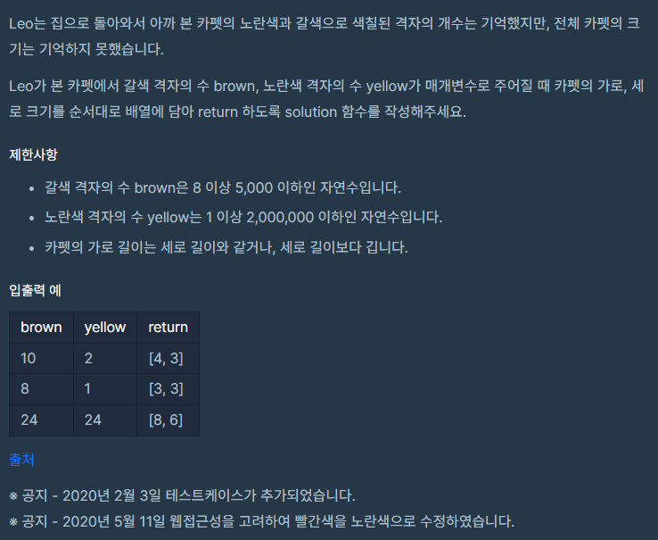

### 문제 설명

Leo는 카펫을 사러 갔다가 아래 그림과 같이 중앙에는 노란색으로 칠해져 있고

테두리 1줄은 갈색으로 칠해져 있는 격자 모양 카펫을 봤습니다.

## 

## 

### 나의 문제 풀이

```javascript
function solution(brown, yellow) {
  let answer = []
  for (let i = 1; i < brown + yellow; i++) {
    for (let j = 1; j < brown + yellow; j++) {
      if (i * j === brown + yellow && i >= j) {
        if ((i - 2) * (j - 2) === yellow) {
          //yellow 갯수가 맞는경우
          answer[0] = i
          answer[1] = j
          return answer
        }
      }
    }
  }
}
```

저는 이중for문을 이용하여 풀었습니다.

위 문제를 해설해보면

우선 i = 가로길이 / j = 세로길이

i 곱 j === brown과 yellow에 합이 일치하고 제한사항을 보면

가로길이가 세로길이와 같거나 길다고 했으므로 i >= j

여기까지는 문제가 없었으나

계속 테스트케이스 몇문제를 통과를 못해서 도움을 얻고자 다른사람의 질문하기 부분에서 도움을 받았습니다.

(i - 2) 곱 (j - 2) === yellow를 생각못해서 테스트케이스 몇문제를 통과 못했던거였습니다..

이 조건문을 넣지 않을 경우 예시를 보면

(18,6) 이 주어진 값일 때, solution=[8,3]이 나와야합니다.

B B B B B B B B

B Y Y Y Y Y Y B

B B B B B B B B

제 코드는 이중for문 조건중에서 i 곱 j === brown + yellow 이조건때문에 solution=[6,4]에서 멈췄습니다.

B B B B B B

B Y Y Y Y B

B Y Y Y Y B

B B B B B B

(i - 2) 곱 (j - 2) === yellow개수 이 조건문을 추가함으로써 이문제를 통과할 수 있었습니다.
