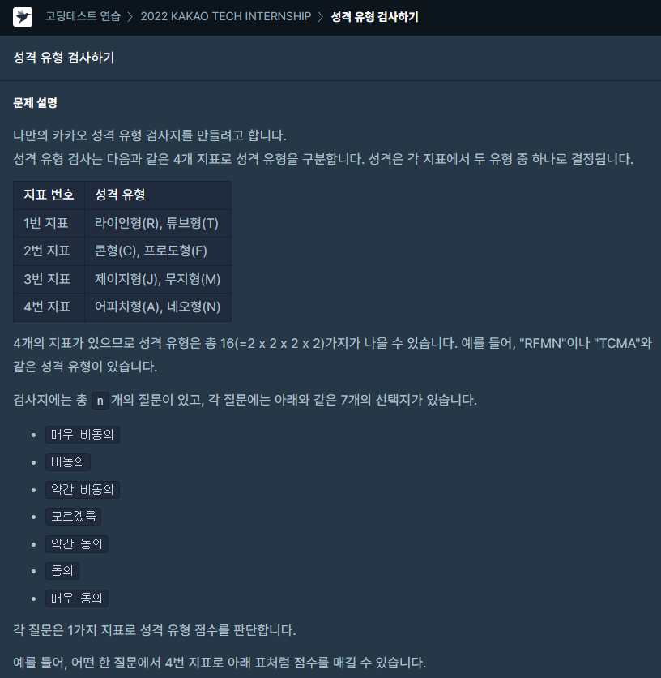
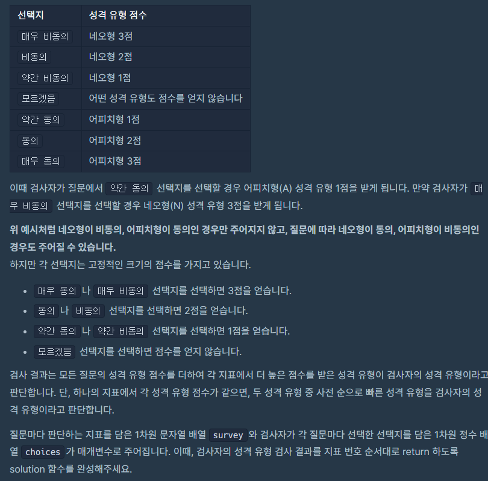
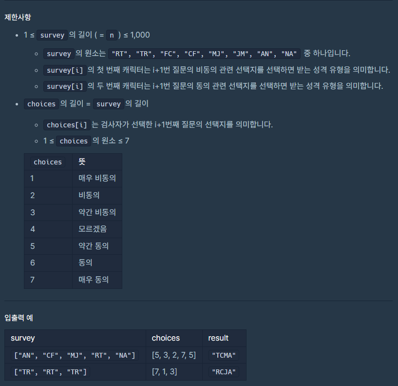

### 문제 설명

## 

## 

## 

### 나의 문제 풀이

```javascript
function solution(survey, choices) {
  let result = ''
  const scoreboard = [3, 2, 1, 0, 1, 2, 3] //점수판
  let character = { R: 0, T: 0, C: 0, F: 0, J: 0, M: 0, A: 0, N: 0 }

  for (let i = 0; i < survey.length; i++) {
    if (choices[i] >= 5) {
      //5이상은 선택지가 동의이며 뒤에 위치한 알파벳에 점수를 넣어준다.
      character[survey[i][1]] += scoreboard[choices[i] - 1]
    } else if (choices[i] <= 3) {
      //3이하는 선택지가 비동의이며 앞에 위치한 알파벳에 점수를 넣어준다.
      character[survey[i][0]] += scoreboard[choices[i] - 1]
    }
  }

  //점수 비교 점수가 같은경우 알파벳순서
  Object.values(character)[0] >= Object.values(character)[1]
    ? (result += 'R')
    : (result += 'T')
  Object.values(character)[2] >= Object.values(character)[3]
    ? (result += 'C')
    : (result += 'F')
  Object.values(character)[4] >= Object.values(character)[5]
    ? (result += 'J')
    : (result += 'M')
  Object.values(character)[6] >= Object.values(character)[7]
    ? (result += 'A')
    : (result += 'N')

  return result
}
```

저는 문제를 이런식으로 접근하고 풀이해서 통과했습니다.

점수판을 배열로 생성하고

choices(선택지)에 따라서 점수판에 점수를 성격에 넣어줄 객체를 생성했습니다.

문제에 정해진 규칙을 보면

choices 5이상은 선택지가 동의 / choices 3이하는 선택지가 비동의입니다.

알파벳이 뒤에 위치한거는 동의 / 알파벳이 앞에 위치한거는 비동의입니다.
