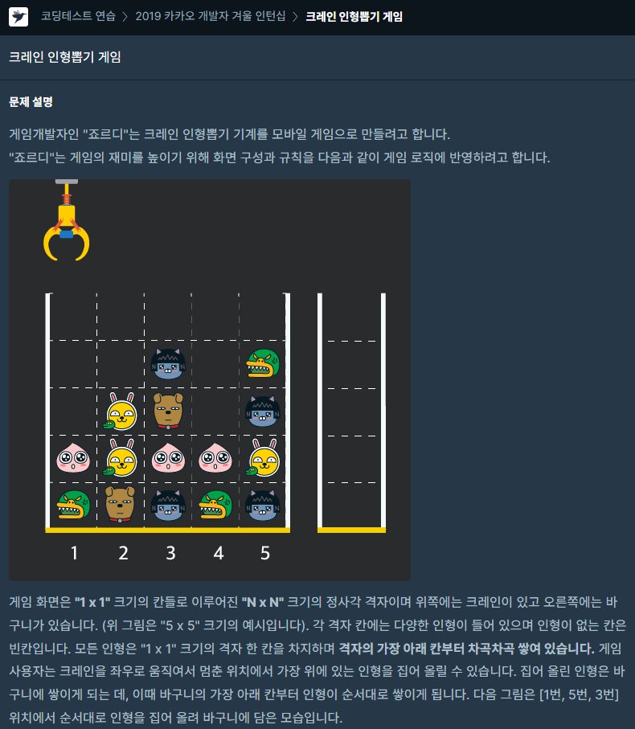
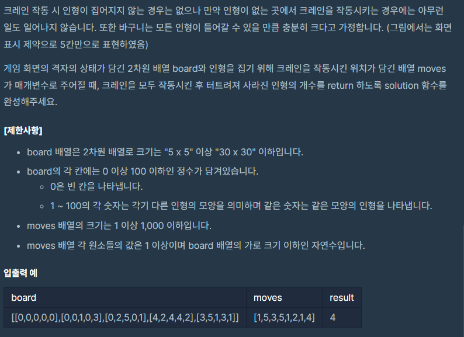

### 문제 설명

## 

만약 같은 모양의 인형 두 개가 바구니에 연속해서 쌓이게 되면

두 인형은 터뜨려지면서 바구니에서 사라지게 됩니다.

위 상태에서 이어서 [5번] 위치에서 인형을 집어 바구니에 쌓으면 같은 모양 인형 두 개가 없어집니다.

## 

문제를 풀이해보면

moves 배열에 담긴 순서대로 board 배열에 담긴 숫자를 뽑아서 오른쪽 바구니에 담습니다.

오른쪽에 담을 때 같은 숫자면 터트려서 사라지게 합니다.

그림과 설명을 보면 바구니가 쌓이는 방식이 스택(Stack)이 생각나지 않나요?

저는 스택(Stack)을 생각하고 자바스크립트에 pop(), push()를 사용하는 방향으로 문제를 풀었습니다.

이문제에서 주의해야 할 점이 있다면 배열은 0부터 시작이라서

moves 배열에 담긴 순서(el)는 -1을 해줘야 합니다.

### 나의 문제 풀이

```javascript
function solution(board, moves) {
  let answer = 0
  let arr = []

  moves.map(el => {
    for (let i = 0; i < board.length; i++) {
      if (board[i][el - 1] !== 0) {
        if (arr[arr.length - 1] === board[i][el - 1]) {
          arr.pop() //기존 배열에 존재하던 인형을 삭제
          answer += 2 //리턴해줄 값에 인형 2개 추가
          board[i][el - 1] = 0 // 뽑아온 인형은 빈칸(0)으로 만듬
          break
        } else {
          arr.push(board[i][el - 1])
          board[i][el - 1] = 0
          break
        }
      }
    }
  })
  return answer
}
```
