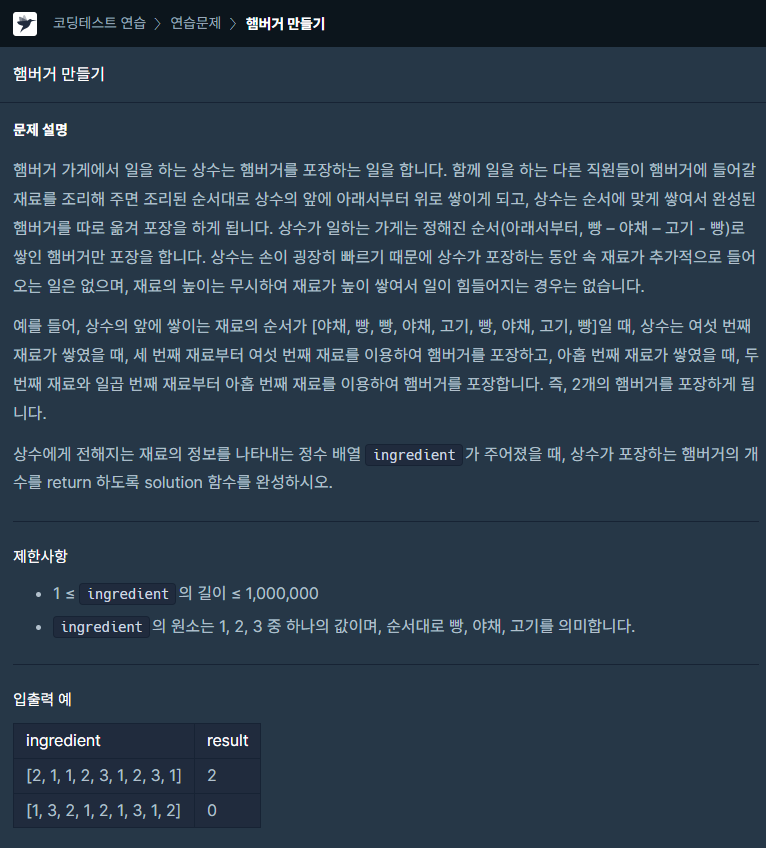

### 문제 설명

## 

### 나의 문제 풀이

여기서 키워드는 햄버거가 1 - 2 - 3 - 1 순서로 쌓인다는거다.

첫 번째 문제를 푼 코드

```javascript
function solution(ingredient) {
  let result = 0
  for (let i = 0; i < ingredient.length; i++) {
    if (
      ingredient[i] === 1 &&
      ingredient[i + 1] === 2 &&
      ingredient[i + 2] === 3 &&
      ingredient[i + 3] === 1
    ) {
      ingredient.splice(i, 4) //1231 삭제
      result++
      i -= 3 // 삭제한 1이전부터 다시 검사하기위해서
    }
  }
  return result
}
```

처음에는 1231부분을 삭제 후 for문을 처음부터 돌렸는데

시간초과로 케이스 4개를 통과하지못했다.

처음부터 하지 않고 삭제한 1이전부터 for문을 다시돌리니 통과하였다.

통과는 했으나 시간을 더 빠르게 할수있는 방법을 다른사람에 질문하기 힌트를 참고하여 풀었다.

두 번째 문제를 푼 코드

```javascript
function solution(ingredient) {
  let result = 0
  let checkarr = [] //체크용 배열
  for (let i = 0; i < ingredient.length; i++) {
    checkarr.push(ingredient[i])
    if (checkarr.length >= 4) {
      //숫자가 4개 이상일경우 마지막 숫자4개만 체크
      if (
        checkarr[checkarr.length - 4] === 1 &&
        checkarr[checkarr.length - 3] === 2 &&
        checkarr[checkarr.length - 2] === 3 &&
        checkarr[checkarr.length - 1] === 1
      ) {
        let j = 0
        while (j <= 3) {
          checkarr.pop() // 1231 삭제
          j++
        }
        result++
      }
    }
  }
  return result
}
```

체크용 배열을 만들어서

push로 값을 넣고 체크용 배열이 4개이상일 경우 마지막 숫자4개를 체크하고

조건이 맞으면 pop을 이용하여 1231을 삭제하였다.

이렇게 제출하면 훨씬 시간을 단축하였다.

코드는 좀 더 길지만 속도면에서는 우수하였다.
