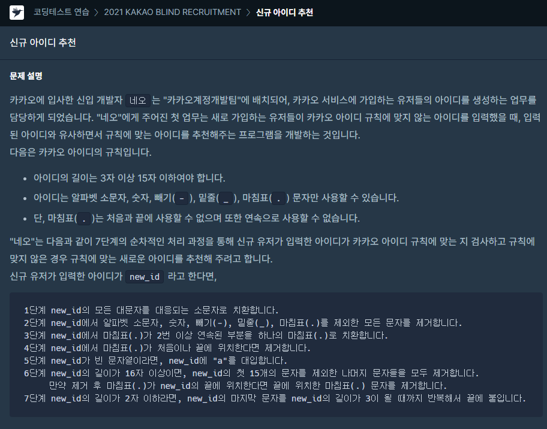
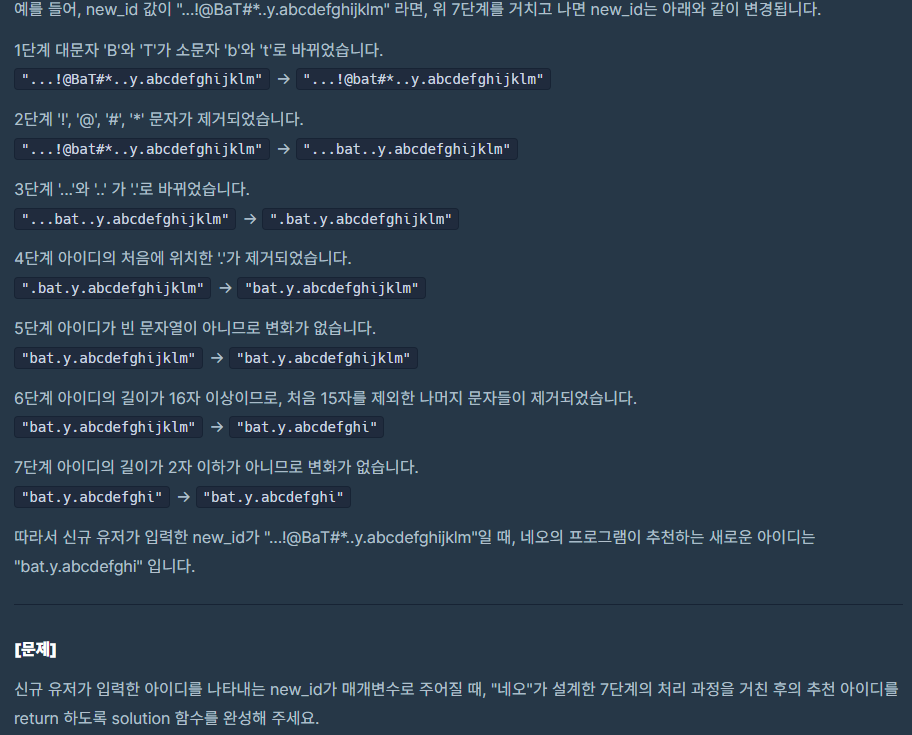
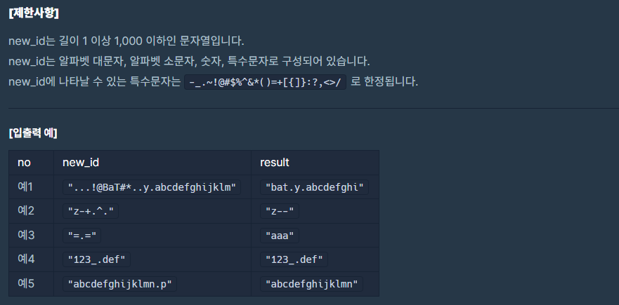

### 문제 설명

## 

## 

## 

이 문제는 그냥 설명이 친절하게 나와있습니다.

설명 그대로 풀면 됐습니다.

### 나의 문제 풀이

```javascript
function solution(new_id) {
  let finishid = ''
  for (let i = 1; i < 8; i++) {
    switch (i) {
      case 1: //1단계
        new_id = new_id.toLowerCase()
        break
      case 2: //2단계
        new_id = new_id.replace(/[^A-Za-z0-9-_.]+/g, '')
        break
      case 3: //3단계
        new_id = new_id.replace(/[.]+/g, '.')
        break
      case 4: //4단계
        let first_char = new_id.substr(0, 1)
        let last_char = new_id.substr(new_id.length - 1, 1)
        if (first_char === '.') {
          new_id = new_id.slice(1)
        } else if (last_char === '.') {
          new_id = new_id.slice(0, -1)
        }
        break
      case 5: //5단계
        new_id === '' ? (new_id += 'a') : new_id
        break
      case 6: //6단계
        if (new_id.length > 15) {
          new_id = new_id.slice(0, 15)
        }
        let last_char = new_id.substr(new_id.length - 1, 1)
        if (last_char === '.') {
          new_id = new_id.slice(0, -1)
        }
        break
      default: //7단계
        while (new_id.length < 3) {
          let last_char = new_id.substr(new_id.length - 1, 1)
          new_id += last_char
        }
        finishid = new_id
        break
    }
  }
  return finishid
}
```

### 다른 사람의 풀이

WOW.. 정규식이 최고다.

```javascript
function solution(new_id) {
  const answer = new_id
    .toLowerCase() // 1
    .replace(/[^\w-_.]/g, '') // 2
    .replace(/\.+/g, '.') // 3
    .replace(/^\.|\.$/g, '') // 4
    .replace(/^$/, 'a') // 5
    .slice(0, 15)
    .replace(/\.$/, '') // 6
  const len = answer.length
  return len > 2 ? answer : answer + answer.charAt(len - 1).repeat(3 - len)
}
```
