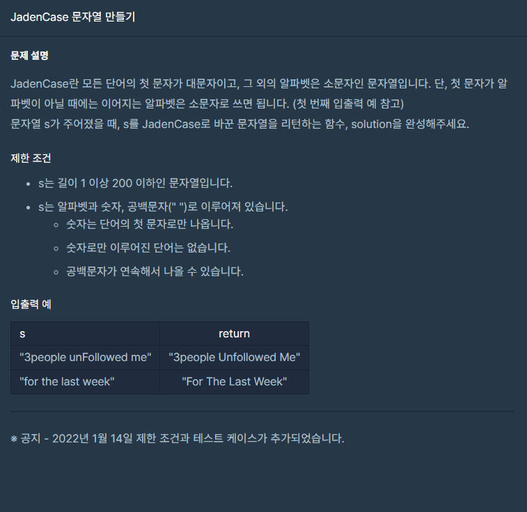

### 문제 설명

## 

### 나의 문제 풀이

문제 그대로 풀었다.

```javascript
function solution(s) {
  let result = ''
  let stringsplit = []
  let check = /^[a-zA-Z]+$/ //알파벳 정규식
  s = s.toLowerCase() //소문자로 변경
  stringsplit = s.split(' ')

  for (let i = 0; i < stringsplit.length; i++) {
    if (check.test(stringsplit[i])) {
      //알파벳인것만 체크
      stringsplit[i] = stringsplit[i].replace(
        stringsplit[i].charAt(0),
        stringsplit[i].charAt(0).toUpperCase(),
      ) //첫번째 문자 대문자로 변경
    }
  }
  result = stringsplit.join(' ') // 배열을 공백으로 나눈 문자열로 합치기
  return result
}
```

### 다른 사람의 풀이

이사람의 코드를 보면 내가 너무 복잡하게 푼거 같기도 하다.

훨씬 코드가 짧아서 보기 좋다.

```javascript
function solution(s) {
  s = s.toLowerCase()
  var answer = s
    .split(' ')
    .map(s => {
      let arr = s.split('')
      if (arr[0] != null) arr[0] = arr[0].toUpperCase()
      return arr.join('')
    })
    .join(' ')
  return answer
}
```
