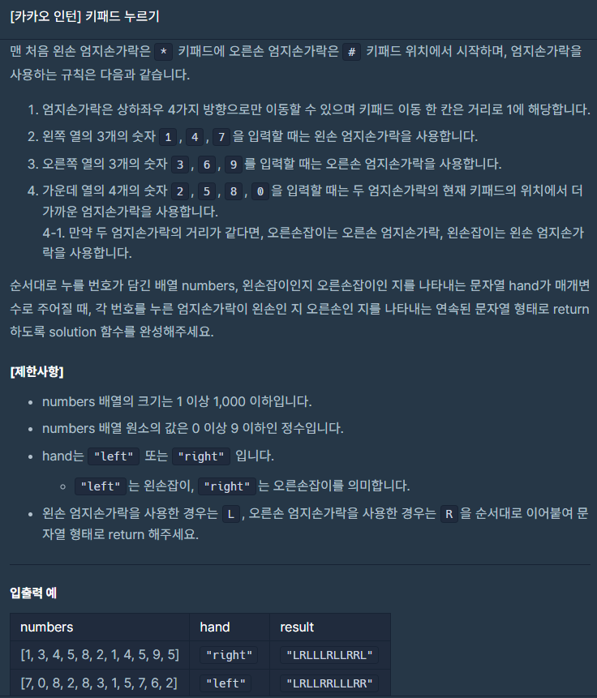
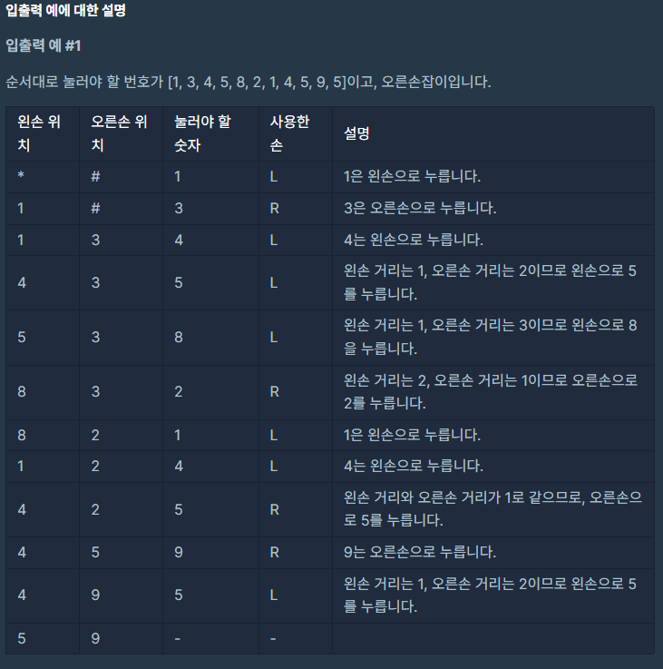

### 문제 설명

## 

## 

이 문제는 접근을 그냥 설명 그대로 이해하고 풀면되는 문제였습니다.

처음에는 숫자패드를 담을 생각을 안하고 어렵게 접근해서 애를 먹었습니다..

우선 스마트폰 숫자패드를 이차원배열 형태로 담고

숫자 패드 마다 처리하는 방식을 다르게 했습니다.

가장 중요한 부분은 숫자패드 2, 5, 8, 0을 처리하는 방식이였습니다.

코드가 너무 길다고 생각했는데 통과하고 다른 사람의 풀이를 보니 다들 길어서 약간의 안심을 했습니다.

### 나의 문제 풀이

```javascript
function solution(numbers, hand) {
  const padnumber = [
    [1, 2, 3],
    [4, 5, 6],
    [7, 8, 9],
    ['*', 0, '#'],
  ]
  let usedhands = '' //사용한 손가락
  let lefthandlocation = '*' // 현재   왼손 위치
  let righthandlocation = '#' // 현재   오른손 위치
  let lefthandpad = [] // 왼손   숫자패드 배열 위치
  let righthandpad = [] // 오른손 숫자패드 배열 위치
  let clickpadnum = [] // 눌러야 할 숫자패드 배열 위치
  let lefthandstreet = 0 // 왼손 거리
  let righthandstreet = 0 // 오른손 거리

  let i = 0
  while (i < numbers.length) {
    switch (numbers[i]) {
      case 1:
      case 4:
      case 7:
        usedhands += 'L'
        lefthandlocation = numbers[i] //현재 왼손 위치 넣어주기
        break
      case 3:
      case 6:
      case 9:
        usedhands += 'R'
        righthandlocation = numbers[i] //현재 오른손 위치 넣어주기
        break
      default: //2,5,8,0  두 엄지손가락의 현재 키패드의 위치에서 더 가까운 엄지손가락을 사용함
        for (let j = 0; j < 4; j++) {
          for (let k = 0; k < 3; k++) {
            //현재 손 위치가 패드위치 어디에 있는지 찾는다
            if (lefthandlocation === padnumber[j][k]) {
              lefthandpad = [j, k]
            }
            if (righthandlocation === padnumber[j][k]) {
              righthandpad = [j, k]
            }
            //내가 눌러야 할 패드위치를 찾는다
            if (numbers[i] === padnumber[j][k]) {
              clickpadnum = [j, k]
            }
          }
        }
        //숫자가 음수일 경우도 있으므로 절대값 메서드 Math.abs사용
        lefthandstreet =
          Math.abs(lefthandpad[0] - clickpadnum[0]) +
          Math.abs(lefthandpad[1] - clickpadnum[1])
        righthandstreet =
          Math.abs(righthandpad[0] - clickpadnum[0]) +
          Math.abs(righthandpad[1] - clickpadnum[1])
        //거리가 같을경우는 어떤손잡이인지로 판단
        if (lefthandstreet === righthandstreet) {
          hand === 'right'
            ? ((usedhands += 'R'), (righthandlocation = numbers[i]))
            : ((usedhands += 'L'), (lefthandlocation = numbers[i]))
        } else if (lefthandstreet < righthandstreet) {
          usedhands += 'L'
          lefthandlocation = numbers[i]
        } else if (lefthandstreet > righthandstreet) {
          usedhands += 'R'
          righthandlocation = numbers[i]
        }
        break
    }
    i++
  }
  return usedhands
}
```
