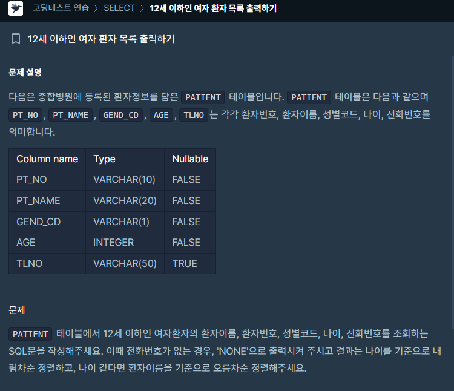

### 문제 설명

## 

### 나의 정답

```sql
SELECT
PT_NAME,
PT_NO,
GEND_CD,
AGE,
IFNULL(TLNO, 'NONE')
FROM PATIENT
WHERE AGE <= 12 AND GEND_CD = 'W'
ORDER BY AGE DESC, PT_NAME
```

주말에 쉬면서 사이트를 둘러보다가 간단한 SELECT 문제 하나가 보여서 풀어봤습니다.

해당 사이트에서는 MYSQL과 ORACLE만 지원하기때문에 MYSQL로 바꿔서 풀었습니다.

프로젝트에서 사용하던 SQL을 이렇게 코딩테스트처럼 문제로 제시된 방식으로

풀어보는건 처음이라 신선한 경험이었습니다.
