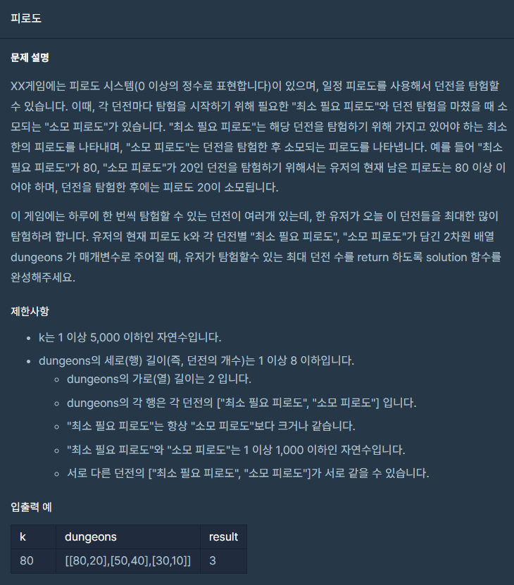
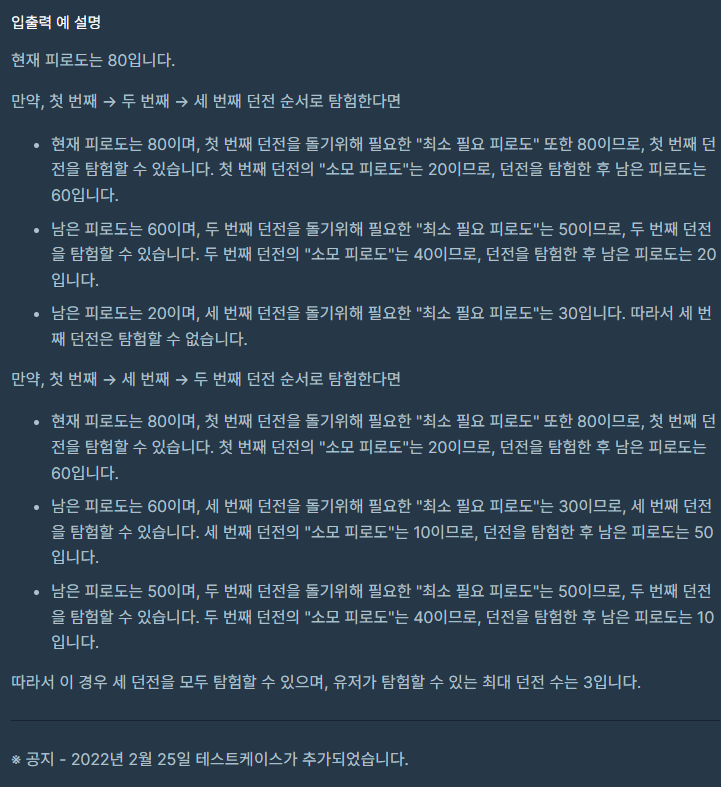

### 문제 설명

## 

## 

### 나의 문제 풀이

이 문제는 엉뚱하게 시간을 많이 사용하여 삽질을 많이하고 풀었다.

순열을 사용하지 않고 풀어보려다가 포기하고

결국에는 순열알고리즘을 사용하여 풀었다.

```javascript
function solution(k, dungeons) {
  let result = getPermutations(dungeons, dungeons.length) //모든 경우의 수 담기
  let cnt = 0
  let pirodo = k //현재 피로도
  const arr = []
  result.forEach(x => {
    x.forEach(y => {
      if (pirodo >= y[0]) {
        //현재 피로도가 최소 필요 피로도보다 크거나 같을경우
        pirodo = pirodo - y[1] // 현재 피로도에 소모 피로도를 뺀다
        cnt++ //카운터 증가
      }
    })
    arr.push(cnt)
    pirodo = k
    cnt = 0
  })
  return Math.max(...arr) //최대 던전 수 리턴
}

//순열 코드
function getPermutations(arr, selectNumber) {
  const results = []
  if (selectNumber === 1) return arr.map(value => [value]) // 1개씩 택할 때, 바로 모든 배열의 원소 return
  arr.forEach((fixed, index, origin) => {
    const rest = [...origin.slice(0, index), ...origin.slice(index + 1)] // 해당하는 fixed를 제외한 나머지 배열
    const permutations = getPermutations(rest, selectNumber - 1) // 나머지에 대해 순열을 구한다.
    const attached = permutations.map(permutation => [fixed, ...permutation]) // 돌아온 순열에 대해 떼 놓은(fixed) 값 붙이기
    results.push(...attached) // 배열 spread syntax 로 모두다 push
  })
  return results // 결과 담긴 results return
}
```
