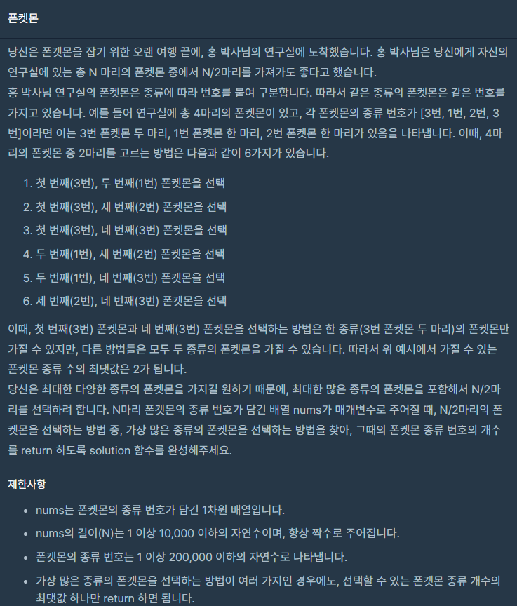
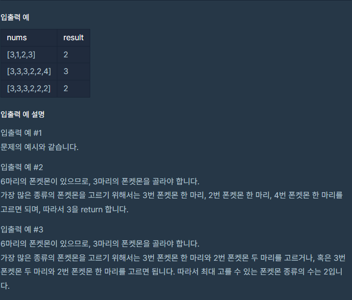

### 문제 설명

## 

## 

이 문제는 굉장히 코드가 짧고 쉽게 풀수있는 간단한 문제였습니다.

여기서 핵심 포인트는 총 N 마리의 폰켓몬 중에서 N/2마리를 가져가도 좋으며

선택할 수 있는 최대 폰켓몬 종류의 수를 구하는겁니다.

쉽게 말하면 가져갈수 있는 마리 수에 제한사항에 맞춰서

한 종류의 폰켓몬들을 가져갈때 최댓값을 구하는거라고 생각하시면 됩니다.

### 나의 문제 풀이

```javascript
function solution(nums) {
  let standard = nums.length / 2 // 가져갈수 있는 마리 수
  nums = [...new Set(nums)] // Set으로 배열 중복제거
  return standard > nums.length ? nums.length : standard // 가져갈수 있는 마리 수 > 한 종류의 폰켓몬들을 가져갈때 최댓값
}
```
