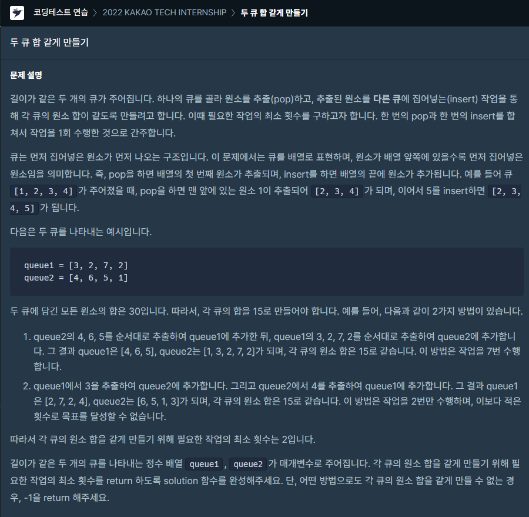
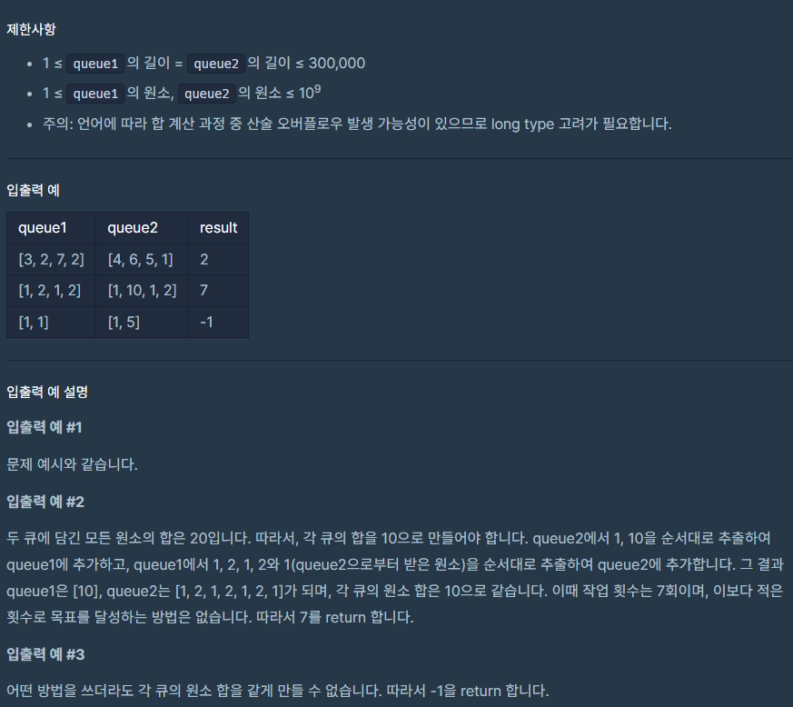

### 문제 설명

## 

## 

### 나의 문제 풀이

처음에 삽질을 계속하면서 문제를 풀지 못했다..

감을 못 잡아서 질문하기 게시판에서 힌트를 얻었다.

투 포인터 알고리즘을 사용해서 문제를 풀어야 한다는 힌트를 얻고 나서

문제를 해결할 수 있었다.

여기서 핵심은 큐를 순서대로 추출하는 것이다.

기준값과 큐 sum을 비교 후 같으면 값을 return 큐sum값이 작으면 end 포인트 부분을 더해주고 다음 칸 이동

크면 start 포인트 부분을 빼주고 다음 칸 이동 하면 된다.

```javascript
//투 포인터 알고리즘
function solution(queue1, queue2) {
  let result = 0
  const sum = queuesum(queue1, queue2) // 배열마다 sum구하기
  const standardNum = (sum[0] + sum[1]) / 2 //기준값
  const queue = queue1.concat(queue2)

  let start = 0 //start 포인트
  let end = queue1.length //end 포인트
  while (start < queue.length && end < queue.length) {
    if (sum[0] === standardNum) return result
    else if (sum[0] < standardNum) {
      sum[0] += queue[end]
      end++
    } else {
      sum[0] -= queue[start]
      start++
    }
    result++
  }

  return -1
}

function queuesum(queue1, queue2) {
  const queue1sum = queue1.reduce(function add(sum, currValue) {
    return sum + currValue
  }, 0)
  const queue2sum = queue2.reduce(function add(sum, currValue) {
    return sum + currValue
  }, 0)
  return [queue1sum, queue2sum]
}
```
