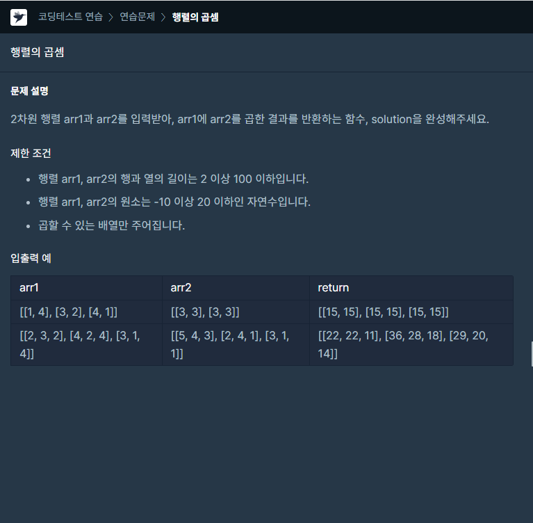

### 문제 설명

## 

### 1. 행렬의 곱셈이란?

말 그대로 두 행렬을 곱하는 것을 말합니다.

가장 대표적으로 2×3행렬과 3×2행렬을 곱하는 것을 예시로 들어보겠습니다.

첫번째 행렬을 A, 두번째 행렬을 B, 결과 행렬을 C로 한다면

A의 행과 B의 열을 곱하는 성질때문에 결과 행렬의 경우 (A의 행의 수)×(B의 열의 수)가 됩니다.

따라서 A의 행의 수와 B의 열의 수가 같아야지만 행렬의 곱셈을 할 수 있습니다.

### 나의 문제 풀이

문제의 키워드 첫번째는 삼중for문을 이용하여 문제를 접근하는 것이며

두번째는 arr1에 열length와 arr2에 행length이 같다는겁니다.

풀이 예시

```javascript
// 3*2
// arr1 = [[1, 4],
//         [3, 2],
//         [4, 1]];
// 2*2
// arr2 = [[3, 3],
//         [3, 2]]

//[1, 4]
// 1 * 3 3   1 * 3 3
// 4 * 3 12  4 * 2 8
// [15, 11]

//[3, 2]
// 3 * 3 9   3 * 3 9
// 2 * 3 6   2 * 2 4
// [15, 13]

//[4, 1]
// 4 * 3 12  4 * 3 12
// 1 * 3 3   1 * 2 2
// [15, 14]
```

```javascript
function solution(arr1, arr2) {
  let answer = new Array()
  for (let k = 0; k < arr1.length; k++) {
    answer[k] = new Array()
    for (let i = 0; i < arr2[0].length; i++) {
      let sum = 0
      for (let j = 0; j < arr1[0].length; j++) {
        sum += arr1[k][j] * arr2[j][i]
      }
      answer[k].push(sum)
    }
  }
  return answer
}
```
