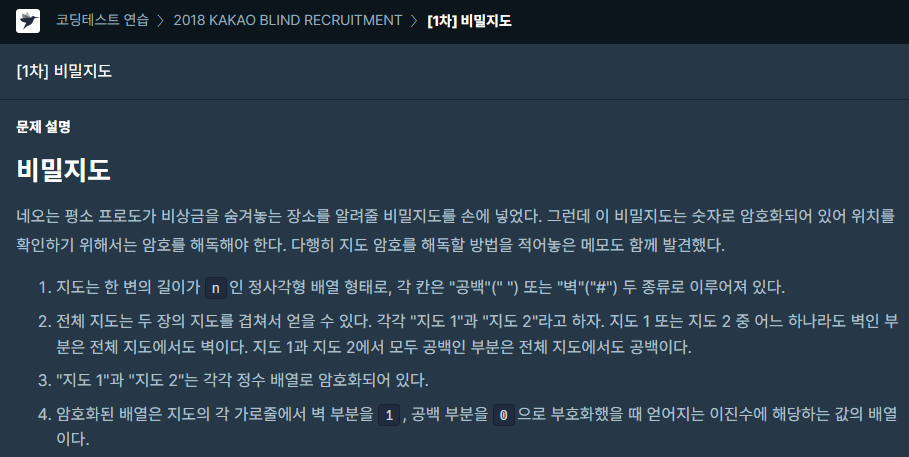
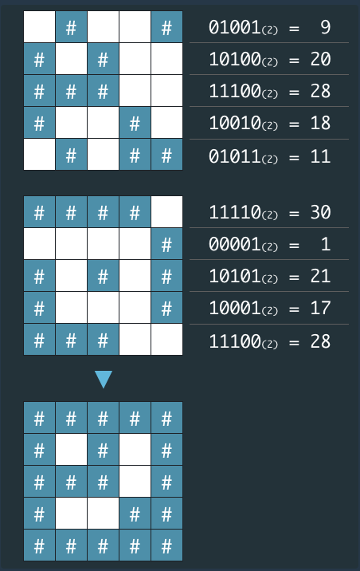
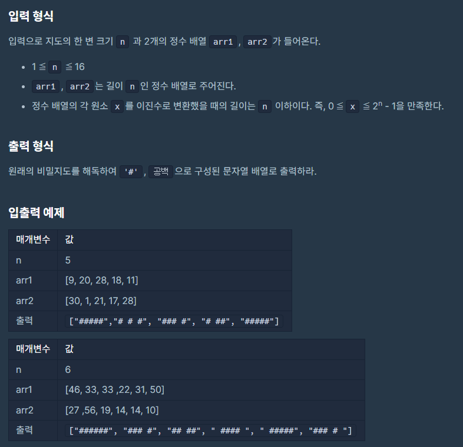

### 문제 설명

## 

## 

## 

### 나의 문제 풀이

```javascript
function solution(n, arr1, arr2) {
  let answer = new Array(n) //한 변의 길이가 n만큼인 배열 만들기
  answer.fill('')
  let Allarr = [arr1, arr2]

  //Allarr 이진수 변환작업
  Allarr.map(arr => {
    arr.map((el, index) => {
      arr[index] = el.toString(2) //이진수로 변환
      while (arr[index].length !== n) {
        arr[index] = '0' + arr[index] //이진수로 변환할때 앞에 생략된 0은 n의 길이만큼 채워주기
      }
    })
  })

  for (let i = 0; i < n; i++) {
    for (let j = 0; j < n; j++) {
      //두 배열에 삽입한 이진수중에 하나라도 1이면 # 없으면 ' '
      Number(Allarr[0][i][j]) > 0 || Number(Allarr[1][i][j]) > 0
        ? (answer[i] += '#')
        : (answer[i] += ' ')
    }
  }
  return answer
}
```

여기서 핵심은 배열에 담긴 숫자를 이진수로 바꿔주고 n(변의 길이)에 맞춰서 모자란 길이만큼 앞에 0을 채워

두 배열에 이진수 1(벽),0(공백)를 확인하여 배열에 #과 ' '을 삽입해줬습니다.
