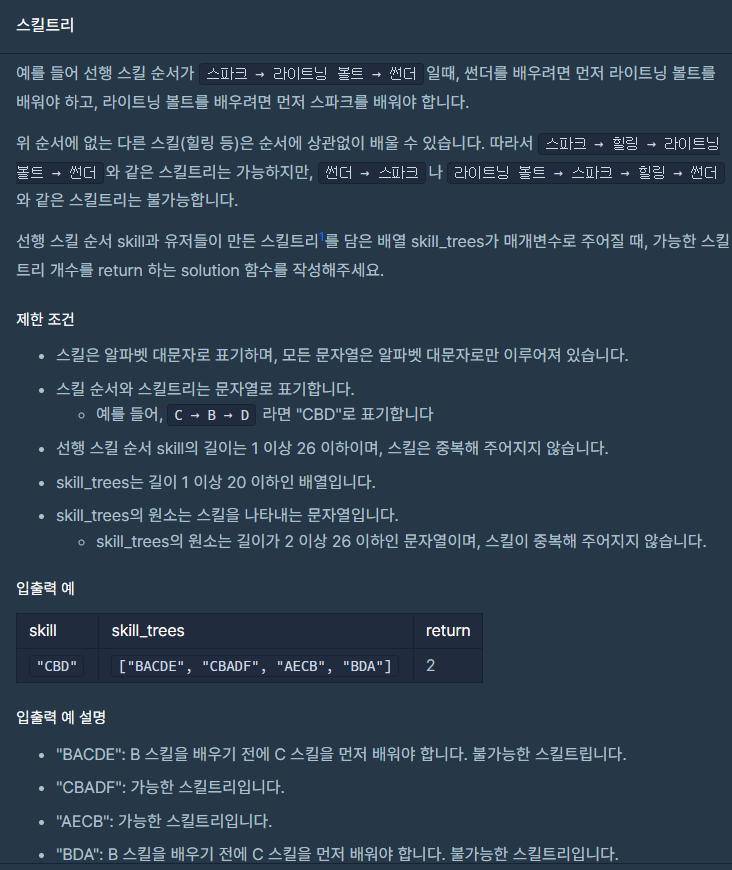

### 문제 설명

## 

### 나의 문제 풀이

문제를 처음에 어렵게 접근만 하지않으면 난이도에 비해 굉장히 쉬운 문제였다.

여기서 포인트는 선행스킬을 담은 skill변수이다.

선행스킬 순서에 없는 다른 스킬은 순서에 상관없이 배울 수 있다.

```javascript
function solution(skill, skill_trees) {
  let answer = 0
  let skillarr = [...skill] //선행스킬을 하나씩 배열로 담는다
  skill_trees.map(tree => {
    let treearr = [...tree] //스킬트리를 하나씩 배열로 담는다
    let order = treearr.filter(sk => skillarr.includes(sk)) //포함여부 확인
    let bool = true
    order.filter((ord, index) => {
      if (ord !== skillarr[index]) bool = false
    }) //순서대로 담긴게 일치하지 않으면 false
    bool === false ? answer : answer++
  })
  return answer
}
```
