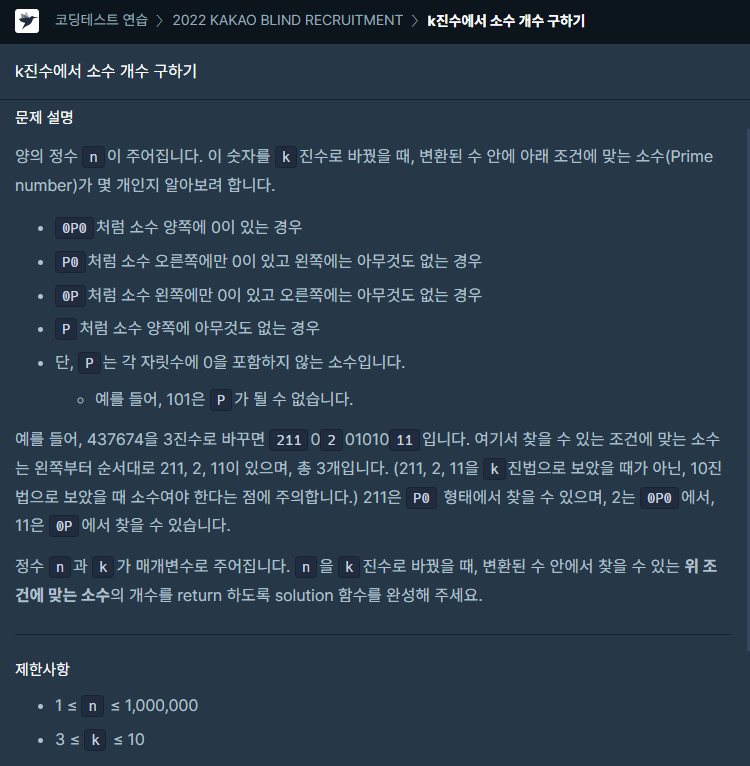
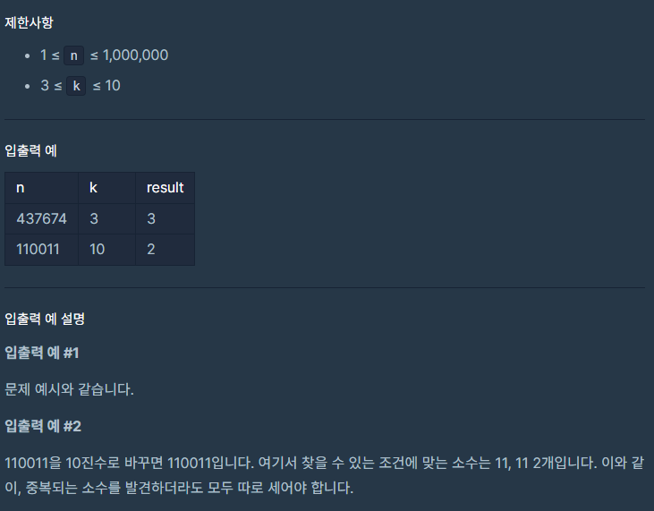

### 문제 설명

## 

## 

### 나의 문제 풀이

```javascript
function solution(n, k) {
  let answer = 0
  let jinsu = n.toString(k).split(0) //k진수로 변환후 0을 기준으로 자르기
  jinsu = jinsu.filter(x => x !== '1') //1은 소수가 아니므로 제거
  jinsu = jinsu.filter(x => x !== '') //00인경우 '' 제거

  //소수 판별
  for (let i = 0; i < jinsu.length; i++) {
    for (let j = 2; j <= Math.floor(Math.sqrt(jinsu[i])); j++) {
      if (jinsu[i] % j === 0) {
        answer--
        break // 한 번이라도 나누어 졌으니 소수가 아님
      }
    }
    answer++ // 나눠진 수가 없다면 해당 수는 소수
  }
  return answer
}
```

여기서 핵심은 0P0 P0 0P P 패턴을 보았을 때 k 진수로 변환 후 0을 기준으로 나눠서 배열에 담았고

0을 기준으로 담았을 때 '1'과 ''에 경우의 수를 제거하고

소수 판별 공식을 넣어서 쉽게 해결하였습니다.

소수 판별 공식은 제곱근을 이용해서 푸는 방법을 선택하였습니다.

굳이 num의 제곱근보다 큰 수까지 반복문을 돌릴 필요가 없다고 합니다.

num의 제곱근보다 작은 수에서 나눠지는 수가 안 나온다면 num의 제곱근보다

큰 수에서도 나눠지는 수가 나올 수 없기 때문입니다.

(그래서 이때의 시간복잡도는 O(√ N)로 가장 빠르다고 합니다. )
