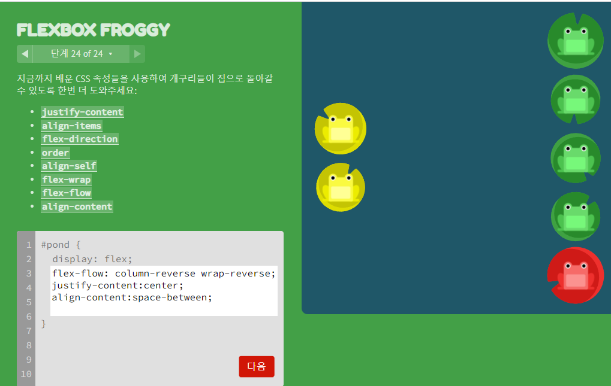

## flex란 ?

flex는 뷰포트나 요소의 크기가 불명확하거나 동적으로 변할 때,

효율적으로 요소를 배치, 정렬, 분산할 수 있는 방법을 제공한다.

flex는 복수의 부모 요소인 flex container과 그 상위 자식 요소인 flex item으로 구성된다.

flex를 만드는 법은 간단하다. 정렬하려는 요소의 부모 요소한테

다음과 같이 display: flex 속성을 선언하면 된다.

```css
.flex_container {
  display: flex;
}
```

display: flex 속성이 적용된 요소는 flex container가 되고, flex container의 자식 요소는 flex item이 된다.

a마치 flex container와 flex item은 부모 요소와 자식 요소를 한 세트로 사용하는 ul과 li와 같다고 보면 된다.

# flex의 속성들

### flex-direction

다음과 같이 플렉스 박스 안에서 아이템이 배치될 '방향'을 설정할 수 있습니다.

- row : 기본값입니다. 따로 정의하지 않아도 왼쪽에서 오른쪽으로 요소가 배치됩니다.
- row-reverse : 기본값과는 반대로, 오른쪽에서 왼쪽으로 요소가 배치됩니다.
- column : 위쪽에서 아래쪽으로 요소가 세로로 배치됩니다.
- column-reverse : 그냥 콜룸과는 반대 방향으로, 아래쪽에서 위쪽으로 요소가 배치됩니다.

### justify-content

플렉스 요소의 수평 방향 정렬 방식을 설정합니다.

display: flex를 한 뒤에 가장 자주 쓰는 속성이니 꼭 알아두어야 합니다.

- flex-start : 기본값입니다. 시작점부터 요소를 배치합니다.
- flex-end : 뒤쪽에서부터 요소를 배치합니다.
- center : 가운데에서부터 요소를 배치합니다.
- space-between : 요소들 사이에만 여유 공간을 두고 요소를 배치합니다.
- space-around : 양옆과 요소들 사이에도 모두 여유 공간을 두고 요소를 배치합니다.

### align-items

위의 justify-content는 수평 방향 정렬이었습니다.

이번에 알아볼 align-items는 플렉스 요소의 수직 방향 정렬 방식을 설정합니다.

align-self라는 것도 있는데, 각각 요소에 다른 align 속성값을 설정할 수 있고,

align-items 속성보다 우선적으로 적용됩니다.

- stretch : 기본값입니다. 요소의 높이를 컨테이너의 높이와 같게 늘려서 배치합니다.
- flex-start : 컨테이너의 위쪽에 배치합니다.
- flex-end : 컨테이너의 아래쪽에 배치합니다.
- center : 컨테이너의 가운데에 배치합니다.
- baseline : 컨테이너의 기준선에 배치합니다.

### flex-wrap

wrap은 여유 공간이 없을 때, 플렉스 요소의 위치를 다음 줄로 넘길지를 설정합니다.

참고로 wrap이라는 용어는 감싸는게 아니고, 플렉스 뿐 만 아니라 CSS에서 '줄바꿈'을 의미합니다.

- nowrap : 기본값. 요소가 다음 줄로 넘어가지 않습니다.
- wrap : 여유 공간이 없으면 다음 줄로 줄바꿈을 해서 요소를 배치합니다.
- wrap-reverse : 여유 공간이 없으면 다음 줄로 넘어가지만, 아래줄이 아닌 윗 줄로 넘어가는 차이가 있습니다.

참고로 nowrap을 하면 줄바꿈을 하지 않지만, 대신 요소의 너비를 줄여 우겨넣는 식으로 배치하게 됩니다.

저는 wrap을 자주 쓰는데, 반응형 디자인 자체가 화면이 작아지면 줄바꿈을 하는 것이 자연스럽습니다.

flex-flow라는 것도 있는데, flex-direction 속성과 flex-wrap 속성을 이용한

스타일을 한꺼번에 설정할 수 있습니다.

### align-content

요소의 수직 방향 정렬을 하는 align-items과 비슷하지만, 플렉스 요소를 정렬하는 대신에

플렉스 라인을 정렬한다는 차이가 있습니다.

justify-content의 세로 버전이라고 생각하면 쉽습니다.

- stretch : 기본값입니다. 플렉스 라인의 높이가 남는 공간을 전부 차지하게 됩니다.
- flex-start : 플렉스 라인은 플렉스 컨테이너의 앞쪽에 뭉치게 됩니다.
- flex-end : 플렉스 라인은 플렉스 컨테이너의 뒤쪽에 뭉치게 됩니다.
- center : 플렉스 라인은 플렉스 컨테이너의 가운데에 뭉치게 됩니다.
- space-between : 플렉스 라인은 플렉스 컨테이너에 고르게 분포됩니다.
- space-around : 플렉스 라인은 플렉스 컨테이너에 고르게 분포됩니다. 단, 양쪽 끝에 약간의 공간을 남겨둡니다.

만약 요소를 세로로 균일하게 배치하려면

flex-direction: column을 하고 align-content: space between이나 space around를 하면 됩니다.

### order

order는 플렉스 요소들의 순서를 설정합니다.

flex를 했을 때 기본적으로 인식되는 아이템들의 순서와 다르게,

다음과 같이 인위적으로 순서를 정할 수 있습니다.

### flex

이 속성은 컨테이너 안에 있는 요소의 너비를 상대적으로 설정해 줍니다.

쉽게 말해 100%의 영역이 있다고 할 때 요소 1은 20%, 요소 2는 40%, 요소 3은 40%

이렇게 영역을 나눠가지도록 설정이 가능합니다.div나 ul와 같은 부모에

flex: 1을 하면 자식의 영역을 균일하게 배분합니다.

부모에 하지 않고 자식마다 3, 1, 1등으로 전체 영역에 대한 비율을 나눌 수도 있습니다.

## game

game을 통하여 flex 속성을 배울 수 있는 사이트가 있습니다

연못 위에 개구리를 옮기는 game이었습니다.

flex를 처음 배우시는 분들에게는 정말 좋은 game일 것 같습니다.

https://flexboxfroggy.com/

## 

## 마치면서

이상으로 CSS flex 7가지 속성 요약 정리를 해보고 flex게임을 알려드렸습니다.

읽어주셔서 감사합니다.
