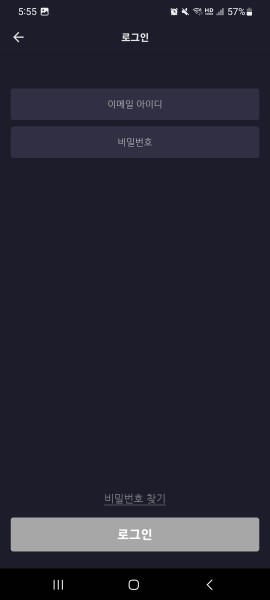

## 회사 입사 OJT 진행

짧았지만 혼자서 많이 경험하고 성장한 이야기를 하겠습니다.

우선 저는 프론트엔드 신입으로 들어가게 되었습니다.

이때 당시에 React,ReactNative 실무 경험 이 없어서 신입 포지션으로 입사하였었습니다.

첫 출근을 하고 다음 날이 되었을 때 근무환경은 개발팀장님은 다른 곳에서 근무하고

저 혼자만 사무실에서 남아서 따로 떨어진 채 백지 상태에서 환경 세팅을 하고 개발 OJT를 진행하였습니다.

아래 사진은 전달받은 피그마에서 OJT로 만든 기획안입니다.

## 

피그마를 참고하여 퍼블리싱하고 ReactNative(Expo), TypeScript를 사용하여

앱을 처음부터 끝까지 개발하였으며, 이 과정에서는 REST API 방식으로 HTTP 통신을 하였습니다.

앱은 키보드라든지 퍼블리싱을 좀 다르게 신경을 써야 해서 좀 더 적응하느라 시간이 걸렸던 것 같습니다.

아래는 앱으로 개발한 일부를 캡처한 화면입니다.

## 

## 

## 

## 

그리고 이번에는 OJT 앱이 끝나고 실무에 투입되어 개발을 진행하면서

기획팀에서 기획 중일 때는 시간이 남기 때문에

OJT에서 앱으로 만든 것을 모바일 웹으로 만들라고 하셔서 진행하였습니다.

기획을 보며 퍼블리싱하고 React, TypeScript, styled-components를 사용해서 웹 모바일을 만들었습니다.

ReactNative와 React가 아무래도 앱과 웹이어서 퍼블리싱 부분이 비슷하면서도 다르기 때문에

처음에는 다시 React에 적응해가면서 OJT 개발을 진행하였습니다.

아래는 웹으로 개발한 일부를 캡처한 화면입니다.

## 

## 

## 

## 

OJT를 마치면서 설계와

React, ReactNative, TypeScript와 다양한 라이브러리 등에 익숙해지고

React에 component, hook, Memoization 개념과 사용 그리고 폴더 구조에 대한 이해 등을 하게 되고

혼자서 문제를 해결하는 능력을 더 향상했던 경험이었습니다.

## 회사 입사 실무 진행

OJT앱을 만들고 OJT웹을 만들고 있는 도중에

정확히는 입사하고 한달이 지나서 기획안을 전달받고 앱 개발 실무에 투입되었습니다.

작업을 진행할 때는 팀장님과 메신저로 소통하면서 진행하였습니다.

저는 포지션이 프론트였으며 팀장님은 백엔드 부분을 담당하셨습니다.

개발 내용은 기존 프로젝트에 새롭게 추가할 스크린 화면과 기능들 수정하고 싶은 기능들 그리고 오류라든지

기획안이 나오면 새로 개발하고 수정하는 작업이었습니다.

처음에는 아예 새로 개발하는 부분에서는 괜찮았으나 아닌 경우는 방대한 코드양과

복잡하면서 주석이 없으므로 이런 부분들은 코드를 분석해나가며 개발하였습니다.

개발을 진행하면서 잠시 기획이 있는 시간에는 버전 마이그레이션 작업등도 함께 진행하였습니다.

버전 마이그레이션을 최신버전으로 하였을 때 앱이 켜지지 않는 이슈가 발생해서 안드로이드 스튜디오에

Logcat등을 보면서 작업을 진행하면서 문제를 해결해나갔었습니다.

결론적으로 오히려 주석이 없고 코드가 복잡하니까 보는 눈이 점점 성장하게 됐던 것 같습니다.

코드를 분석하며 이것을 사용한 이유를 생각해보면서 진행했던 것 같습니다.

실무 기획안 개발이 다 끝나면 잠시 쉬는 타임이 있어서 그럴 때는 OJT 웹을 진행했었습니다.

OJT 웹을 진행하면서 실무에서 좋다고 생각하는 프로젝트 구조라든지 기존 코드에서

괜찮다고 생각하는 부분들은 OJT 웹에 적용해가면서 진행하였습니다.

<!-- 아래는 진행하였던 프로젝트에 첫 화면입니다.

##  -->

## 회사 불황으로 권고사직

이야기를 끝으로

실무 개발 진행 중에 급여가 밀려서 문의하였는데

급여가 많이 밀릴 거 같다고 저 포함해서 다른 팀에 신입분들 모두 권고사직으로 퇴사하였습니다.

열심히 학습하고 개발도 하면서 보람도 느꼈었지만 이렇게 되었습니다.

비록 짧은 시간이라고 할 수 있지만 그 시간 동안에

좀 더 성장할 수 있었던 좋은 경험이었다고 생각합니다!
