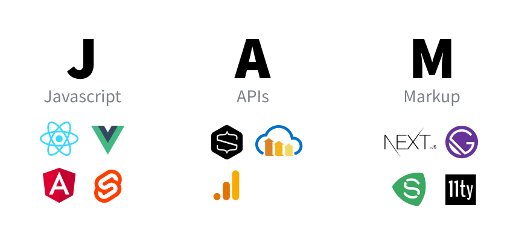
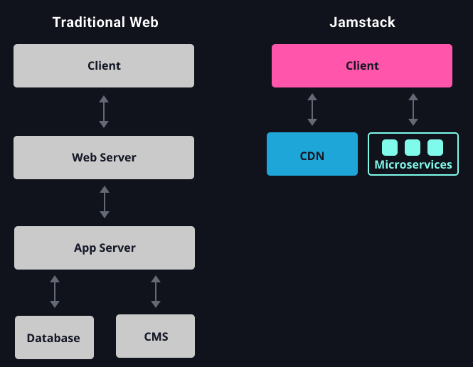
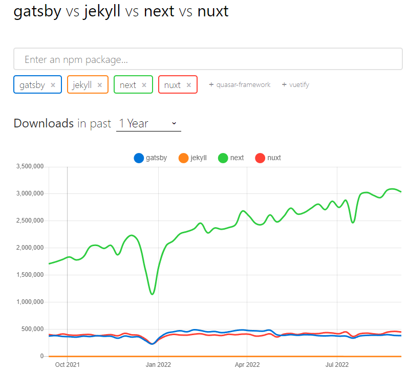

## Gatsby

Gatsby는 React 및 GraphQL을 사용하여 Node.js 위에 구축된 오픈 소스 정적 사이트 생성기입니다.

서버를 사용하지 않고 정적 사이트를 생성하고 싶을 때 사용할 수 있는 React기반 프레임워크입니다.

## JAM Stack

## 

Gatsby는 JAM Stack을 활용한 정적 사이트 생성기입니다.

JAM Stack은 Javascript, Api, MarkUp Stack의 약자로 이 3가지로 웹을 구성하는 방법입니다.

JAM Stack의 공식홈페이지에서는 다음과 같이 설명합니다.

JAM Stack 은 더 빠르고, 안전하며, 스케일링하기 쉬운 웹을 만들기 위해 디자인된 아키텍처입니다.

## JAM Stack의 동작원리

## 

기존 웹 사이트트의 방식은 대부분 서버의 데이터베이스 or CMS(Content Management System)에서 추출한 데이터를

프론트엔드에 뿌려주는 방식입니다.

사진에서 보이는 것과 같이 클라이언트에 데이터를 보여주기 위해서 많은 절차를 거쳐야만 하고, 따라서 구조도 복잡합니다.

하지만 JAM Stack을 사용한 방식은 기존 웹 사이트의 방식과 다르게 절차가 간단합니다

마크업 요소와 다양한 API를 통해 만든 정적 웹사이트를 Pre-render하고,

그것을 CDN(Content Delivery Network)를 통해 웹 사이트를 열람할 수 있습니다.

- 기존 방식보다 더 빠르게 웹사이트를 제공할 수 있다.

  - JAM Stack은 렌더링할 화면들을 모두 Pre-render 하여 제공하기 때문에

    그만큼 사용자에게 화면을 보여주기 위해 준비하는 시간을 단축할 수 있습니다.

- 안전한 웹 사이트를 제공할 수 있다.

  - JAM Stack은 API를 통해 정적 사이트를 생성합니다.

    여기서 사용되는 API는 JAM Stack을 활용한 각 프레임워크에서의 마이크로 서비스로서,

    사이트 생성을 위한 프로세스가 추상화되어 있음으로 그만큼 공격 노출 범위가 감소하게 됩니다.

## 왜 Gatsby인가?

대표적인 JAM Stack 기반 프레임워크는 gatsby,jekyll,next,nuxt가 있습니다.

## 

위 사진은 2022년 최근 1년간 다운로드 횟수를 나타낸 그래프입니다.

Next.js 의 다운로드 수가 제일 많고,

다음으로 Gatsby 와 nust가 서로 경쟁을 합니다.

그렇다면 더 인기가 많은 Next.js 가 아닌 Gatsby 를 사용하는 이유는 무엇일까요?

두 프레임워크의 사용 용도가 다르기 때문입니다.

Next.js 는 정적 사이트 생성의 기능도 있지만 주로 서버 사이드 렌더링을 위해 사용하는 프레임워크입니다.

즉, 서버와 통신을 하며 요청을 받을 때마다 동적으로 웹 사이트를 생성합니다.

하지만 Gatsby 는 서버 없이, 오로지 정적 사이트 생성을 위해 사용하는 프레임워크입니다.

JavaScript 가 실행되면 빈 HTML 페이지 안에 마크업을 추가해주는 SPA(Single Page Application) 와 다르게,

개발 후 Build 과정에서 마크업이 생성됩니다.
