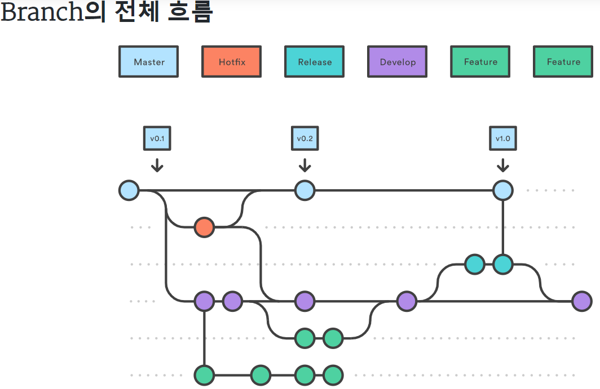
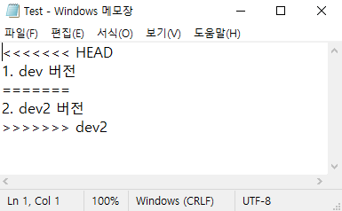
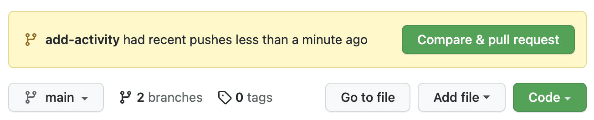

## 브랜치란?

브랜치란 Git을 활용하여 협업할 때 사용하는 주된 기능 중 하나로, 현재 버전을 여러 가지로 나누어 따로 개발하고 나중에 병합할 수 있는 기능이다.

두 명 이상의 개발자가 하나의 프로젝트를 같이 개발한다고 할 때 한 버전에 서로 다른 코드를 반영시키고자 하는 상황이 발생할 수 있다.

예를 들어 A 개발자는 로그인 기능, B 개발자는 검색 기능을 개발한다고 가정했을 때, A 개발자가 먼저 개발을 끝내 로그인 기능을 포함한 전체 프로젝트 코드를 커밋으로 만들어 원격저장소에 올리는 상황을 생각해보자.

B 개발자는 로그인 기능은 포함되어 있지 않고, 검색 기능만 포함된 전체 프로젝트 코드를 커밋으로 만들어 원격저장소에 올리려고 하지만 오류가 발생할 것이다. B 개발자의 로컬저장소에서는 추적된 적이 없는 로그인 기능 코드가 원격저장소에 있음을 감지했기 때문이다. 즉, 두 개발자가 만든 코드가 원격저장소에서 씽크가 안맞는 것이라고 볼 수 있다.

이런 경우 브랜치를 사용함으로써 문제를 간단히 해결할 수 있다. 다시 예를 들어 A 개발자는 feature/BE-login 요런 이름의 브랜치를 만들고 B 개발자는 feature/BE-searching 요런 이름의 브랜치를 만들어 각 브랜치에서 개발을 완료하고 나중에 master 브랜치로 합치면 된다.

## 브랜치의 종류

Master 브랜치
Master 브랜치는 배포 이력을 관리하기 위해 사용되며, 배포 가능한 상태만을 관리한다.

Develop 브랜치
기능 개발 브랜치를 병합하기 위해 사용된다.
모든 기능을 이 브랜치로 병합하고 모든 버그가 수정되면 Master 브랜치로 병합한다.

Feature 브랜치
Develop 브랜치에서 분기하여 사용하며, 각 브랜치가 하나의 기능 개발을 담당한다.
기능 개발 및 버그 수정이 완료되면 Develop 브랜치에 병합되어 다른 사람과 공유하게 한다.

Release 브랜치
현 버전 배포 전 다음 버전 개발을 그대로 진행하는 경우에 현 버전 배포를 위한 브랜치이다. 배포를 위한 준비는 Release 브랜치에서 진행하고, 다음 버전 개발은 그대로 Develop 브랜치에서 진행한다.

Hotfix 브랜치
배포한 버전에 급히 수정해하는 사항이 발생한 경우 Master 브랜치에서 분기하는 브랜치이다.

## 

## 두 개 이상 브랜치 만들어서 충돌 해결하여 병합하기

두 개의 브랜치(dev,dev2) 만들어서 각 브랜치마다 Test.txt에 다른 텍스트를 써두었다.

우선 dev 브랜치로 이동한 다음 git merge dev2 라는 명령어를 입력하면 충돌이 날것이다.

그리고 이렇게 충돌난 파일으로 가보면 Git에서 충돌난 부분을 마킹해두었음을 확인할 수 있다.

## 

이 부분을 수동으로 정리해주고 git bash로 돌아가서 충돌이 발생한 파일을 다시 add 해주고

commit을 하면 새로운 커밋이 생긴다. 이 커밋을 다시 master에서 merge하면 master에 병합된 커밋이 반영된다.

## 풀 리퀘스트로 병합 요청하기

내가 분기한 브랜치에서 작업한 내용을 원격저장소에 병합을 요청할 수 있는 방법이 있다.

그것이 바로 풀 리퀘스트(Pull request)이다.

바로 연습해보자. dev 브랜치로 체크아웃하고 작업한 후 이를 커밋하여 원격저장소로 push했다.

그랬더니 Github에는 아래와 같은 Pull Request가 도착했다.

## 

Compare & Pull Request 버튼을 클릭하고 Pull Request를 만든다.

이 때 base 브랜치와 compare 브랜치를 명시하게 되는데 base 브랜치는 합병 결과가 반영될 브랜치이고

compare 브랜치는 변동 내용이 합병당할 브랜치이다.

여기에서는 base:master / compare:dev 로 자동 명시되어 있을 것이다.

Create pull request를 하고 나면 아래와 같이 pull request가 생성되었을 것이다.

Files changed 탭에서 어떤 파일이 어떻게 변했는지 라인마다 리뷰를 남길 수 있어서

풀 리퀘스트 내부에서 토론을 진행할 수 있다.

다른 사람은 이 풀 리퀘스트를 수락, 수정요청을 할 수 있으며 병합할 수도 있다.
