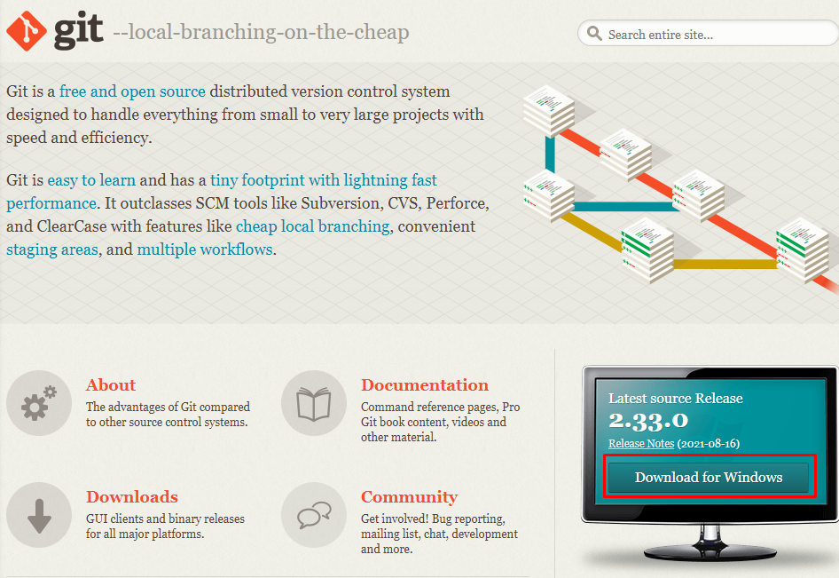
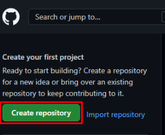
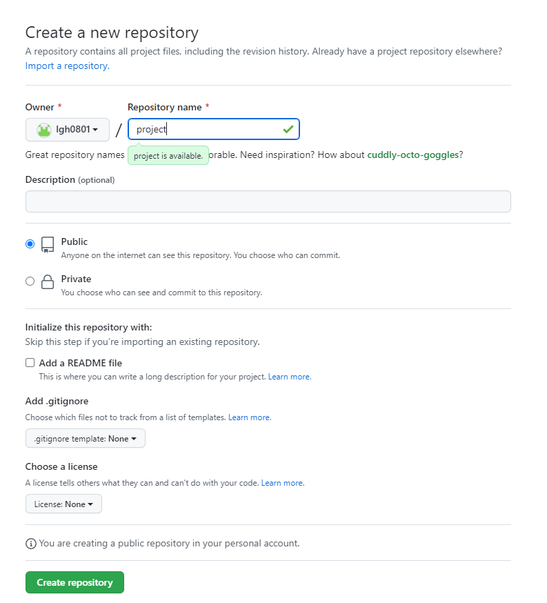
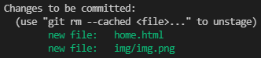
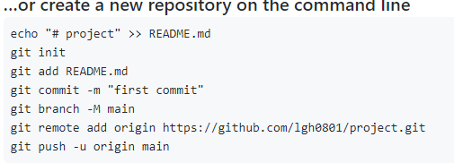

## 깃(Git) 설치 방법

먼저 설치하기 위해서 깃(Git) 홈페이지(https://git-scm.com/) 들어가야 합니다.

깃(Git) 홈페이지에 들어오시면 'Latest source Release'라는 부분에 'Download for Windows'를 클릭하셔서

설치할 수 있고, 설치 과정은 계속 다음(또는 Next)을 눌러주시면 됩니다.

## 

설치가 완료되셨다면 이제 깃(Git) 환경설정을 해줘야 합니다.

Windows 환경에서 시작 메뉴에 Git 관련 메뉴가 생기셨을 겁니다.

그중 Git Bash를 클릭하여줍니다.

프롬프트가 나오실 텐데 먼저 사용자 이름을 입력해주는 명령어를 작성하고 클릭해봅니다.

```bash
git config --global user.name "사용자명"
```

다음은 이메일을 입력해주는 명령어를 작성하고 클릭해봅니다.

```bash
git config --global user.email "이메일"
```

이 이메일을 기억해줍시다.

나중에 깃허브 가입할 때 사용하는 이메일과 같아야 하기 때문입니다.

이제 제대로 입력값이 들어갔는지 확인해봅시다.

```bash
git config --list
```

여기까지 잘 나오신다면 기본적인 세팅은 끝났습니다.

## 깃허브(Github) 설정 및 프로젝트 생성 방법

먼저 깃허브 홈페이지 (https://github.com/) 에 들어가 줍니다.

들어가서 먼저 하실 것은 회원가입을 하셔야 합니다. Sign Up을 눌러 회원가입을 합니다.

회원 가입할 때 주의하실 점은 이메일을 꼭 깃에 입력했던 이메일과 동일하게 해주셔야 한다는 점입니다.

로그인을 하시고 'Create repository'를 클릭해줍니다.

이는 새로운 프로젝트를 생성하는 과정이라고 생각하시면 되겠습니다.

## 

'Repository name'은 프로젝트명을 자유롭게 작성해주시면 됩니다.

밑에 Public과 Private는 프로젝트를 공개 또는 비공개하겠다는 의미입니다.

개인 사이트 연동시 무료회원이면 무조건 Public 선택 하셔야 합니다.

설정이 끝나면 'Create repository'를 클릭하시면 생성이 완료됩니다.

## 

## 깃허브(Github) 연결 방법

저는 vs code를 이용하여 진행해보겠습니다. vs code를 켜시고 상단 터미널(T)-새 터미널을 클릭합니다.

git init 명령어를 입력하여 초기화를 해줍니다.

git add . 명령어를 입력하여 업로드합니다. 여기서 . 의 의미는 모든 파일을 업로드하겠다는 의미입니다.

git status 명령어를 입력하여 업로드 가능한 파일 상태를 확인해봅니다.

아래와 같이 나올 경우 업로드가 가능하다는 의미입니다.

## 

git commit -m "first commit" 명령어를 통해 히스토리를 만들어줍니다.

이렇게 만들어놓은 히스토리를 깃허브로 보내야 합니다. 그러려면 깃허브 프로젝트와 깃을 연결해야 합니다.

깃허브 프로젝트와 깃을 연결하는 방법은 깃허브에서 프로젝트를 만들었을 때 나온 명령들 중

get remote... 명령을 그대로 붙여서 실행해주면 됩니다. git remote -v 명령어로 연결 확인이 가능합니다.

## 

이제 master branch로 내 코드를 보내볼 차례입니다. git push origin master 명령어를 사용하여 보내봅니다.

이제 깃허브에서 확인해보시면 소스 확인하실 수 있습니다.
