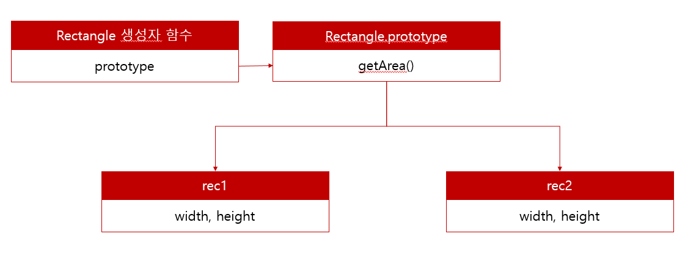
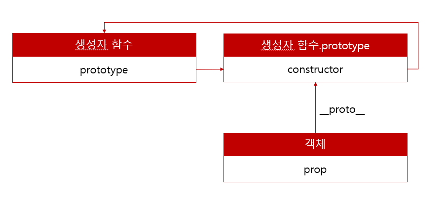

## 프로토타입(prototype)

자바스크립트의 모든 객체(obj)는 자기 부모 역할을 하는 프로토타입이라는

객체를 가지고 있으며, 객체 지향의 상속과 같이 모든 객체는

그 객체의 부모 객체인 프로토타입으로부터 프로퍼티와 메서드를 상속받습니다.

모든 객체는 최소한 하나 이상의 다른 객체로부터 상속받으며,

이때 상속되는 정보를 제공하는 객체를 프로토타입이라고 합니다.

arr.push()를 예로 들어보면

배열 arr는 자식이고 그 안에 Array라는 부모객체가 있고 Array 안에

prototype 객체가 있고 그 안에 .push() 같은 메서드가 있는 것입니다.

## 일반적인 객체 생성

```javascript
//생성자 함수
function Rectangle(width, height) {
  this.width = width
  this.height = height

  this.getArea = function () {
    return this.width * this.height
  }
}

//두 개의 정사각형 인스턴스 생성
const rec1 = new Rectangle(5, 5)
const rec2 = new Rectangle(6, 6)

console.log(rec1.getArea === rec2.getArea) // false

console.log(rec1.getArea()) //25
console.log(rec2.getArea()) //36
```

위 코드는 생성자 함수 Rectangle을 이용해 동일한 구조를 갖는 2개의 객체를 생성하는 코드입니다.

이러한 방식은 여러 객체를 생성하는데 유리하지만 문제가 있습니다.

Rectangle객체의 width, height속성은 일반적으로 인스턴스마다 서로 다릅니다.

그러나 getArea메서드는 모든 객체에서 동일한 내용을 수행합니다.

하지만 위의 코드에서는 getArea를 포함한 모든 속성이 독립적으로 유지됩니다.

쉽게말하면 Rectangle 생성자 함수 아래 rec1/rec2가 독립적으로 존재하는데

getArea()는 중복이라서 불필요한 메모리의 낭비가 됩니다.

이런 문제를 해결할 수 있는것이 프로토타입을 이용한 객체 생성입니다.

## 프로토타입을 이용한 객체 생성

```javascript
//생성자 함수
function Rectangle(width, height) {
  this.width = width
  this.height = height
}

//공유해서 사용할 수 있도록 프로토타입에 추가
//프로토타입은 생성자 함수의 prototype에 바인딩되어있다.
Rectangle.prototype.getArea = function () {
  return this.width * this.height
  //this는 함수를 호출하는 시점에 결정된다.
  //이제 왜 this가 이러한 동작을 하는지 어느정도 납득이 가능할것이다.
}
//두 개의 정사각형 인스턴스 생성
const rec1 = new Rectangle(5, 5)
const rec2 = new Rectangle(6, 6)

//생성자 함수가 생성한 모든 인스턴스는 프로토타입을 부모 객체로 상속하며 생성된다.
console.log(rec1.getArea === rec2.getArea) // true

console.log(rec1.getArea()) //25
console.log(rec2.getArea()) //36
```

## 

prototype속성은 함수가 정의되면 자동으로 생성됩니다.

생성자 함수가 생성한 모든 인스턴스는 자신의 프로토타입(\_\_proto\_\_)역할을 하는

생성자함수.prototype의 모든 프로퍼티와 메소드를 상속받습니다.

이제 getArea 메소드는 단 하나만 생성되어 Rectangle.prototype에 할당되어있고

Rectangle 생성자 함수가 생성하는 모든 인스턴스는 getArea 메소드를 사용할 수 있습니다.

## 프로토타입 객체

프로토타입 객체란 객체 간 상속을 구현하기 위해 사용됩니다.

프로토타입은 어떤 객체의 부모 역할을 하는 객체로서

다른 객체에 공유 프로퍼티를 제공합니다.

## 

위 그림처럼 객체는 \_\_proto\_\_ 접근자 프로퍼티를 통해

자신의 프로토타입에 간접적으로 접근할 수 있습니다.

프로토타입은 자신의 constructor 프로퍼티를 통해 생성자 함수에 접근할 수 있고,

생성자 함수는 자신의 prototype프로퍼티를 통해 프로토타입에 접근할 수 있습니다.

## 프로토타입 객체

자바스크립트는 객체의 프로퍼티에 접근하려고 할 때 해당 객체에 접근하려는

프로퍼티가 없다면 내부 슬롯의 참조를 따라 자신의 부모 역할을 하는

프로토타입의 프로퍼티를 순차적으로 검색합니다. 이를 프로토타입 체인이라고 합니다.

프로토타입 체인은 자바스크립트가 상속을 구현하는 메커니즘입니다.

프로토타입 체인의 최상위에 위치하는 객체는 언제나 Object.prototype입니다.

따라서 Object.prototype을 프로토타입 체인의 종점이라고 합니다.
