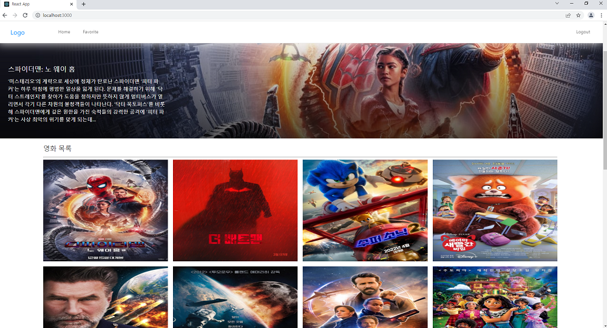
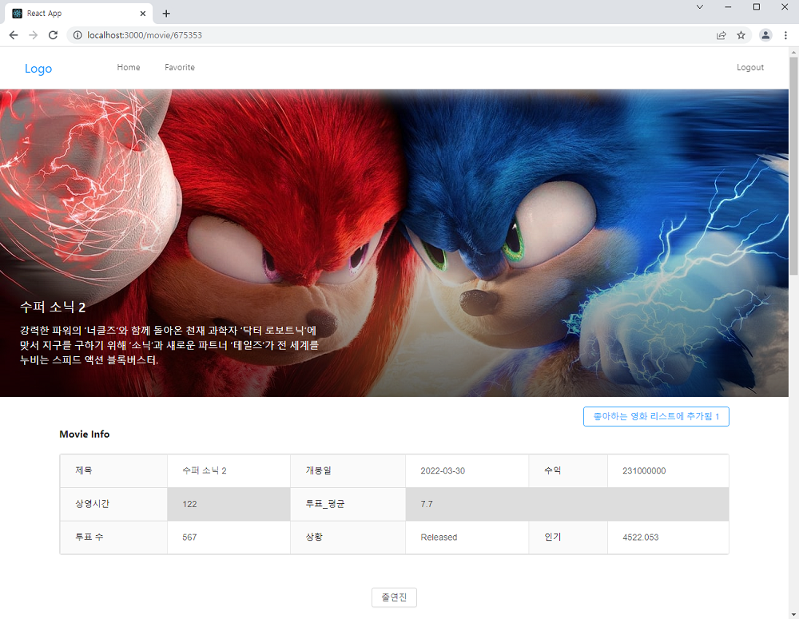
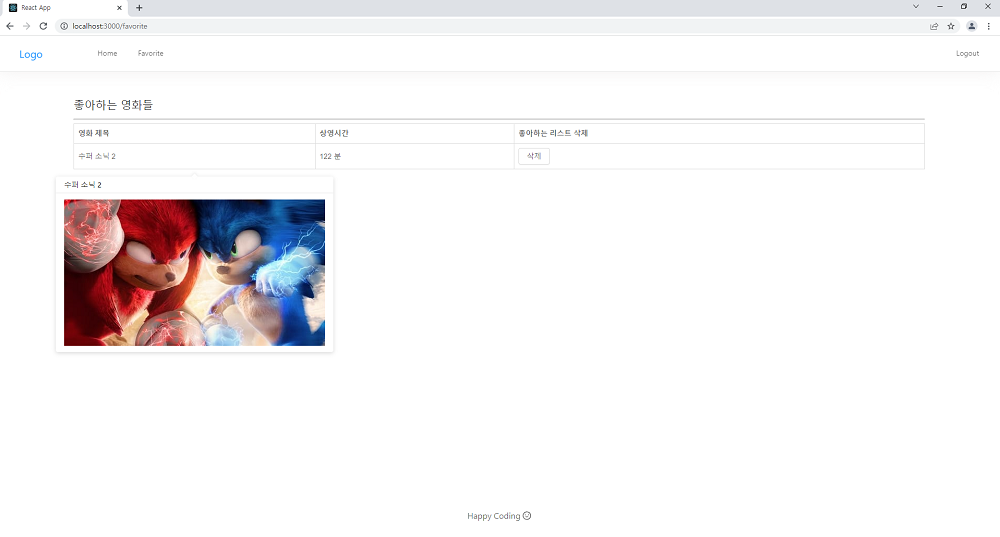

### MovieApp CloneCoding

React로 최신 영화목록을 보여주는 웹을 구현하는 강의를 찾아서 학습하였습니다.

오류가 생각보다 많이 발생하여서 진도가 막힐때도 있었지만 (버전 문제 대부분)

구글링등 도움을 구하여 해결하였습니다.

무조건 따라한것은 아니고 디버깅해가며 소스를 이해하고 영상에는없는 권한기능등을 추가하였습니다.

react 함수형컴포넌트, MovieApi연동, Redux기능등이 익숙해지는 좋은 경험이됬다.

React,NodeJS,MongoDB,API를 사용했습니다.

# 홈화면

## 

# 영화 정보

## 

# 출연진 정보

## 

# 좋아하는 리스트

## 

---

강의 출처 (https://www.youtube.com/watch?v=e8xMcMXqYGw&list=PL9a7QRYt5fqkowXUgTj_tbkFClsPhO5XV&ab_channel=JohnAhn)
