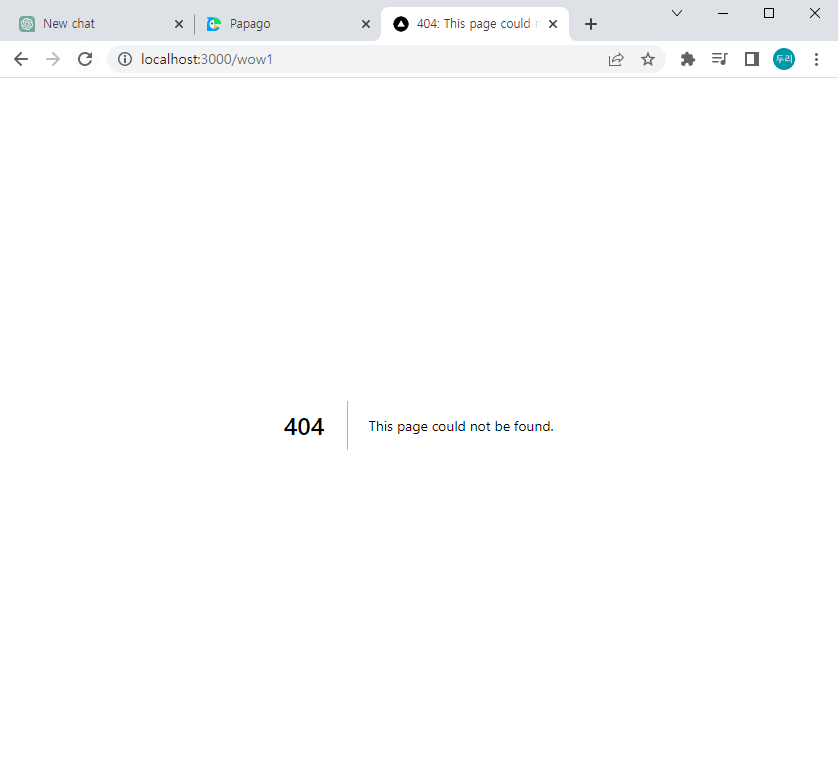

## Next.js

Next.js는 서버 사이트 렌더링, 정적 웹 페이지 생성 등 리액트 기반

웹 애플리케이션 기능들을 가능케 하는 Node.js 위에서 빌드된

오픈 소스 웹 개발 프레임워크입니다.

리액트 문서는 개발자들이 Node.js로 서버 렌더링되는 웹사이트를

빌드할 때의 해결책의 하나로 충고하고 있습니다.

React팀은 정적인 웹사이트를 만들때는 Gatsby프레임워크를 추천하고

서버 렌더링 Node.js 웹사이트를 만들고 있다면 Next.js프레임워크를 추천합니다.

## 동작원리

## 

### Next.js 동작과정- 초기화면 수행 (SSR 방식 이용)

1. 사용자가 홈페이지를 접속한 경우(최초 접속) 클라이언트는 이를 확인하고 서버로 요청 합니다.

2. 서버에서는 미리 구성된 HTML, CSS 파일을 클라이언트에게 전달합니다.

3. 이 과정에서 동시에 클라이언트에서는 스크립트 파일을 수행하여서 클라이언트에게 전달합니다.

### Next.js 동작과정- 페이지 이동 / 동작이 발생하는 경우(CSR 방식 이용)

페이지 이동 및 동작이 발생하는 경우에는 CSR 방식을 통해서

서버를 거치지 않고 브라우저에서 페이지를 이동한다.

## 사용이유

### Next.js는 초기 페이지를 서버에서 자바스크립트를 로딩합니다.(Pre-rendering)

React는 No Pre-rendering 방식입니다.

No Pre-rendering은 빈 HTML 파일을 최초에 먼저 렌더링 한 이후에

스크립트를 로딩하는 방식으로 처리가 됩니다.

이러한 방식은 사용자에게 보여지는 초기화면 로딩시간이 늦어집니다.

파일이 로드되기 전까지 페이지를 볼 수 없다는 뜻이며,

결국 UX 측면에서 낮은 평가를 받게되며 SEO 점수에서도 낮은 점수를 받습니다.

### Next.js는 SEO(Search Engine Optimiztion) 문제를 해결합니다.

‘pre-rendering’ 덕택에 HTML, CSS, Javascript로 만들어진 HTML을

제공함으로써 SEO 문제를 해결할 수 있습니다.

CSR은 초기화면이 로딩이 너무 오래걸려서 검색엔진 봇들이

데이터 수집을 못하여서 검색 엔진 노출이 어렵습니다.

### 직관적인 페이지 기반 라우팅 시스템입니다.

프로젝트의 /pages폴더에서 컴포넌트를 export하면 폴더명이 페이지 route가 됩니다.

예외가 있다면 index.js는 Home화면입니다.

테스트 완료한 화면을 보여드리겠습니다.

## 

## 

React에서 당연히 해야 했던 라우팅 설정을 할 필요가 없어서

시간 절약을 할 수 있을 것 같습니다.

덤으로 404처리도 안 해도 됩니다.

## 

### Next.js는 SPA의 장점을 유지합니다.

첫페이지는 SSR방식을 이용 다른 페이지로 이동할 때부터는

CSR방식을 이용하여 SPA장점을 유지합니다.

## 프로젝트 생성

```JavaScript
// next.js 프로젝트 생성
npx create next-app

// Typescript 기반 next.js 프로젝트 생성
npx create next-app --typescript
```

## 마치면서

이상으로 Next.js 정의와 사용 목적을 배워봤습니다.

글을 작성해보니 Next.js가 React에 서버 렌더링 문제를 보완해주면서

React에 장점을 이용할 수 있는 좋은 프레임워크인것 같습니다.
