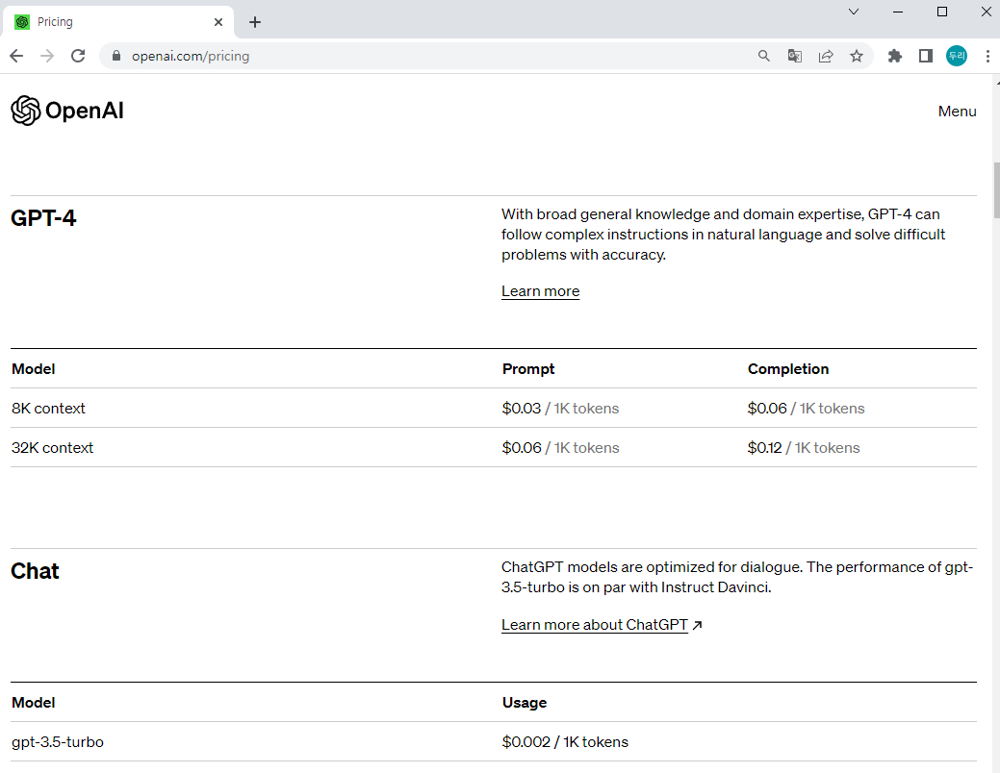
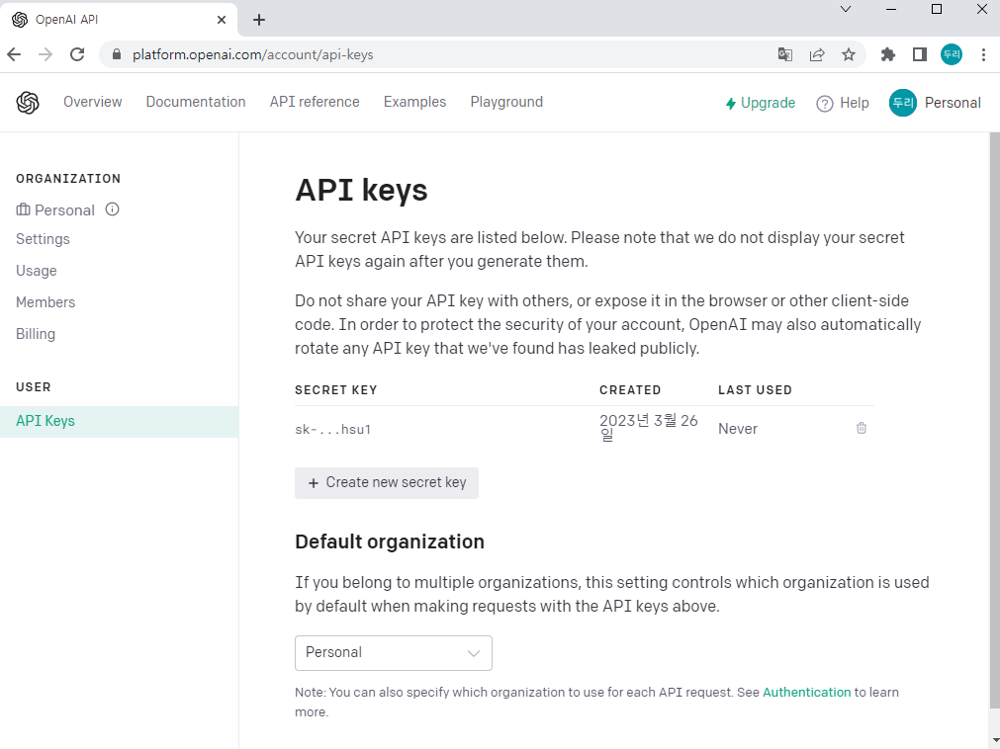
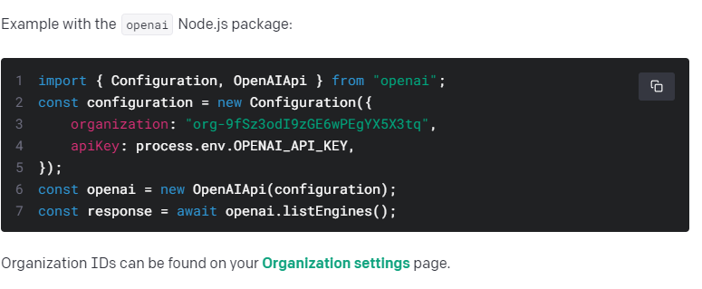
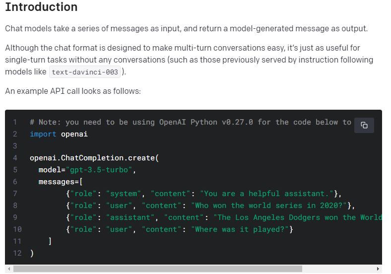
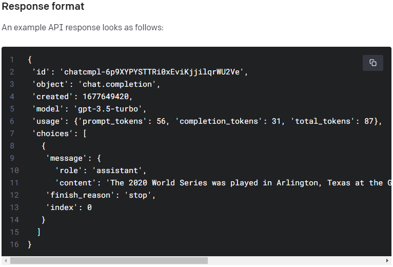
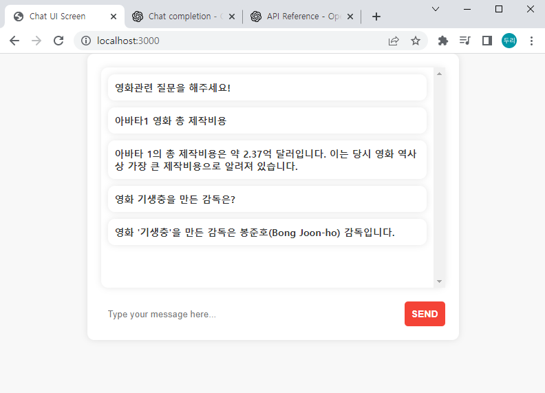

## ChatGpt API 연동해보기

여전히 화제를 일으키고 있는 인공지능 챗봇 ChatGpt를

API로도 사용할수있다고하여 API 연동을해보기로 하였습니다.

우선 일정 기간 동안은 체험용으로 무료가 있지만 배포하고

계속 사용하실 거면 유료로 이용을 하셔야 합니다.

아래 사진은 가격입니다.

## 

위 사진을 보면 아시겠지만 GPT4는 가격이 gpt3.5에비해 10배 이상 비쌉니다.

저는 물론 배포도 하지 않을 것이고 체험용으로 연동하는 거기 때문에 gpt3.5를 사용하겠습니다.

일단 제일 처음은 API 키를 발급받으셔야 합니다.

## 

저는 로컬에서만 경험해볼 것이기 때문에 보안이라든지

디자인 부분(gpt사용)은 신경을 많이 쓰지 않고 기능구현에 집중하였습니다.

프론트는 html,css,javacript 백엔드는 node.js를 사용하여 구현하였습니다.

react를 사용할까 하다가 간단한 구현이기 때문에 사용하지 않았습니다.

이제 본격적으로 시작해보겠습니다.

openai를 install 해주고

```bash
npm install openai
```

그다음으로 node.js에서 사용할 express를 install해줍니다.

```bash
npm install express
```

공식문서에서 node.js에서 사용하는 방법을 참조하여 코드를 짜겠습니다.

### node.js 셋팅 관련 문서

## 

### 대화를 생성하는 데 사용되는 함수(Python 예시)

## 

node.js는 openai.createChatCompletion를 사용하셔야합니다.

role을 보면 system, user, assistant가있습니다.

system은 "챗봇이 이해하지 못한 입력" 또는 "일시적으로 문제가 발생하여 대화를 계속할 수 없음"

등의 메시지가 system 메시지로 처리되고 user는 사용자 채팅 assistant는 답변입니다.

### API가 응답으로 보내주는 데이터

## 

### 구현 화면

## 

### app.js

```javascript
const { Configuration, OpenAIApi } = require('openai')
const express = require('express')
const app = express()

const configuration = new Configuration({
  apiKey: '본인 API키',
})
const openai = new OpenAIApi(configuration)

app.use(express.json())
app.use(express.urlencoded({ extended: true }))
app.use(express.static(__dirname))

app.post('/aiChat', async function (req, res) {
  let { userMessages, assistantMessages } = req.body
  let messages = [
    {
      role: 'system',
      content: '일시적으로 문제가 발생하여 대화를 계속할 수 없습니다.',
    },
  ]

  while (userMessages.length || assistantMessages.length) {
    if (userMessages.length) {
      messages.push(
        JSON.parse(
          '{"role": "user", "content": "' + String(userMessages.shift()) + '"}',
        ),
      )
    }
    if (assistantMessages.length) {
      messages.push(
        JSON.parse(
          '{"role": "assistant", "content": "' +
            String(assistantMessages.shift()) +
            '"}',
        ),
      )
    }
  }

  //사용자가 입력한 문장을 기반으로 대화생성
  const completion = await openai.createChatCompletion({
    model: 'gpt-3.5-turbo',
    messages: messages,
  })

  let assistant = completion.data.choices[0].message['content']
  res.json({ assistant: assistant })
})

app.listen(3000)
```

### index.html

chatgpt api를 사용하는거니까 디자인을 gpt한테 얻어서 사용하였습니다.

영화관련해서 채팅UI를 만들어달라고하니까 준 디자인입니다.

스크립트부분빼고는 손을 대지않았습니다.

```html
<!DOCTYPE html>
<html>
  <head>
    <meta charset="UTF-8" />
    <title>Chat UI Screen</title>
    <style>
      body {
        margin: 0;
        padding: 0;
        font-family: 'Noto Sans KR', sans-serif;
        font-size: 14px;
        background: #f8f8f8;
      }

      .chat-container {
        max-width: 500px;
        margin: 0 auto;
        padding: 20px;
        background: #fff;
        box-shadow: 0px 0px 10px rgba(0, 0, 0, 0.1);
        border-radius: 10px;
      }

      .chat-box {
        background-color: #fff;
        padding: 10px;
        border-radius: 10px;
        margin-bottom: 20px;
        overflow-y: scroll;
        height: 300px;
        box-shadow: 0px 0px 10px rgba(0, 0, 0, 0.1);
      }

      .chat-message {
        background-color: #fff;
        padding: 10px;
        border-radius: 10px;
        margin-bottom: 10px;
        box-shadow: 0px 0px 10px rgba(0, 0, 0, 0.1);
      }

      .chat-message p {
        margin: 0;
        padding: 0;
        color: #333;
        font-weight: 600;
      }

      .chat-message span {
        font-weight: 400;
        color: #666;
        font-size: 12px;
        margin-left: 10px;
      }

      .chat-message.assistant {
        background-color: #f4f4f4;
      }

      .chat-message.assistant p {
        color: #3498db;
      }

      .chat-input {
        display: flex;
        margin-top: 20px;
      }

      .chat-input input {
        flex: 1;
        padding: 10px;
        border: none;
        border-radius: 5px;
        margin-right: 10px;
      }

      .chat-input button {
        background-color: #f44336;
        color: #fff;
        border: none;
        padding: 10px;
        border-radius: 5px;
        cursor: pointer;
        font-size: 14px;
        font-weight: 600;
        text-transform: uppercase;
        transition: background-color 0.3s ease-in-out;
      }

      .chat-input button:hover {
        background-color: #e53935;
      }
      .assistant {
        color: blue;
      }
    </style>
  </head>

  <body>
    <div class="chat-container">
      <div class="chat-box">
        <div class="chat-message">
          <p class="assistant">영화관련 질문을 해주세요!</p>
        </div>
      </div>
      <div class="chat-input">
        <input type="text" placeholder="Type your message here..." />
        <button>Send</button>
      </div>
    </div>
    <script>
      const chatBox = document.querySelector('.chat-box')
      let userMessages = []
      let assistantMessages = []

      const sendMessage = async () => {
        const chatInput = document.querySelector('.chat-input input')
        const chatMessage = document.createElement('div')
        chatMessage.classList.add('chat-message')
        chatMessage.innerHTML = `<p>${chatInput.value}</p>`
        chatBox.appendChild(chatMessage)

        //유저 채팅 추가
        userMessages.push(chatInput.value)

        chatInput.value = ''

        const response = await fetch('http://localhost:3000/aiChat', {
          method: 'POST',
          headers: {
            'Content-Type': 'application/json',
          },
          body: JSON.stringify({
            userMessages: userMessages,
            assistantMessages: assistantMessages,
          }),
        })

        const data = await response.json()

        //GPT 답변 추가
        assistantMessages.push(data.assistant)

        const astrologerMessage = document.createElement('div')
        astrologerMessage.classList.add('chat-message')
        astrologerMessage.innerHTML = `<p class='assistant'>${data.assistant}</p>`
        chatBox.appendChild(astrologerMessage)
      }

      document
        .querySelector('.chat-input button')
        .addEventListener('click', sendMessage)
    </script>
  </body>
</html>
```

## 마치면서

ChatGpt를 웹사이트에서 사용만 하는 중인데

API를 연동할 수 있다는 것을 알고는 있었지만 경험하지는 못했었습니다.

이번에 기회가 되어서 연동을 한번 해보게 되었습니다.

아이디어가 있다면 충분히 AI API 연동을 이용하여

여러 가지 서비스를 만들어낼 수 있을 것 같습니다.
