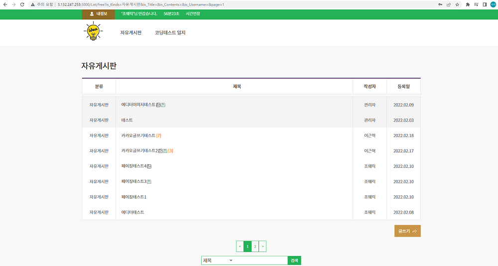

## 페이징

ToyProject를 진행하는 중에 게시판 글에 페이징 기능이 필요하여서

페이지네이션 라이브러리인 react-paginate를 사용하기로 하였습니다.

1. react-paginate install

```javascript
$ npm install react-paginate
```

아래에서 보여주는 소스는 react-paginate를 사용하여

ToyProject에 적용한 react-paginate와 관련된 일부 코드 부분만을

추출하거나 수정해서 가져온겁니다.

```javascript
//List.js
import ReactPaginate from 'react-paginate'

const List = props => {
  //perPage 페이지에 한번에 보이는 게시글 수
  const [page, setPage] = useState({
    offset: 0,
    perPage: 8,
    currentPage: 0,
    pageCount: 0,
  })

  useEffect(() => {
    let cookie_userid = cookie.load('userid')
    if (cookie_userid === undefined && kakaoInfo.kakaousernum === '') {
      window.location.href = '/login'
    }
    if (
      inputSearchRef.current.value !== '' ||
      selectSearchRef.current.value !== 'title'
    ) {
      //글 카테고리 바뀔때마다 초기화
      selectSearchRef.current.value = 'title'
      inputSearchRef.current.value = ''
    }
    callListApi()
  }, [page.currentPage, page.offset, props.match.params.kind])

  const HandlePageClick = e => {
    //e.selected 1페이지 선택시 값은 0
    const selectedPage = e.selected
    const offset = selectedPage * page.perPage
    setPage({ ...page, currentPage: selectedPage, offset: offset })
  }

  const ListAppend = res => {
    const List = res.data
    let slice = []
    if (inputSearchRef.current.value !== '') {
      if (List.json.length === 0) {
        sweetalert('검색 자료가 없습니다.', '', 'info', '확인')
      }
      slice = List.json.slice(0, List.json.length) //검색시는 페이징에서 리스트 목록 개수 제한을 없애줌
      setPage({ ...page, pageCount: Math.ceil(1) })
    } else {
      slice = List.json.slice(page.offset, page.offset + page.perPage) //페이징 작업
      setPage({
        ...page,
        pageCount: Math.ceil(List.json.length / page.perPage),
      })
    }
  }
  return (
    <>
      <ReactPaginate
        previousLabel={'<'}
        nextLabel={'>'}
        breakLabel={'...'}
        breakClassName={'break-me'}
        pageCount={page.pageCount}
        marginPagesDisplayed={2}
        pageRangeDisplayed={5}
        onPageChange={HandlePageClick}
        containerClassName={'pagination'}
        subContainerClassName={'pages pagination'}
        activeClassName={'active'}
      />
    </>
  )
}
```

css 부분은 containerClassName을 이용하여 스타일링 할 수 있습니다.

```css
/* 페이징 */
.pagination {
  margin: 15px auto;
  display: flex;
  list-style: none;
  outline: none;
  display: flex;
  justify-content: center;
  align-items: center;
}
.pagination > .active > a {
  background-color: #25b156;
  border-color: #25b156;
  color: #fff;
}
.pagination > li > a {
  border: 1px solid #25b156;
  padding: 5px 10px;
  outline: none;
  cursor: pointer;
}
.pagination > .active > a,
.pagination > .active > span,
.pagination > .active > a:hover,
.pagination > .active > span:hover,
.pagination > .active > a:focus,
.pagination > .active > span:focus {
  background-color: #25b156;
  border-color: #25b156;
  outline: none;
}
.pagination > li > a,
.pagination > li > span {
  color: #25b156;
}
.pagination > li:first-child > a,
.pagination > li:first-child > span,
.pagination > li:last-child > a,
.pagination > li:last-child > span {
  border-radius: unset;
}
```

ReactPaginate는 필요에 맞게 찾아서 옵션을 사용하시면 됩니다.

- pageCount : 총 페이지 수

- marginPagesDisplayed : 페이지 구성요소의 양쪽 끝에 표시할 페이지 수

- pageRangeDisplayed : 표시된 총 페이지 수

- onPageChange : 페이지 버튼을 눌렀을 때 일어나는 이벤트 이를 이용해 페이지 증감

## 
