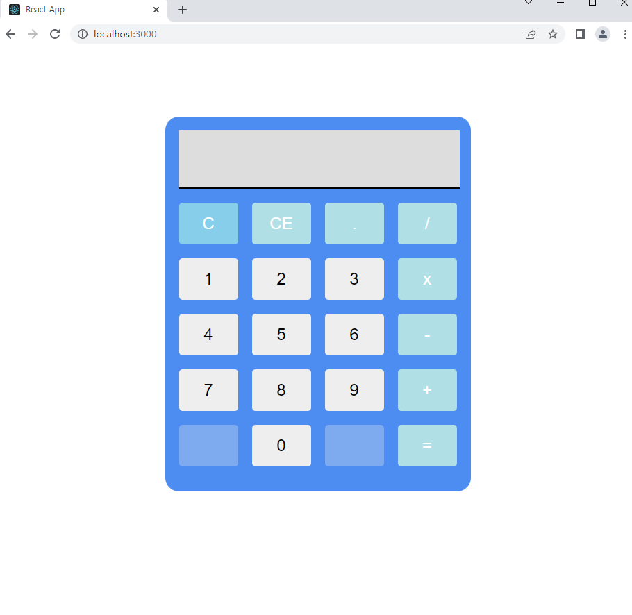
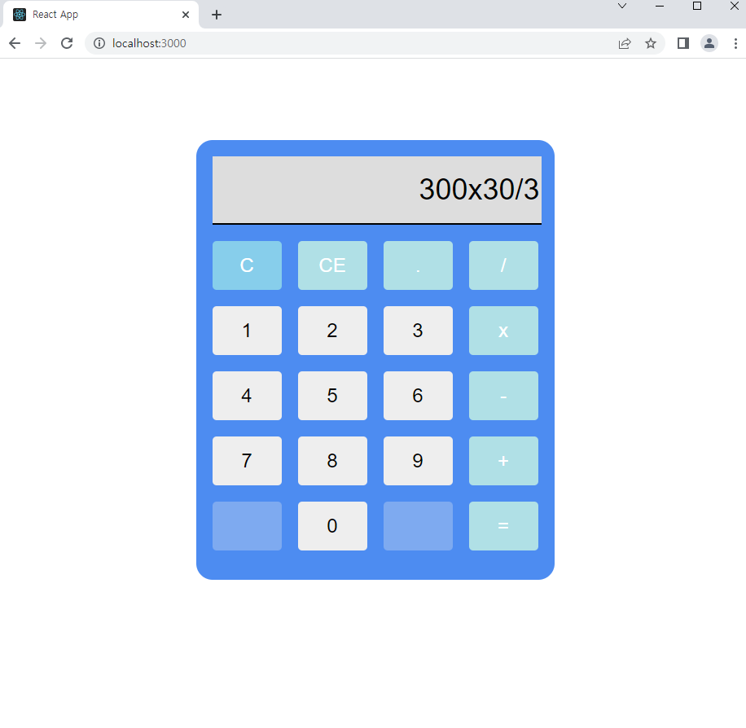
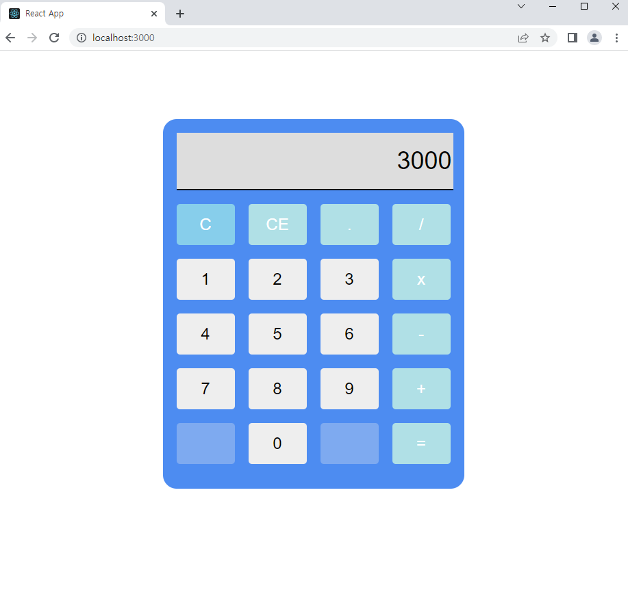

## 계산기

윈도우 계산기를 사용하다가 간단한 계산기를 만들어보고 싶어서

React, TypeScript, Styled-Components를 사용하여 계산기를 만들게 되었습니다.

C = 초기화 / CE 한칸씩 지우기 / . 소수점 / 사칙연산

## 

계산식을 넣고

## 

= 버튼을 누르면 계산

## 

아래는 계산기 소스 코드입니다.

```typescript
//App.tsx
import Adder from './commponent/adder'

function App() {
  return <Adder />
}

export default App
```

```typescript
//adder.tsx
import React, { useState } from 'react'
import styled from 'styled-components'

interface BackgroundProps {
  backgroundColor: string
}

const Calculator = styled.div`
  background-color: #4d8cf1;
  width: 400px;
  height: 500px;
  margin: 100px auto;
  border-radius: 20px;
  padding: 20px;
`

const DisplayInput = styled.input`
  background-color: #ddd;
  width: 100%;
  height: 80px;
  font-size: 36px;
  text-align: right;
  border: none;
  border-bottom: 2px solid black;
  margin-bottom: 20px;
`

const Buttons = styled.div`
  display: grid;
  grid-template-columns: repeat(4, 1fr);
  grid-gap: 20px;
`
const Button = styled.button<BackgroundProps>`
  background-color: ${props => props.backgroundColor};
  color: ${props => props.color || ''};
  border: none;
  width: 100%;
  height: 60px;
  font-size: 24px;
  border-radius: 5px;
  cursor: pointer;
  &:hover {
    background-color: #ddd;
  }
`
const Adder = () => {
  const [value, setValue] = useState<string>('')
  const handleClick = (event: React.MouseEvent<HTMLButtonElement>) => {
    switch (event.currentTarget.value) {
      case 'C': //전체 clear
        setValue('')
        break
      case 'CE': //한칸씩 clear
        setValue(String(value).substring(0, String(value).length - 1))
        break
      case '=':
        setValue(eval(value.replace('x', '*'))) //곱셈은 변환해줘야함
        break
      default:
        setValue(value + event.currentTarget.value)
        break
    }
  }

  const buttons = [
    { value: 'C', color: 'white', backgroundColor: 'skyblue' },
    { value: 'CE', color: 'white', backgroundColor: 'powderblue' },
    { value: '.', color: 'white', backgroundColor: 'powderblue' },
    { value: '/', color: 'white', backgroundColor: 'powderblue' },
    { value: '1', backgroundColor: '#eee' },
    { value: '2', backgroundColor: '#eee' },
    { value: '3', backgroundColor: '#eee' },
    { value: 'x', color: 'white', backgroundColor: 'powderblue' },
    { value: '4', backgroundColor: '#eee' },
    { value: '5', backgroundColor: '#eee' },
    { value: '6', backgroundColor: '#eee' },
    { value: '-', color: 'white', backgroundColor: 'powderblue' },
    { value: '7', backgroundColor: '#eee' },
    { value: '8', backgroundColor: '#eee' },
    { value: '9', backgroundColor: '#eee' },
    { value: '+', color: 'white', backgroundColor: 'powderblue' },
    { disabled: true, backgroundColor: '' },
    { value: '0', backgroundColor: '#eee' },
    { disabled: true, backgroundColor: '' },
    { value: '=', color: 'white', backgroundColor: 'powderblue' },
  ]

  return (
    <Calculator>
      <DisplayInput value={value} type="text" readOnly />
      <Buttons>
        {buttons.map(button => (
          <Button
            key={button.value}
            onClick={handleClick}
            value={button.value}
            color={button.color}
            backgroundColor={button.backgroundColor}
            disabled={button.disabled}
          >
            {button.value}
          </Button>
        ))}
      </Buttons>
    </Calculator>
  )
}

export default Adder
```

계산기 Button은 Map으로 구현했습니다.

Button 부분을 클릭하였을 때 event.currentTarget.value값을 활용했습니다.

clear 기능/back 기능/사칙 연산기능을 구현했습니다.

=부분은 eval()를 사용했습니다.

eval을 사용하면 '3+2' 문자열을 계산식으로 바꿔줘서 num5라는 결괏값을 줍니다.

그러므로 사칙연산을 간단하게 구현할 수 있었습니다.

하지만 eval은 검토 후 사용하시길 권장합니다.

이유는 바로 보안이슈가 있기 때문입니다.

이상으로 react+typescript를 이용한 계산기 구현이었습니다.
