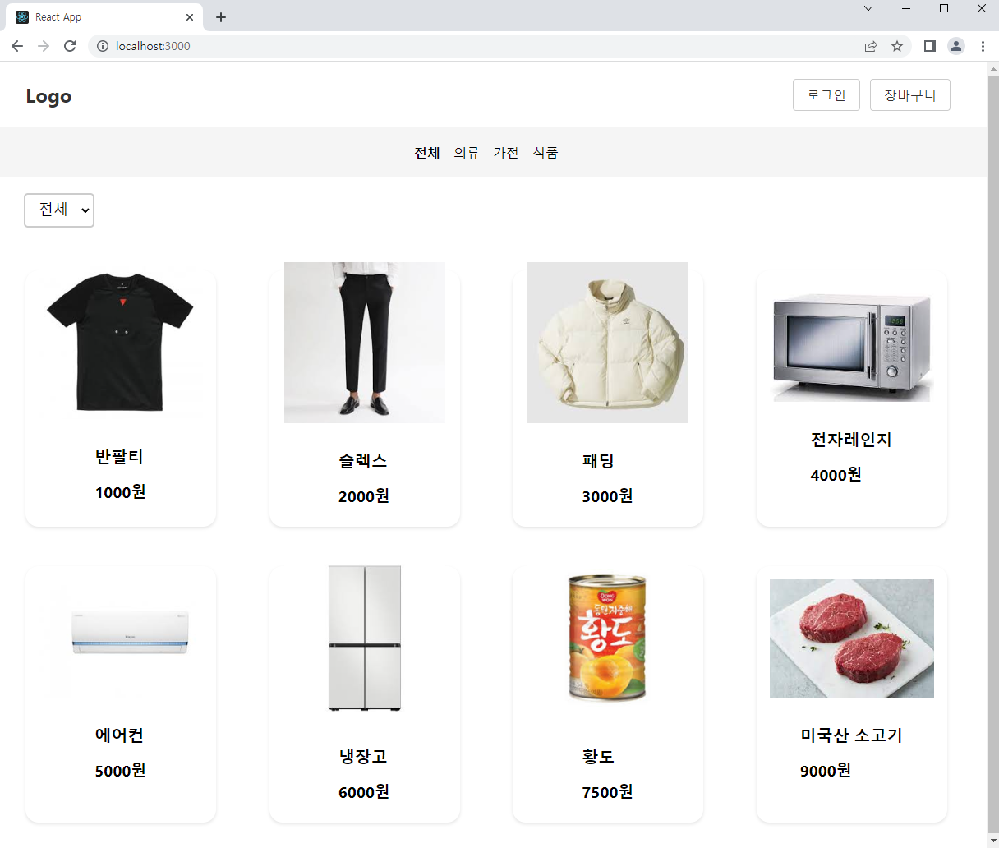
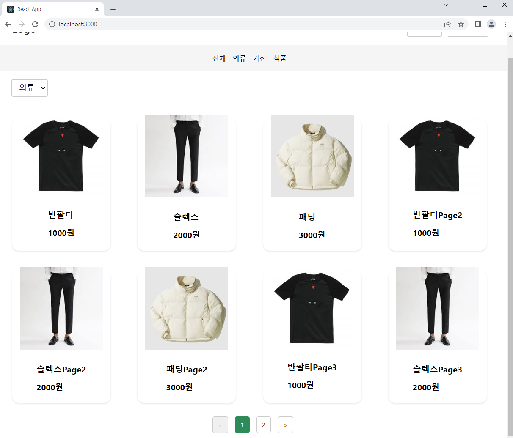
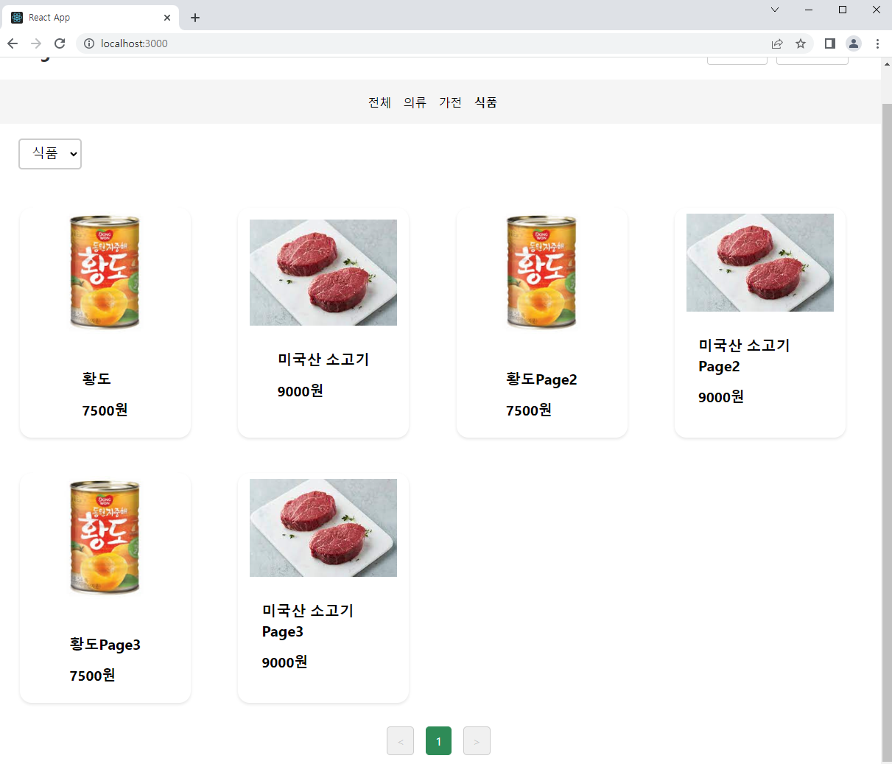
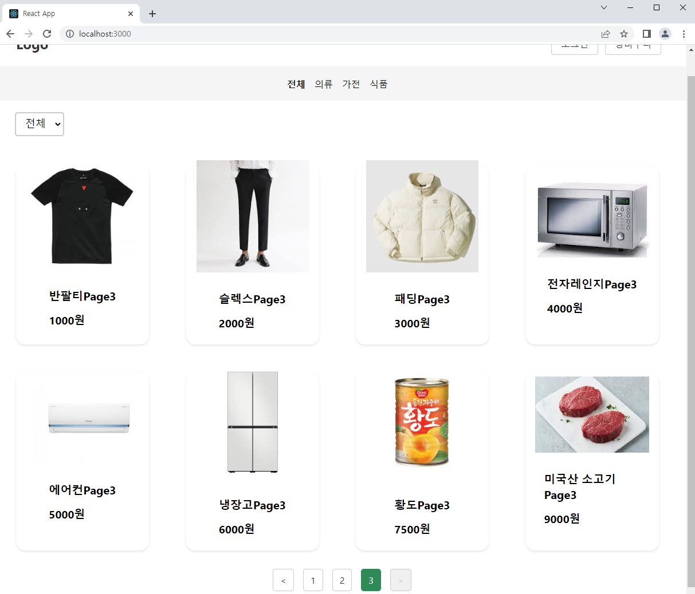

## 홈쇼핑 메인화면

구글링 대신 ChatGPT와 협업하여 간단한 홈쇼핑 메인화면 틀을 만들어 봤습니다.

카테고리 전체

## 

네비게이션바 / 콤보박스 카테고리 클릭 또는 변경시 화면

## 

## 

페이지네이션 기능 화면

## 

### App.tsx

```typescript
import React, { useState } from 'react'
import Header from './commponent/Header'
import Navigation from './commponent/Navigation'
import HomePage from './pages/HomePage'
import products from './data/products'

const App = () => {
  const [activeCategory, setActiveCategory] = useState('전체')

  const handleSelectCategory = (category: string) => {
    setActiveCategory(category)
  }
  const categories = ['전체', '의류', '가전', '식품']

  return (
    <div>
      <Header />
      <Navigation
        activeCategory={activeCategory}
        onSelectCategory={handleSelectCategory}
        categories={categories}
      />
      <HomePage
        products={products}
        onSelectCategory={handleSelectCategory}
        activeCategory={activeCategory}
        categories={categories}
      />
    </div>
  )
}

export default App
```

네비게이션바와 홈페이지 컴포넌트에 prop으로 함수와 값들을 넘겨줍니다.

products는 제품들 데이터 값 입니다.

### Header.tsx

```typescript
import styled from 'styled-components'

const HeaderWrapper = styled.header`
  background-color: #ffffff;
  height: 80px;
  display: flex;
  align-items: center;
  justify-content: space-between;
  padding: 0 32px;
  box-shadow: 0 4px 6px rgba(0, 0, 0, 0.1);
`

const Logo = styled.div`
  font-size: 24px;
  font-weight: bold;
  color: #333;
`

const ButtonsWrapper = styled.div`
  display: flex;
`

const Button = styled.button`
  background-color: #fff;
  border: 1px solid #ccc;
  border-radius: 4px;
  color: #333;
  font-size: 16px;
  margin-right: 12px;
  padding: 8px 16px;
  cursor: pointer;
  transition: background-color 0.2s ease-in-out;
  &:hover {
    background-color: #ccc;
  }
`

const Header = () => {
  return (
    <HeaderWrapper>
      <Logo>Logo</Logo>
      <ButtonsWrapper>
        <Button>로그인</Button>
        <Button>장바구니</Button>
      </ButtonsWrapper>
    </HeaderWrapper>
  )
}

export default Header
```

### products.ts

```typescript
export interface Product {
  id: number
  name: string
  price: number
  category: string
  imageUrl: string
}

const products: Product[] = [
  {
    id: 1,
    name: '반팔티',
    price: 1000,
    category: '의류',
    imageUrl:
      'https://encrypted-tbn0.gstatic.com/images?q=tbn:ANd9GcSTWAYa8sklGfrB9b7Tt4puirpLqU8XPyjkoQ&usqp=CAU',
  },
  {
    id: 2,
    name: '슬렉스',
    price: 2000,
    category: '의류',
    imageUrl:
      'https://encrypted-tbn0.gstatic.com/images?q=tbn:ANd9GcS5Q9NDC-rQCTQ-1r-q81vFokeIIeqZGhj7IR8fQ6c7gR-2QdV92Vg3o2ksTllpvlHP0bU&usqp=CAU',
  },
  {
    id: 3,
    name: '패딩',
    price: 3000,
    category: '의류',
    imageUrl:
      'https://encrypted-tbn0.gstatic.com/images?q=tbn:ANd9GcSS9VBXElcFpsG1gcckVdvGFiQRs5U3Nz39gw&usqp=CAU',
  },
  {
    id: 4,
    name: '전자레인지',
    price: 4000,
    category: '가전',
    imageUrl:
      'https://encrypted-tbn0.gstatic.com/images?q=tbn:ANd9GcQlkSbX6-CCLoya6nNZhM5imcDeiHMkdrD9Q_jXWpP5KRiGju0NYRXKcu2YQbTn3oAVcYc&usqp=CAU',
  },
  {
    id: 5,
    name: '에어컨',
    price: 5000,
    category: '가전',
    imageUrl:
      'https://encrypted-tbn0.gstatic.com/images?q=tbn:ANd9GcRFu9UOtld5LZcKxondC3au9jKPTKqG-6fsIQ&usqp=CAU',
  },
  {
    id: 6,
    name: '냉장고',
    price: 6000,
    category: '가전',
    imageUrl:
      'https://encrypted-tbn0.gstatic.com/images?q=tbn:ANd9GcSk9SpU70b3MY6yq9gVazQdWqrwM4_bhyISqg&usqp=CAU',
  },
  {
    id: 7,
    name: '황도',
    price: 7500,
    category: '식품',
    imageUrl:
      'https://encrypted-tbn0.gstatic.com/images?q=tbn:ANd9GcSFr6wRLbp_SdH5G9HRjsgmzYkopzMDFsZWrg&usqp=CAU',
  },
  {
    id: 8,
    name: '미국산 소고기',
    price: 9000,
    category: '식품',
    imageUrl:
      'https://encrypted-tbn0.gstatic.com/images?q=tbn:ANd9GcQB-TtBBqKSSUXpvxrRvord1_QVjaZJeD3-P8VFs2jED10k4NtOsAEezFPUcDI6LsufG10&usqp=CAU',
  },
  //...
]

export default products
```

interface로 데이터 타입들을 지정

데이터들은 배열에 객체형식으로 담고 각각 export

### Navigation.tsx

```typescript
import styled from 'styled-components'

const NavigationWrapper = styled.nav`
  display: flex;
  align-items: center;
  justify-content: center;
  height: 60px;
  background-color: #f5f5f5;
  ul {
    display: flex;
    list-style: none;
    margin: 0;
    padding: 0;
    cursor: pointer;
  }
  li {
    margin-right: 1rem;
  }
`

interface NavigationProps {
  activeCategory: string
  onSelectCategory: (category: string) => void
  categories: string[]
}

const Navigation = ({
  activeCategory,
  onSelectCategory,
  categories,
}: NavigationProps) => {
  return (
    <NavigationWrapper>
      <ul>
        {categories.map(category => (
          <li
            key={category}
            style={{
              fontWeight: category === activeCategory ? 'bold' : 'normal',
            }}
            onClick={() => onSelectCategory(category)}
          >
            {category}
          </li>
        ))}
      </ul>
    </NavigationWrapper>
  )
}

export default Navigation
```

map을 이용하여 카테고리 뿌려주기

현재 선택된 activeCategory부분은 bold 아니면 normal처리

클릭시 prop으로 넘겨받았던 onSelectCategory함수를 실행

이제 HomePage.tsx으로 넘어가겠습니다.

### HomePage.tsx

```typescript
import React, { useState, useEffect } from 'react'
import ProductCard from '../commponent/ProductCard'
import { Product } from '../data/products'
import ProductFilter from '../commponent/ProductFilter'
import styled from 'styled-components'
import ReactPaginate from 'react-paginate'

interface Props {
  products: Product[]
  onSelectCategory: (category: string) => void
  activeCategory: string
  categories: string[]
}

const HomePageContainer = styled.div`
  display: grid;
  grid-template-columns: repeat(4, 1fr);
  gap: 1rem;
  padding: 1rem;
`

const PaginationWrapper = styled.div`
  display: flex;
  justify-content: center;
  align-items: center;
  margin-bottom: 2rem;

  ul {
    display: flex;
    justify-content: center;
    align-items: center;
    list-style: none;
    margin: 0;
    padding: 0;

    li {
      margin: 0 0.5rem;

      a {
        display: block;
        padding: 0.5rem 0.75rem;
        color: #333;
        background-color: #fff;
        border: 1px solid #ccc;
        border-radius: 5px;
        text-decoration: none;
        transition: background-color 0.2s;
        cursor: pointer;

        &:hover {
          background-color: #f0f0f0;
        }
      }

      &.pagination_active a {
        background-color: #2e8b57;
        color: #fff;
        border-color: #2e8b57;

        &:hover {
          background-color: #2e8b57;
        }
      }

      &.pagination_disabled a {
        color: #ccc;
        background-color: #f0f0f0;
        border-color: #ccc;
        pointer-events: none;
      }
    }
  }
`

const HomePage = ({
  products,
  onSelectCategory,
  activeCategory,
  categories,
}: Props) => {
  const [pageNumber, setPageNumber] = useState(0)
  const [filteredProducts, setFilteredProducts] = useState<Product[]>([])
  const productsPerPage = 8 // 한 페이지에 보여줄 상품 개수
  const pagesVisited = pageNumber * productsPerPage // 현재 페이지에서 보여줄 상품 리스트의 시작 인덱스
  const pageCount = Math.ceil(filteredProducts.length / productsPerPage) // 전체 페이지 개수

  useEffect(() => {
    setFilteredProducts(
      activeCategory === '전체'
        ? products
        : products.filter(product => product.category === activeCategory),
    )
    setPageNumber(0)
  }, [activeCategory, products])

  const changePage = ({ selected }: { selected: number }) => {
    setPageNumber(selected)
  }
  return (
    <>
      <ProductFilter
        onSelectCategory={onSelectCategory}
        categories={categories}
        activeCategory={activeCategory}
      />
      <HomePageContainer>
        {filteredProducts
          .slice(pagesVisited, pagesVisited + productsPerPage)
          .map(product => (
            <ProductCard
              key={product.id}
              product={product}
              activeCategory={activeCategory}
            />
          ))}
      </HomePageContainer>
      <PaginationWrapper>
        <ReactPaginate
          previousLabel={'<'}
          nextLabel={'>'}
          pageCount={pageCount}
          onPageChange={changePage}
          containerClassName={'pagination'}
          previousLinkClassName={'pagination_prev'}
          nextLinkClassName={'pagination_next'}
          disabledClassName={'pagination_disabled'}
          activeClassName={'pagination_active'}
        />
      </PaginationWrapper>
    </>
  )
}

export default HomePage
```

위 코드에서는 페이지네이션을 구현했고 react-paginate라이브러리를

사용하여 구현했습니다. 이전에 ToyProject에서 사용했던 라이브러리입니다.

activeCategory가 전체인 경우에는 모든 상품이 포함된 리스트를 사용하고,

그 외의 경우에는 activeCategory와 일치하는 카테고리를 가진 상품만 필터링합니다.

필터링 한 filteredProducts부분을 slice와 map을 사용하여 ProductCard을 뿌려줬습니다.

ProductFilter 부분은 콤보박스입니다.

### ProductFilter.tsx

```typescript
import React from 'react'
import styled from 'styled-components'

interface ProductFilterProps {
  categories: string[]
  onSelectCategory: (category: string) => void
  activeCategory: string
}

const FilterWrapper = styled.div`
  display: flex;
  justify-content: space-between;
  align-items: center;
  margin: 20px 0;
`

const CategorySelect = styled.select`
  font-size: 18px;
  padding: 8px 12px;
  border: 2px solid #ccc;
  border-radius: 5px;
  margin-left: 30px;
`

const ProductFilter = ({
  categories,
  onSelectCategory,
  activeCategory,
}: ProductFilterProps) => {
  const handleChange = (e: React.ChangeEvent<HTMLSelectElement>) => {
    onSelectCategory(e.target.value)
  }
  return (
    <FilterWrapper>
      <CategorySelect onChange={handleChange} value={activeCategory}>
        {categories.map((category, index) => (
          <option key={index}>{category}</option>
        ))}
      </CategorySelect>
    </FilterWrapper>
  )
}

export default ProductFilter
```

마지막으로는 ProductCard 코드입니다.

```typescript
//ProductCard.tsx
import styled from 'styled-components'
import { Product } from '../data/products'

const ProductCardWrapper = styled.div`
  display: flex;
  flex-direction: column;
  align-items: center;
  justify-content: center;
  width: 200px;
  height: 280px;
  padding: 16px;
  margin: 16px;
  border-radius: 16px;
  box-shadow: 0px 2px 4px rgba(0, 0, 0, 0.1);
  cursor: pointer;

  &:hover {
    transform: scale(1.05);
  }
`

const ProductImage = styled.img`
  max-width: 100%;
  height: 70%;
  object-fit: cover;
  margin-bottom: 16px;
`

const ProductInfo = styled.div`
  padding: 1rem;
`

const ProductName = styled.h2`
  font-size: 1.25rem;
  margin: 0 0 1rem 0;
`

const ProductPrice = styled.p`
  font-size: 1.2rem;
  font-weight: bold;
  margin-top: 0.5rem;
`

interface ProductCardProps {
  product: Product
}

const ProductCard = ({ product }: ProductCardProps) => {
  const { name, price, imageUrl } = product
  return (
    <>
      <ProductCardWrapper>
        <ProductImage src={imageUrl} alt={name} />
        <ProductInfo>
          <ProductName>{name}</ProductName>
          <ProductPrice>{price}원</ProductPrice>
        </ProductInfo>
      </ProductCardWrapper>
    </>
  )
}

export default ProductCard
```

## 마치면서

보통 개발을 공부하거나 프로젝트를 할 때는 구글링을 많이 사용하였으나

이번에는 ChatGPT를 사용하여 간단한 홈쇼핑 메인화면 개발을 해봤습니다.

정말 디자인 같은 부분과 시간 단축을 위해서 필요한 코드들을

서로 티키타카 하면서 소스를 수정해보고 응용하니 정말 든든한 동료가 생긴 느낌이었습니다.

물론 항상 옳은 답을 주는 것은 아니므로 검증할 수 있어야 하고 코드를 이해해서 응용할 수 있는

능력과 질문에 질을 높이는 능력이 필수일 것 같습니다.

앞으로는 이런 AI 기술을 잘 사용할 수 있는 개발자로 방향을 잡아야 하지 않을까 싶습니다.
