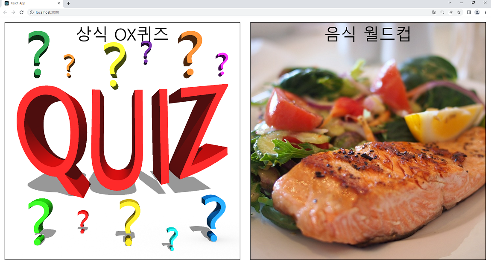
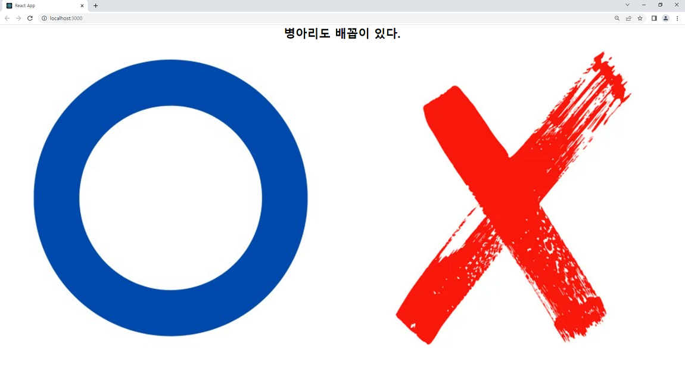
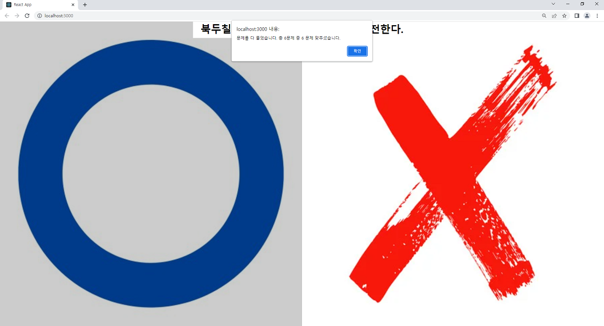
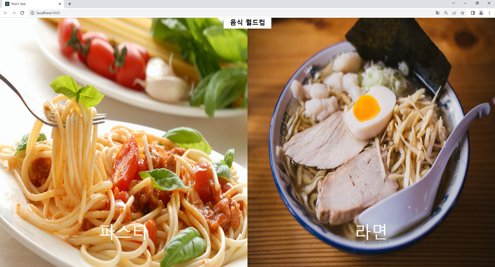
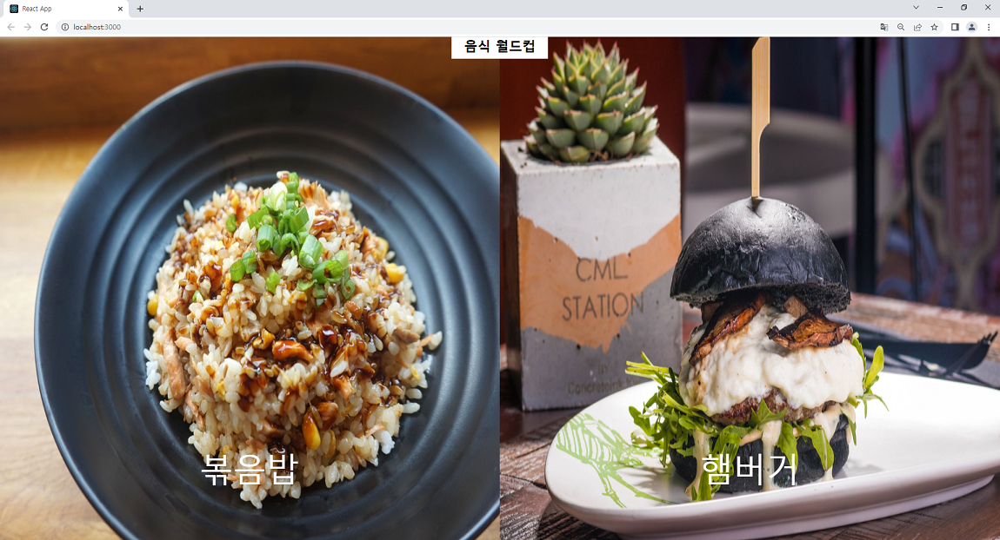
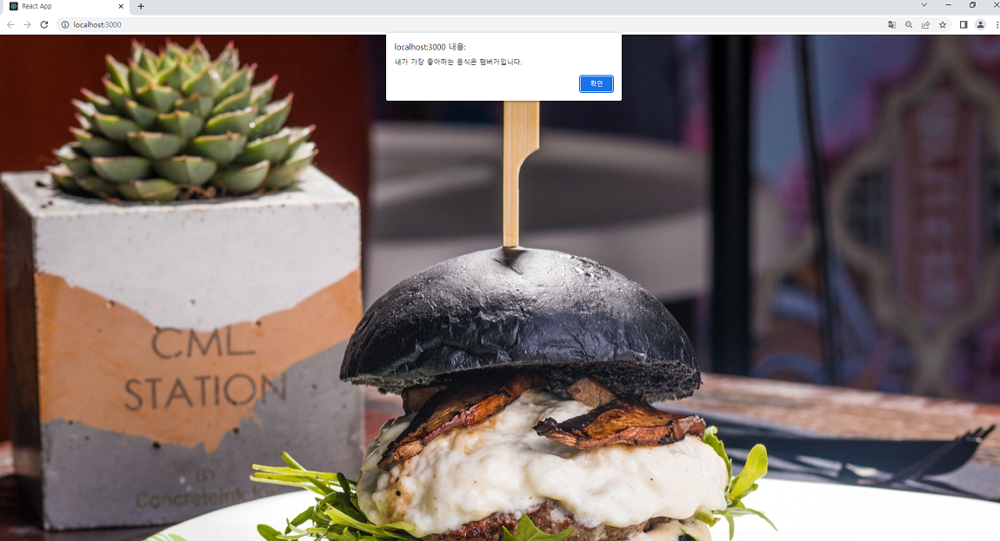

## 시작 화면

예전부터 ox 퀴즈, 이상형월드컵 같은 게임을 react로 이용하여 만들어봐야지 생각만 하다가

오늘 드디어 작업을 실천하게 되었습니다.

우선 처음 시작화면을 구현하였습니다.

게임을 둘 중의 하나 고를 수 있는 화면을 styled-components를 사용하여 구현했습니다.

### 구현 화면

왼쪽 선택시 OX퀴즈 / 오른쪽 선택시 음식 월드컵

## 

### 소스 코드 (App.js)

```javascript
import React, { useState } from 'react'
import styled, { createGlobalStyle } from 'styled-components'
import GameWorldcup from './components/Game/Game'
import GameOX from './components/Game/Game2'

const GlobalStyle = createGlobalStyle`
  * {
    margin: 0;
    padding: 0;
    box-sizing: border-box;
  }
`

const Home = styled.div`
  display: flex;
  justify-content: center;
  flex: 1;
`
// flex: 1 => flex item에 적용한 flex 속성은 flex item의 크기와 관련된 속성이며,
// 다음과 같이 flex-grow 속성과 flex-shrink 속성, flex-basis 속성을 축약한 표현이다.

const ChooseGame = styled.div`
  width: 100%;
  height: 1160px;
  border: 1px solid black;
  text-align: center;
  margin: 25px;
  font-size: 80px;
  background-image: url(${props => props.bgimg});
  background-repeat: no-repeat;
  background-position: center;
  background-size: cover;
  cursor: pointer;
`

function App() {
  const [game, setGame] = useState('')

  return (
    <>
      <GlobalStyle></GlobalStyle>
      {game === '' && (
        <Home>
          <ChooseGame
            bgimg={require('./img/quiz.png')}
            onClick={e => setGame('gameOX')}
          >
            상식 OX퀴즈
          </ChooseGame>
          <ChooseGame
            bgimg={require('./img/worldcup.jpg')}
            onClick={e => setGame('gameWorldcup')}
          >
            음식 월드컵
          </ChooseGame>
        </Home>
      )}

      {game === 'gameOX' && <GameOX></GameOX>}
      {game === 'gameWorldcup' && <GameWorldcup></GameWorldcup>}
    </>
  )
}

export default App
```

styled-components를 사용하여 글로벌 스타일을 주고

background-image 경로는 props로 받아왔습니다.

클릭시 setGame을 사용하여 각각 game값을 저장하여 해당 화면이 보이게 구현했습니다.

## OX퀴즈

OX 퀴즈는 총 6문제이며 문제를 풀 때마다 정답인지 오답인지를 알려주고

마지막에는 몇 문제를 맞혔는지 알려주고 메인 화면으로 이동하도록 구현하였습니다.

### 구현 화면

## 

## 

## 

### 소스 코드

```javascript
import React, { useState, useEffect } from 'react'
import { FlexBox } from './style'

const quiz = [
  {
    quiz: '병아리도 배꼽이 있다.',
    answer: 'O',
  },
  {
    quiz: '셰익스피어 희곡 햄릿의 주인공인 햄릿은 네덜란드 사람이다.',
    answer: 'X',
  },
  {
    quiz: '북두칠성은 시계의 반대 방향으로 회전한다.',
    answer: 'O',
  },
  {
    quiz: '열대 지방에 자라는 나무에는 나이테가 없다.',
    answer: 'O',
  },
  {
    quiz: '벼룩은 암컷과 수컷 가운데 수컷의 몸집이 더 크다.',
    answer: 'X',
  },
  {
    quiz: '세계적으로 가장 많이 발생하는 병은 말라리아 (학질) 이다.',
    answer: 'X',
  },
]

const imagePath = [
  {
    src: require('../../img/o.jpg'),
    name: 'O',
  },
  {
    src: require('../../img/x.jpg'),
    name: 'X',
  },
]

const Game = () => {
  const [displayquiz, setDisplayquiz] = useState({})
  const [displayimg, setDisplayimg] = useState([])
  const [count, setCount] = useState(0)
  useEffect(() => {
    quiz.sort(() => Math.random() - 0.5) //랜덤으로 섞어주기
    setDisplayquiz(quiz[quiz.length - 1])
    setDisplayimg([imagePath[0], imagePath[1]])
  }, [])
  //내가 선택한 정답과 display정답을 비교
  const clickHandler = async ox => {
    if (ox.name === displayquiz.answer) {
      alert('정답입니다.')
      await setCount(count + 1) //await를 사용하여 동기식으로 바꿔놔야 마지막문제 개수를 정확히 넣음
      popEnd()
    } else {
      alert('틀렸습니다.')
      popEnd()
    }
    setDisplayquiz(quizs[quizs.length - 1])
  }

  const popEnd = () => {
    quizs.pop()
    if (quizs.length === 0) {
      alert(`문제를 다 풀었습니다. 총 6문제 중 ${count} 문제 맞추셨습니다.`)
      window.location.reload()
    }
  }

  return (
    <FlexBox>
      {displayquiz && (
        <h1 className="title" style={{ fontSize: '41px' }}>
          {displayquiz.quiz}
        </h1>
      )}
      {displayimg.map(d => {
        return (
          <div className="flex-1" key={d.src} onClick={e => clickHandler(d)}>
            </img>
          </div>
        )
      })}
    </FlexBox>
  )
}

export default Game
```

quiz 배열에 문제정보와 정답 / imagePath에 OX 이미지 정보를 넣어놨습니다.

랜덤으로 섞어놓은 퀴즈 문제들을 마지막 값을 하나씩 꺼내어 displayquiz에 값을 저장합니다.

ox 이미지 클릭 시 해당 정보와 문제정답을 비교하여 진행합니다.

정답일 때만 카운터 작업을 진행합니다.

문제를 풀 때마다 quiz pop으로 제거하고 마지막 값 꺼내서 displayquiz에 저장을 반복합니다.

quiz.length가 0이면 더는 문제가 없으므로 몇 문제를 맞췄는지 알려주고

새로 고침을 실행하여 메인화면으로 다시 돌아갑니다.

## 음식 월드컵

총 4개에 음식 중 마음에 드는 음식을 골라서 우승시키는 게임입니다.

### 구현 화면

## 

## 

## 

### 소스 코드

```javascript
import React, { useState, useEffect } from 'react'
import { FlexBox } from './style'

const items = [
  {
    name: '햄버거',
    src: require('../../img/burger.jpg'),
  },
  {
    name: '볶음밥',
    src: require('../../img/fried-rice.jpg'),
  },
  {
    name: '파스타',
    src: require('../../img/pasta.jpg'),
  },
  {
    name: '라면',
    src: require('../../img/ramen.jpg'),
  },
]

const Game = () => {
  const [foods, setFoods] = useState([])
  const [display, setDisplay] = useState([])
  const [winners, setWinners] = useState([])
  useEffect(() => {
    items.sort(() => Math.random() - 0.5)
    setFoods(items)
    setDisplay([items[0], items[1]])
  }, [])

  const clickHandler = food => {
    if (foods.length <= 2) {
      if (winners.length === 0) {
        setDisplay([food])
        setTimeout(() => {
          alert(`내가 가장 좋아하는 음식은 ${food.name}입니다.`)
          window.location.reload()
        }, 1500)
      } else {
        let updateFood = [...winners, food]
        setFoods(updateFood)
        setDisplay([updateFood[0], updateFood[1]]) //승리한 음식들
        setWinners([]) //winners를 초기화
      }
    } else if (foods.length > 2) {
      setWinners([...winners, food])
      setDisplay([foods[2], foods[3]])
      setFoods(foods.slice(2))
    }
  }

  return (
    <FlexBox>
      <h1 className="title">음식 월드컵</h1>
      {display.map(d => {
        return (
          <div className="flex-1" key={d.name} onClick={e => clickHandler(d)}>
            </img>
            <div className="name">{d.name}</div>
          </div>
        )
      })}
    </FlexBox>
  )
}

export default Game
```

items 배열에 음식 이름과 이미지 경로를 넣어놨습니다.

랜덤으로 섞은 음식들을 foods에 저장하고

화면에 보이는 display에는 첫 번째, 두번째 배열에 정보를 담았습니다.

이미지 클릭 시 foods 개수가 2보다 작거나 같은 경우와 2보다 클 경우를 기준으로 나누었습니다.

2보다 클 경우는 자기가 골라서 올라간 음식을 winners에 넣어주고

display에 세 번째, 네번째 배열에 정보를 넣어줍니다.

그리고 세 번째, 네번째 배열을 자르고 foods에 넣어줍니다.

다음 음식을 골라서 2보다 작거나 같은 경우를 이제 타면 승자끼리 비교해서

최애 음식이 뽑히면 시간차를 두어 알림 문이 나오고 새로 고침을 실행하여 메인화면으로 돌아갑니다.

### 소스 코드 (style.js)

```javascript
import styled from 'styled-components'

export const FlexBox = styled.div`
  display: flex;
  flex-wrap: wrap;
  height: 100vh;
  .title {
    position: absolute;
    z-index: 2;
    top: 0;
    left: 50%;
    transform: translatex(-50%);
    background-color: white;
    padding: 0px 30px;
    padding-bottom: 10px;
  }
  .flex-1 {
    flex: 1;
    min-width: 500px;
    overflow: hidden;
    background-color: black;
    position: relative;
  }
  .image {
    width: 100%;
    height: 100%;
    transition: 0.5s;
    cursor: pointer;
  }
  .image:hover {
    transform: scale(1.1);
    opacity: 0.8;
  }

  .name {
    position: absolute;
    z-index: 3;
    color: white;
    bottom: 10%;
    font-size: 80px;
    left: 50%;
    transform: translatex(-50%);
  }
`
```
