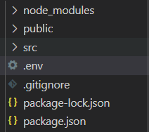

## .env

React에서 API를 활용해서 프로젝트 진행할 때

public/index.html에 스크립트 태그를 넣어주거나

src/ 폴더 하위에 API 키를 입력해줍니다.

하지만 이런 경우 보안 위험이 존재합니다.

위 문제를 React에서 해결할 수 있는 방법을 소개하겠습니다.

1. .env 파일 생성

최상위 폴더에 .env 파일 생성합니다.

## 

2. .env 파일 API KEY 입력

## React.memo

API KEY의 이름은 REACT_APP + 본인이 원하는 이름으로 해줘야합니다.

```javascript
// .env
REACT_APP_KAKAO_LOGIN_API_KEY = '해당 API KEY'
```

3. .gitignore에 .env 추가하기

Github에 본인의 코드를 관리하시는분은 .env파일이 올라가지 않도록

.gitignore에 .env 파일을 입력하시면 됩니다.

## 사용방법

### public/index.html

public/index.html에서 스크립 태그의 src 속성에

입력하는 경우에는 % 기호를 활용합니다.

%.env에 저장해놓은 변수%

### src/ ~.js, ~.jsx, ~.ts, ~.tsx

src 폴더의 js, jsx, ts, tsx 파일에서

사용하는 경우에는 process.env를 활용합니다.

```javascript
// test.js
const Test = () => {
  console.log(process.env.REACT_APP_KAKAO_LOGIN_API_KEY)
}

export default Test
```
