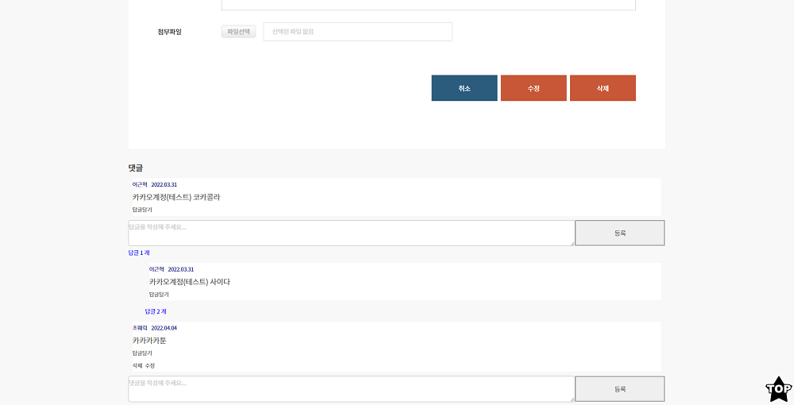
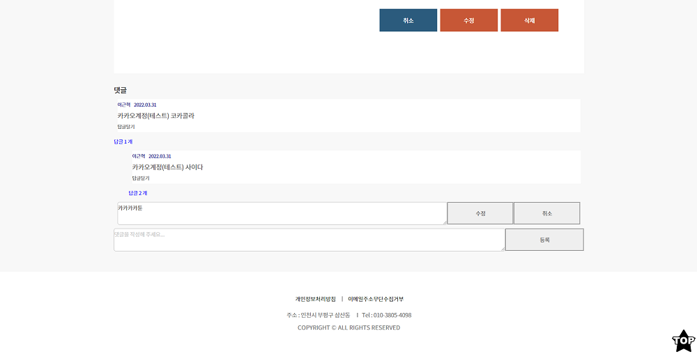

## 댓글/답글

몇일전에 유튜브 클론 강의를 보고 댓글/답글기능이 있었습니다.

그 기능을 보고 ToyProject에도 댓글/답글기능을 넣어보고싶어서

유튜브 클론 강의를 참고 하면서 비슷하게 구현하고

수정, 삭제, 날짜표시, 사용자 권한등을 더 추가해서 완성했습니다.

우선 이기능을 구현하기 위해서 3개의 컴포넌트를 만들었습니다.

아래 소스코드를 보겠습니다.

1. CommentInput.js

일단 첫번째로는 댓글 목록들을 보여주고

댓글을 입력할수있는 화면을 가지고있는 컴포넌트

```javascript
//CommentInput.js
import React, { useState, useEffect } from 'react'
import axios from 'axios'
import CommentList from './CommentList'
import ReplyComment from './ReplyComment'

const CommentInput = props => {
  const [commentValue, setComment] = useState('')
  const [list, Setlist] = useState([])
  const [refrehlist, setrefrehlist] = useState([])
  const [write, setWrite] = useState(false) //글쓰기 화면인지 일반 화면인지 비교를 위해

  const handleClick = event => {
    setComment(event.currentTarget.value)
  }

  const onSubmit = event => {
    // a태그나 Submit태그는 누르게 되면 href를 통해 이동하거나, 창이 새로고침되는데 이러한 동작을 막아줄 수 있습니다.
    event.preventDefault()
    axios
      .post('/api/comment?type=save', {
        is_Swtcode: props.swt_code,
        is_UserId: props.userid,
        is_Username: props.username,
        is_Comment: commentValue,
        is_ResponseTo: 'root', //부모 ResponseTo만 'root'저장
        is_idnum: new Date(),
      })
      .then(response => {
        try {
          setComment('')
          axios
            .get(`/api/comment?is_Swtcode=${props.swt_code}`) //댓글 리스트 조회
            .then(response => {
              try {
                setrefrehlist(response.data.json)
                axios.post('/api/Swtool?type=modifycomment', {
                  //게시판 목록에서 보이는 댓글 개수 저장
                  is_Swtcode: props.swt_code,
                  is_CommentCnt: response.data.json.length,
                })
              } catch (error) {
                alert('작업중 오류가 발생하였습니다.')
              }
            })
        } catch (error) {
          alert('작업중 오류가 발생하였습니다.')
        }
      })
  }

  useEffect(() => {
    if (
      window.location.pathname === '/View/free/register/' ||
      window.location.pathname === '/View/coding/register/'
    ) {
      setWrite(!write) //글쓰기 화면이면 true
    } else {
      axios
        .get(`/api/comment?is_Swtcode=${props.swt_code}`) //댓글 리스트 조회
        .then(response => {
          try {
            Setlist(response.data.json)
          } catch (error) {
            alert('작업중 오류가 발생하였습니다.')
          }
        })
    }
  }, [refrehlist])

  //댓글,답글 값들이 변할때마다 최신화
  const refreshFunction = newComment => {
    setrefrehlist(newComment)
  }

  return (
    <>
      {!write && (
        <div>
          <br />
          <h2>댓글</h2>
          <hr />
          {list &&
            list.map(
              (comment, index) =>
                !comment.RESPONSETO && ( //답글(RESPONSETO값이있는)은 초기화면 리스트에서 안나오게 댓글만 나오게
                  <div key={index}>
                    <CommentList
                      refreshFunction={refreshFunction}
                      comment={comment}
                      swt_code={props.swt_code}
                      userid={props.userid}
                      username={props.username}
                    />
                    <ReplyComment
                      refreshFunction={refreshFunction}
                      commentLists={list}
                      swt_code={props.swt_code}
                      parentCommentId={comment.ID_NUM}
                      userid={props.userid}
                      username={props.username}
                    />
                  </div>
                ),
            )}
          <form style={{ display: 'flex' }} onSubmit={onSubmit}>
            <textarea
              style={{ width: '100%', borderRadius: '5px' }}
              onChange={handleClick}
              value={commentValue}
              placeholder="댓글을 작성해 주세요..."
            />
            <br />
            <button
              style={{
                width: '20%',
                height: '62px',
                borderStyle: 'groove',
                cursor: 'pointer',
              }}
              onClick={onSubmit}
            >
              등록
            </button>
          </form>
        </div>
      )}
    </>
  )
}

export default React.memo(CommentInput)
```

댓글 리스트들을 map()를 이용하여 뿌려주고

댓글,답글 컴포넌트에 필요한 prop값을 넘겨줍니다.

답글은 보이지 않고 댓글만 보이는 리스트를 보여주고

ReplyComment 컴포넌트에는 부모ID값을 넣어줍니다.

CommentList 컴포넌트에는 답글을 작성할때 해당 id값을

responseto에 넣어줄겁니다.

이유는 responseto랑 부모ID가 같은경우만

해당 답글을 뿌려주기 위해서입니다.

2. CommentList.js

responseto는 아래 CommentList 소스에서 보겠습니다

소스가 길어서 아래에서 간략하게 설명하겠습니다.

```javascript
//CommentList.js
import React, { useState, useEffect } from 'react'
import axios from 'axios'
import Swal from 'sweetalert2'

const CommentList = props => {
  const [OpenReply, setOpenReply] = useState(false) //답글달기 bool
  const [commentValue, setCommentvaule] = useState('') //답글달기 값
  const [commentmodifyValue, setcommentmodifyValue] = useState(
    props.comment.COMMENTTEXT, //답글 수정시 값
  )
  const [MyselfCheck, setMyselfCheck] = useState(false) // 삭제,수정 유저 권한 bool
  const [ModiftyCheck, setModiftyCheck] = useState(true) //댓글 수정 전,후 화면 bool

  const onClickReplyOpen = () => {
    setOpenReply(!OpenReply)
  }

  const onHandleChange = event => {
    setCommentvaule(event.currentTarget.value)
  }

  const onHandlemodifyChange = event => {
    setcommentmodifyValue(event.currentTarget.value)
  }

  const actions = [
    <span onClick={onClickReplyOpen} key="comment-basic-reply-to">
      답글달기
    </span>,
  ]

  //답글 저장
  const onSubmit = event => {
    event.preventDefault()

    axios
      .post('/api/comment?type=save', {
        is_Swtcode: props.swt_code,
        is_UserId: props.userid,
        is_Username: props.username,
        is_Comment: commentValue,
        is_ResponseTo: props.comment.ID_NUM, //부모 댓글에서 고유ID값을 가져옴
        is_idnum: new Date(),
      })
      .then(response => {
        try {
          setCommentvaule('')
          setOpenReply(false)
          axios
            .get(`/api/comment?is_Swtcode=${props.swt_code}`) //댓글 리스트 조회
            .then(response => {
              try {
                props.refreshFunction(response.data.json)
                axios.post('/api/Swtool?type=modifycomment', {
                  //게시판 목록에서 댓글 몇개인지....
                  is_Swtcode: props.swt_code,
                  is_CommentCnt: response.data.json.length,
                })
              } catch (error) {
                alert('작업중 오류가 발생하였습니다.')
              }
            })
        } catch (error) {
          alert('작업중 오류가 발생하였습니다.')
        }
      })
  }

  //댓글 수정
  const onModify = (event, type) => {
    if (type === 'cancel') {
      setModiftyCheck(!ModiftyCheck)
      setMyselfCheck(true)
      setcommentmodifyValue(props.comment.COMMENTTEXT)
    } else {
      event.preventDefault()
      axios
        .post('/api/comment?type=modify', {
          is_Swtcode: props.swt_code,
          is_idnum: props.comment.ID_NUM,
          is_UserId: props.comment.USERID,
          is_Comment: commentmodifyValue,
        })
        .then(response => {
          try {
            axios
              .get(`/api/comment?is_Swtcode=${props.swt_code}`) //댓글 리스트 조회
              .then(response => {
                try {
                  props.refreshFunction(response.data.json)
                  setModiftyCheck(!ModiftyCheck)
                  setMyselfCheck(true)
                } catch (error) {
                  alert('작업중 오류가 발생하였습니다.')
                }
              })
          } catch (error) {
            alert('작업중 오류가 발생하였습니다.')
          }
        })
    }
  }

  useEffect(() => {
    //댓글 주인
    if (String(props.userid) === props.comment.USERID) {
      setMyselfCheck(!MyselfCheck)
    } else if (props.userid === 'root@naver.com') {
      //관리자
      setMyselfCheck(!MyselfCheck)
    } else {
      //다른 사람
      setMyselfCheck(false)
    }
  }, [props.userid])

  //댓글 삭제
  const commentdelete = () => {
    let datalength
    deletealert('해당 댓글을 삭제하시겠습니까?', function () {
      axios
        .post('/api/comment?type=delete', {
          is_Swtcode: props.swt_code,
          is_Idnum: props.comment.ID_NUM,
        })
        .then(res => {
          axios
            .get(`/api/comment?is_Swtcode=${props.swt_code}`) //댓글 리스트 조회
            .then(response => {
              try {
                props.refreshFunction(response.data.json)
                response.data.json.length === 0
                  ? (datalength = null)
                  : (datalength = response.data.json.length)
                axios.post('/api/Swtool?type=modifycomment', {
                  //게시판 목록에서 댓글 몇개인지....
                  is_Swtcode: props.swt_code,
                  is_CommentCnt: datalength,
                })
              } catch (error) {
                alert('작업중 오류가 발생하였습니다.')
              }
            })
        })
    })
  }

  const deletealert = (title, callbackFunc) => {
    Swal.fire({
      title: title,
      //position : 'center', //생략가능
      icon: 'question',
      showCancelButton: true,
      //showConfirmButton : true, //생략가능
      confirmButtonColor: '#4B088A',
      cancelButtonColor: '01DF01',
      confirmButtonText: '예',
      cancelButtonText: '아니요',
    }).then(result => {
      if (result.value) {
        Swal.fire('Deleted!', '삭제되었습니다.', 'success')
      } else {
        return false
      }
      callbackFunc()
    })
  }

  //댓글 수정
  const commentmodify = () => {
    setModiftyCheck(!ModiftyCheck)
    setMyselfCheck(false)
  }

  const year = props.comment.REG_DATE.substr(0, 4)
  const month = props.comment.REG_DATE.substr(4, 2)
  const day = props.comment.REG_DATE.substr(6, 2)
  const reg_date = year + '.' + month + '.' + day
  return (
    <div>
      <ul className="commentwrapper">
        {ModiftyCheck && (
          <>
            <li className="commentuser">
              {props.comment.USERNAME}&nbsp;&nbsp;&nbsp;&nbsp;{reg_date}
            </li>
            <li className="commenttext">{props.comment.COMMENTTEXT}</li>
            <li className="commentreply">{actions}</li>
          </>
        )}
        {!ModiftyCheck && (
          <form style={{ display: 'flex' }} onSubmit={onModify}>
            <textarea
              style={{ width: '100%', borderRadius: '5px' }}
              onChange={onHandlemodifyChange}
              value={commentmodifyValue}
            />
            <br />
            <button
              style={{
                width: '20%',
                height: '62px',
                borderStyle: 'groove',
                cursor: 'pointer',
              }}
              onClick={e => onModify(e, 'modify')}
            >
              수정
            </button>
            <button
              style={{
                width: '20%',
                height: '62px',
                borderStyle: 'groove',
                cursor: 'pointer',
              }}
              onClick={e => onModify(e, 'cancel')}
            >
              취소
            </button>
          </form>
        )}
        {MyselfCheck && (
          <>
            <li className="commentdelete" onClick={commentdelete}>
              삭제
            </li>
            <li className="commentmodify" onClick={commentmodify}>
              수정
            </li>
          </>
        )}
      </ul>

      {OpenReply && (
        <form style={{ display: 'flex' }} onSubmit={onSubmit}>
          <textarea
            style={{ width: '100%', borderRadius: '5px' }}
            onChange={onHandleChange}
            value={commentValue}
            placeholder="답글을 작성해 주세요..."
          />
          <br />
          <button
            style={{
              width: '20%',
              height: '62px',
              borderStyle: 'groove',
              cursor: 'pointer',
            }}
            onClick={onSubmit}
          >
            등록
          </button>
        </form>
      )}
    </div>
  )
}

export default React.memo(CommentList)
```

CommentList에서는 답글을 작성할수있습니다.

onSubmit 저장 코드에서 is_ResponseTo: props.comment.ID_NUM 값을 DB에 저장해서

부모 ID_NUM과 자식 is_ResponseTo를 비교해서 답글을 나타내는겁니다.

그리고 MyselfCheck bool여부로 사용자 권한에 따라서

수정/삭제 여부를 표현했습니다.

ModiftyCheck bool여부로 일반 댓글/답글 화면과 수정화면을 분리하였습니다.

수정/삭제시 props.refreshFunction(response.data.json)

prop에서 가져온 함수를 이용하여 댓글목록을 최신화 시켰습니다.

3. ReplyComment.js

이제 마지막 소스는 댓글에 달린 답글을 누르면 해당 답글들을 뿌려주는 컴포넌트입니다.

```javascript
//ReplyComment.js
import React, { useEffect, useState } from 'react'
import CommentList from './CommentList'

const ReplyComment = props => {
  const [ChildCommentNum, setChildCommentNum] = useState(0) //답글 개수
  const [OpenReplyComments, setOpenReplyComments] = useState(false) //답글open

  useEffect(() => {
    let commentNumber = 0 //답글 개수 초기값 0

    props.commentLists.map(comment => {
      if (comment.RESPONSETO === props.parentCommentId) commentNumber++
    })

    setChildCommentNum(commentNumber)
  }, [props.commentLists])

  const renderReplyComment = parentCommentId =>
    props.commentLists.map((comment, index) => (
      <>
        {comment.RESPONSETO === parentCommentId && ( //자식ID랑 부모ID가 같은경우만 답글 뿌려주기 / 답글도 댓글 처럼 똑같이 계속 반복(답글에 답글달기)
          <div key={index} style={{ width: '97%', marginLeft: '40px' }}>
            <CommentList
              refreshFunction={props.refreshFunction}
              comment={comment}
              swt_code={props.swt_code}
              userid={props.userid}
              username={props.username}
            />
            <ReplyComment
              refreshFunction={props.refreshFunction}
              commentLists={props.commentLists}
              swt_code={props.swt_code}
              parentCommentId={comment.ID_NUM}
              userid={props.userid}
              username={props.username}
            />
          </div>
        )}
      </>
    ))

  const onHandleChange = () => {
    setOpenReplyComments(!OpenReplyComments)
  }

  return (
    <div>
      {ChildCommentNum > 0 && (
        <p
          style={{
            fontSize: '14px',
            margin: 0,
            color: 'blue',
            cursor: 'pointer',
          }}
          onClick={onHandleChange}
        >
          답글 {ChildCommentNum} 개
        </p>
      )}
      {OpenReplyComments && renderReplyComment(props.parentCommentId)}
    </div>
  )
}

export default React.memo(ReplyComment)
```

댓글에 답글 갯수를 보여주고 클릭하면 답글을 보여주는 컴포넌트입니다.

CommentInput에서 받아서 props를 이용하여

답글에 responseto값과 부모 댓글 id값이 같은경우 답글 갯수도 세고

답글 갯수를 누르면 해당 로직을 타서 답글들을 뿌려주는겁니다.

답글은 차이를 주기위해 style를 보면 좀더 오른쪽으로 빠집니다.

댓글/답글 기능을 완료했습니다.

react로 댓글을 구현하는것은 처음이라서 저한테는 좋은 경험이 됐습니다.

## 

## 
