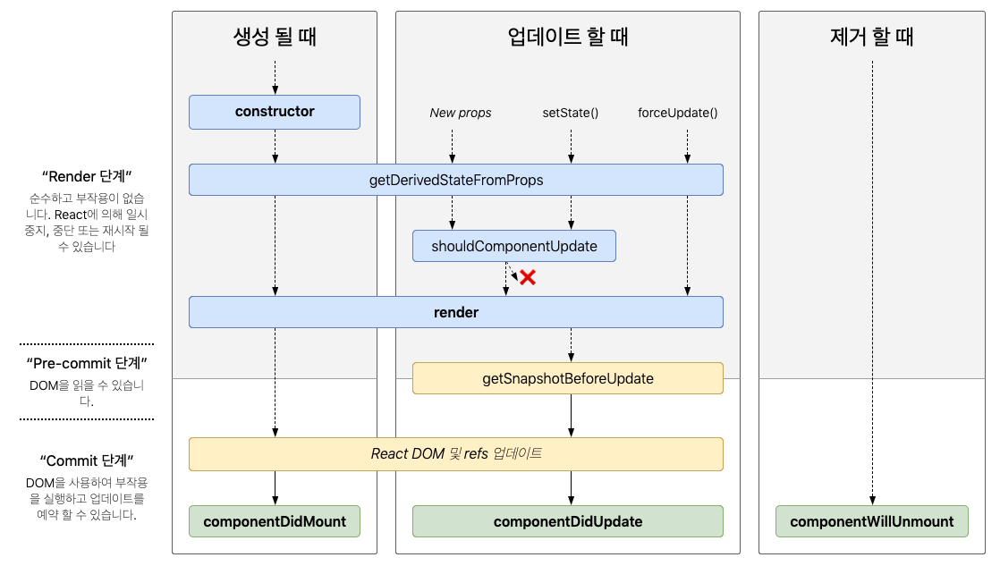

# React Component

React의 Component 선언 방식은 두 가지로 나뉜다.첫번째는 클래스형 컴포넌트, 두번째는 함수형 컴포넌트이다.

현재 많은 사람들이 함수형 컴포넌트로 개발을 진행하지만 기존에 클래스형 컴포넌트를 개발중이던 곳도

많을 수 있기 때문에 그 프로젝트의 유지보수를 위해서라도 클래스형 컴포넌트에 대한 개념을 알고 있으면

많은 도움이 될 것이다.

# 선언 방식의 차이점

클래스형 컴포넌트와 함수형 컴포넌트는 선언 방식이 다르다.

### 클래스형 컴포넌트

```javascript
import React, { Component } from 'react'

class App extends Component {
  render() {
    const text = 'Hi Hyeok'
    return <div className="react">{text}</div>
  }
}

export default App
```

우선 클래스형 컴포넌트는 class 키워드가 필요하며,Component를 상속받아야 합니다.

또한 화면에 표시하기위한 render()메서드가 필요합니다.

### 함수형 컴포넌트

```javascript
import React from 'react'

class App = () => {
    const text = 'Hi Hyeok'
    return <div className="react">{text}</div>
}

export default App
```

클래스형 컴포넌트와 비교해서 훨씬 간결하게 코드를 작성할 수 있습니다.

함수 자체가 render 함수이기 때문에 render메서드를 사용하지 않고,Component를 상속받지 않아도 됩니다.

# State 사용 차이

### 클래스형 컴포넌트

constructor안에서 this.state를 통해 초기 값을 설정합니다.

클래스형 컴포넌트의 state는 객체 형식입니다.

```javascript
constructor(props){
  super(props);

  this.state={
    name: 'hyeok',
    num: 10
  };
}
```

this.setState함수로 state의 값을 변경할 수 있습니다.

```javascript
onClick={() => {
  this.setState({num: num + 1 });
}}
```

### 함수형 컴포넌트

함수형 컴포넌트에서는 useState로 state를 핸들링합니다.

useState의 파라미터는 state의 초기값입니다.

```javascript
  const App = () => {
    const [age, setAge] = useState(20);

    const onButtonClick = {() => {
      setAge(age+1)
    }}
  }
```

# Props 사용 차이

props는 컴포넌트의 속성을 설정할 떄 사용하는 요소입니다.

읽기 전용이며 컴포넌트 자체의 props를 수정해서는 안됩니다.

수정되는 것은 state만 수정되어야 합니다.

### 클래스형 컴포넌트

this.props로 불러옵니다.

```javascript
class App extends Component {
  render() {
    const { name, age } = this.props
    return (
      <div>
        안녕하세요. 제 이름은 {name}이고, {age}살입니다.
      </div>
    )
  }
}
```

### 함수형 컴포넌트

렌더 함수의 파라미터로 props를 전달받아 사용합니다.

```javascript
const App = ({ name, age }) => {
  return (
    <div>
      안녕하세요. 제 이름은 {name}이고, {age}살입니다.
    </div>
  )
}
```

# LifeCycle 차이

모든 React 컴포넌트에는 라이프사이클이 존재합니다.

컴포넌트는 생성(mount) => 업데이트(update) => 제거(unmount)의 생명주기를 갖습니다.

적절한 생명주기에 어떤 작업을 처리해야 하는지 지정해줘야 불필요한 업데이트를 방지할 수 있습니다.

클래스형 컴포넌트에서는 LifeCycle API를 사용하며, 함수형 컴포넌트에서는 Hook을 사용합니다.

### 클래스형 컴포넌트

LifeCtcle API는 클래스형 컴포넌트에서 활용되는 것으로 컴포넌트가 DOM 위에 생성되기 전과 후의 데이터가

변경되어, 상태를 업데이트하기 전과 후로 실행되는 메서드들입니다.

## 

### 함수형 컴포넌트

React Hook은 함수형 컴포넌트에서 React state와 생명주기 기능을 연동할 수 있게 해주는 함수들입니다.

클래스형 컴포넌트에서는 동작하지 않으며, class없이 React를 사용할 수 있게 해줍니다.

# 이벤트 핸들링

### 클래스형 컴포넌트

함수 선언 시 화살표 함수로 바로 선언이 가능하며, 적용하기 위해선 this를 붙여야 합니다.

```javascript
buttonClick = (e) => {...}

render() {
  return(
    <>
      <input type='button' onClick={this.buttonClick}>버튼</input>
    </>
  )
}
```

### 함수형 컴포넌트

this가 필요없다.

```javascript
cosnt buttonClick = () => {...}

  return(
    <>
      <input type='button' onClick={buttonClick}>버튼</input>
    </>
  )
```
