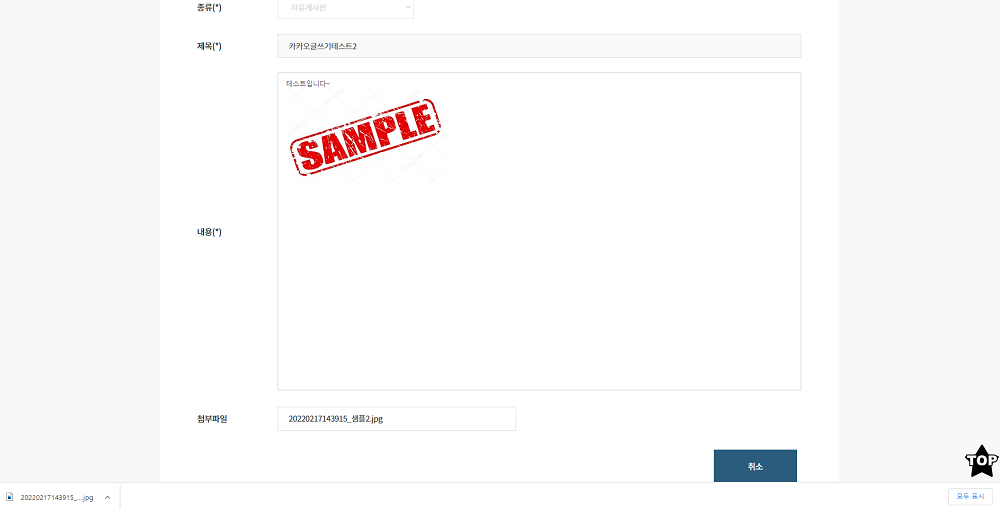

## 다운로드

ToyProject를 진행하는 중에 게시판 글에 다운로드 기능이 필요하여서

게시판 글에 첨부파일을 다운로드하는 기능을 구현했습니다.

아래에서 보여주는 소스는 ToyProject에 다운로드 기능과

관련된 일부 코드 부분만을 추출하거나 수정해서 가져온겁니다.

```javascript
//View.js
import axios from 'axios'

filedown = () => {
  if (filename === '') {
    return
  } else {
    axios
      .post(
        '/api/download?type=' + filename,
        {}, //data 자리
        {
          headers: {
            'Content-Type': 'application/json',
          },
          responseType: 'blob', //이거중요함 (안하면 txt뺴고는 이미지,기타등등 다운로드 후 안읽어짐)
        },
      )
      .then(response => {
        //파일 데이터와 내용 유형을 인수로 전달하는 Blob 생성자사용
        const blob = new Blob([response.data], {
          type: response.headers['content-type'],
        })
        const url = window.URL.createObjectURL(blob) //URL.createObject를 사용하여 Blob에서 URL 개체가 생성
        const link = document.createElement('a')
        link.href = url //Blob의 콘텐츠에 액세스한 url를 link href에 넣어줌
        link.setAttribute('download', filename) //링크의 다운로드 특성이 원하는 파일 이름으로 설정
        link.style.cssText = 'display:none'
        document.body.appendChild(link)
        link.click()
        link.remove()
        window.URL.revokeObjectURL(url) // 생성된 URL 개체는 URL.revokeObjectURL를 사용하여 해지(메모리 확보)
      })
      .catch(error => {
        alert('작업중 오류가 발생하였습니다.')
        return false
      })
  }
}
```

처음에 이미지 파일 다운로드 후 이미지가 안보여서 당황했었는데

responseType: 'blob' 이걸 넣지 않아서 발생하는 문제였습니다.

이거 때문에 애를 먹었던 기억이 납니다.

아래는 서버쪽(node.js) 다운로드 전체 코드입니다.

다운로드 관련 node.js 정보들은 금방 얻을 수 있고 이해할 수 있었습니다.

```javascript
//DownloadRout.js
const express = require('express')
const router = express.Router()
const fs = require('fs')
const path = require('path')
const mime = require('mime')

const getDownloadFilename =
  require('./library/getDownloadFilename').getDownloadFilename //한글도 다운받을수있게 처리

router.post('/', (req, res, next) => {
  const upload_folder = '/ReactPratice/uploads/swmanual/' //서버용 '/home/ubuntu/reactpratice/uploads/swmanual/'
  const file = upload_folder + req.query.type // ex) /upload/files/sample.txt

  try {
    if (fs.existsSync(file)) {
      // 파일이 존재하는지 체크
      const filename = path.basename(file) // 파일 경로에서 파일명(확장자포함)만 추출
      const mimetype = mime.getType(file) // 파일의 타입(형식)을 가져옴

      res.setHeader(
        'Content-disposition',
        'attachment; filename=' + getDownloadFilename(req, filename),
      ) // 다운받아질 파일명 설정
      res.setHeader('Content-type', mimetype) // 파일 형식 지정

      const filestream = fs.createReadStream(file)
      filestream.pipe(res)
    } else {
      res.send('해당 파일이 없습니다.')
      return
    }
  } catch (e) {
    // 에러 발생시
    console.log(e)
    res.send('파일을 다운로드하는 중에 에러가 발생하였습니다.')
    return
  }
})

module.exports = router
```

## 
