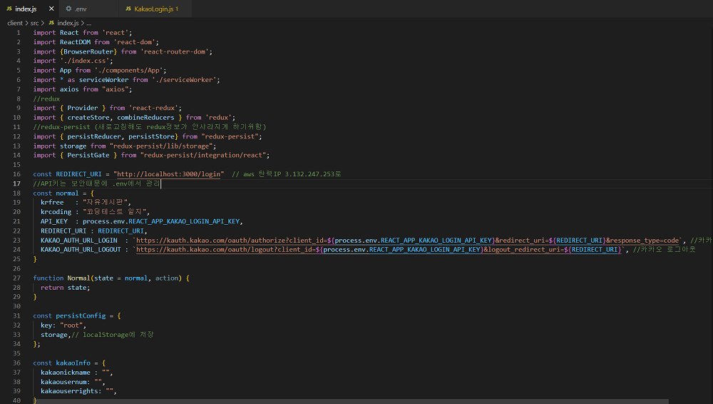
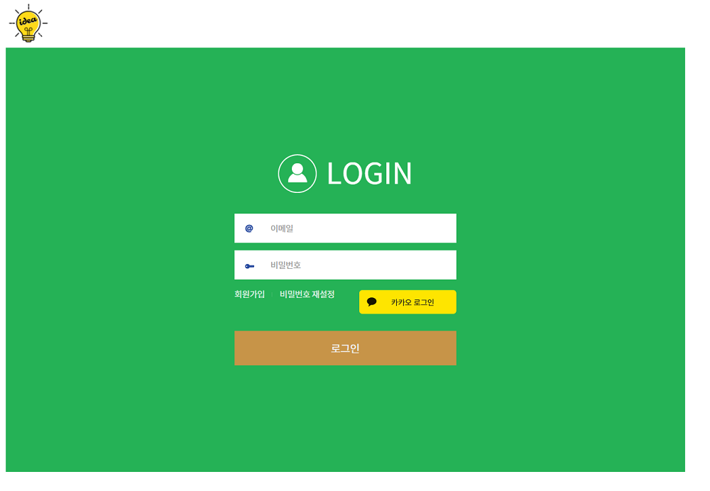
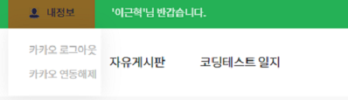
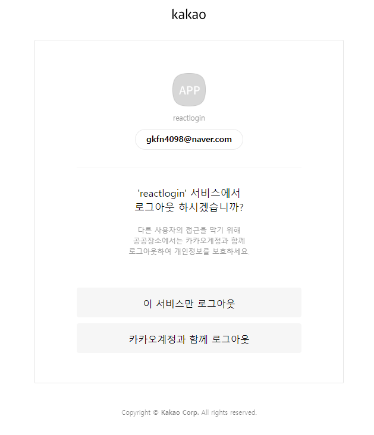

## 카카오 로그인

ToyProject를 진행하는 중에 카카로 로그인 기능을 넣어보고 싶어서 시작했습니다.

REST API키를 사용하여 구현했습니다.

일반로그인에서 가능한 권한들을 카카로로그인도 가능하게 만들었습니다.

우선 시작하기전 index.html 스크립트 부분에 아래 코드를 넣어줍니다.

```javascript
<script src="https://developers.kakao.com/sdk/js/kakao.js"></script>
```

카카오 API를 사용하기 위한 정보들은 Redux를 사용해서 관리하였습니다.

아래는 Redux 관련 일부 소스 사진입니다.

## 

카카오 로그인 기능

```javascript
//KakaoLogin.js
import React, { useEffect } from 'react'
import { useHistory } from 'react-router'
import axios from 'axios'
import { useDispatch, useSelector } from 'react-redux'
import Swal from 'sweetalert2'
import qs from 'qs'

const { Kakao } = window

const KakaoLogin = () => {
  const history = useHistory()
  const dispatch = useDispatch()
  const KaKaoStore = useSelector(state => state.normal)
  useEffect(() => {
    const code = new URL(window.location.href).searchParams.get('code') //인가코드 가져오기
    //인가코드 값이 있을경우만 디비정보저장
    if (code !== '' && code !== null) {
      callKaKaoLoginApi(code)
    }
  }, [])

  const callKaKaoLoginApi = async code => {
    Kakao.init(KaKaoStore.API_KEY) //발급받은 키 중 REST API키를 사용해준다.
    const tokendata = qs.stringify({
      grant_type: 'authorization_code',
      client_id: KaKaoStore.API_KEY,
      redirect_uri: KaKaoStore.REDIRECT_URI,
      code: code,
    })
    try {
      const res = await axios.post(
        'https://kauth.kakao.com/oauth/token',
        tokendata,
      )
      Kakao.Auth.setAccessToken(res.data.access_token) //Access Token 저장
      try {
        let data = await Kakao.API.request({
          url: '/v2/user/me',
        })
        //로그인 후 가지고있는 Access Token은 만료기간이 짧음
        //카카오 연동 후 각각 고유 ID값이 생겼음 그걸 DB에저장해서 로그인 처리
        //디비회원번호값과 세션에 카카오회원번호값을 비교해서 같으면 로그인성공으로 이동
        const response = await axios.post('/api/LoginForm?type=kakaosignin', {
          is_kakaousernum: data.id,
        })
        if (response.data.json[0] === undefined) {
          //디비에 값이 없으면 정보저장
          KakaoProfile()
        } else {
          dispatch({
            type: 'kakaoinfosave', //카카오 현재 유저정보 Redux 저장
            kakaoinfosave: {
              kakaonickname: response.data.json[0].KAKAO_NICKNAME,
              kakaousernum: response.data.json[0].KAKAO_USER_NUM,
              kakaouserrights: response.data.json[0].USERRIGHTS,
            },
          })
          if (data.id === response.data.json[0].KAKAO_USER_NUM) {
            history.push('/List/free') //로그인 성공
          } else {
            sweetalert('로그인 실패.', '', 'error', '닫기')
          }
        }
      } catch (error) {
        console.log(error)
      }
    } catch (error) {
      console.log(error)
    }
  }

  //카카오 회원정보 가져오기 및 로그인 정보 DB에 저장함수
  const KakaoProfile = async () => {
    try {
      let data = await Kakao.API.request({
        url: '/v2/user/me',
      })
      axios
        .post('/api/LoginForm?type=kakaosignup', {
          //카카오 로그인 정보 DB 삽입
          is_kakaousernum: data.id,
          is_Nickname: data.properties.nickname,
        })
        .then(res => {
          const body = res.data
          if (body === 'succ') {
            dispatch({
              type: 'kakaoinfosave', //카카오 현재 유저정보 Redux 저장
              kakaoinfosave: {
                kakaonickname: data.properties.nickname,
                kakaousernum: data.id,
                kakaouserrights: 'guest',
              },
            })
            history.push('/List/free') //로그인 성공
          } else {
            sweetalert('작업중 오류가 발생하였습니다.', body, 'info', '닫기')
          }
        })
        .catch(error => {
          console.log(error)
        })
    } catch (error) {
      console.log(error)
    }
  }

  const sweetalert = (title, contents, icon, confirmButtonText) => {
    Swal.fire({
      title: title,
      text: contents,
      icon: icon,
      confirmButtonText: confirmButtonText,
    })
  }

  return (
    <>
      <a style={{ float: 'right' }} href={KaKaoStore.KAKAO_AUTH_URL_LOGIN}>
        
      </a>
    </>
  )
}

export default React.memo(KakaoLogin)
```

## 

## 

카카오 로그아웃 기능 / 연동해제(회원탈퇴) 기능

```javascript
//Header admin.js

import { useDispatch, useSelector } from 'react-redux'
import { persistor } from '../../index'

const { Kakao } = window
const Header = props => {
  //카카오 연동 연결해제
  const Kakaodisconnect = async () => {
    await persistor.purge() //저장소에 넣어둔 redux정보들 초기화
    await Kakao.API.request({
      url: '/v1/user/unlink',
      success: function (response) {
        console.log(response)
      },
      fail: function (error) {
        alert(
          '카카오 회원탈퇴 처리가 실패하였습니다. \n관리자에게 문의하시기 바랍니다.',
        )
        console.log(error)
      },
    })
    //회원정보 디비도 삭제 해야함
    axios
      .post('/api/LoginForm?type=kakaodisconnect', {
        is_kakaousernum: props.usernum,
      })
      .then(res => {
        const body = res.data
        if (body === 'succ') {
          sweetalert('카카오 회원탈퇴를 완료하였습니다.', '', 'info', '닫기')
          window.location.href = '/login'
        }
      })
      .catch(error => {
        sweetalert('작업중 오류가 발생하였습니다.', error, 'err', '닫기')
      })
  }

  //카카오 로그아웃
  const KakaoInfoLogout = async () => {
    await persistor.purge() //저장소에 넣어둔 redux정보들 초기화
  }

  return (
    <ul className="hd_left af">
      <li
        className="my1"
        onMouseEnter={() => setHover(true)}
        onMouseLeave={() => setHover(false)}
      >
        <b>내정보</b>
        {hover ? (
          <div className="box0 box1">
            {cookie_userid ? (
              <ul>
                <li className="logout">
                  <Link to="/#" onClick={logout}>
                    로그아웃
                  </Link>
                </li>
                <li className="Usermodify">
                  <Link to={'/Usermodify'}>정보 수정/탈퇴</Link>
                </li>
              </ul>
            ) : (
              <ul>
                <li className="Kakaologout">
                  <a
                    href={KaKaoStore.KAKAO_AUTH_URL_LOGOUT}
                    onClick={KakaoInfoLogout}
                  >
                    카카오 로그아웃
                  </a>
                </li>
                <li className="Kakaodisconnect">
                  <a onClick={Kakaodisconnect}>카카오 연동해제</a>
                </li>
              </ul>
            )}
          </div>
        ) : null}
      </li>
    </ul>
  )
}
```

## 

로그아웃은 카카오계정과 함께 로그아웃 기능을 사용했습니다.

카카오 계정과 함께 로그아웃은 Logout Redirect URI 등록 후 REST API로 요청할 수 있습니다.

## 

사용자가 서비스만 로그아웃을 선택했다면 즉시 앱 정보에

등록된 Logout Redirect URI로 리다이렉트됩니다.

사용자가 카카오 계정과 함께 로그아웃을 선택했다면 카카오 계정 세션이 존재할 경우,

카카오 계정 세션을 만료시킨 후 앱 정보에 등록된 Logout Redirect URI로 리다이렉트됩니다.

카카오 계정 세션이 존재하지 않을 경우,

즉시 앱 정보에 등록된 Logout Redirect URI로 리다이렉트됩니다.

이 서비스만 로그아웃 시 다시 로그인하면 id, PW 입력 없이 바로 로그인 가능하며

카카오 계정과 함께 로그아웃은 처음부터 다시 id, PW 입력 후 로그인 가능합니다.

연결 끊기는 앱과 사용자 카카오 계정의 연결을 끊는 기능입니다.

연결 끊기 요청에 성공하면 해당 사용자 회원 번호를 응답으로 받을 수 있습니다.

저는 props로 받은 값이 있어서 그냥 props.usernum값을 이용하여

카카오 회원 정보를 저장한 DB를 삭제했습니다.

token들은 자동으로 만료가 됩니다.
