# React Native란?

React의 문법으로 ( javascript 기반 ), android, ios의 앱을 만드는 프로그램

javascript로 작성된 코드들을, android 와 ios에 맞춰 바꾸어준다. ( 크로스플랫폼 )

# 교육환경

React Native를 하려면 셋팅이 조금 복잡하기때문에 (Java,Android,Xcode..등등)

Expo를 이용하여 학습하였습니다.

저는 Expo를 저의 핸드폰을 직접 연결해서 하지않고 snack.expo.dev를 이용하여

웹에서 iOS디바이스 환경을 이용하였습니다.

snack.expo.dev는 console.log사용도 가능해서 좋았습니다.

단점을 뽑자면 자신의 디바이스가 아니면 사용자가 많으면 실행시 대기번호가 있으며

일정시간 클릭을 안하면 종료되는점만 빼면 편했습니다.

# Code Challenge

저는 우선 React Native가 무엇인지 기초를 배우고싶어서

유튜버 노마드코더님에 기초(왕초보를 위한 React Native 101)강의를 수강완료 하였습니다.

기초과정은 무료이고 심화는 유료입니다.

강의 링크: https://nomadcoders.co/react-native-for-beginners/lobby

강의를 끝으로 몇가지 Code Challenge 과제를 내주셔서

복습할겸 과제를 완료하며 React Native에 기본을 학습했습니다.

# Code Challenge 과제1

Travel을 클릭하고 앱을 껐다키면 기본값은 Work로 있습니다.

Travel을 클릭하고 앱을 껐다키면 기본값이 클릭한걸로 남아있게하는 작업을 구현하시오.

## 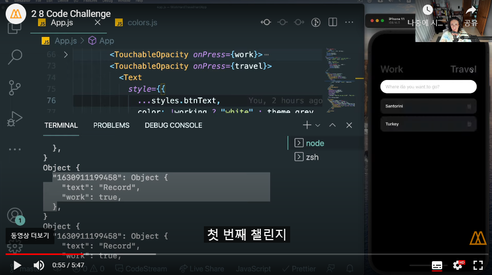

## 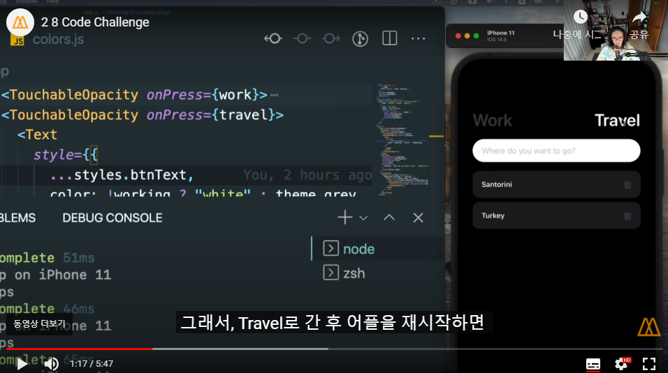

## 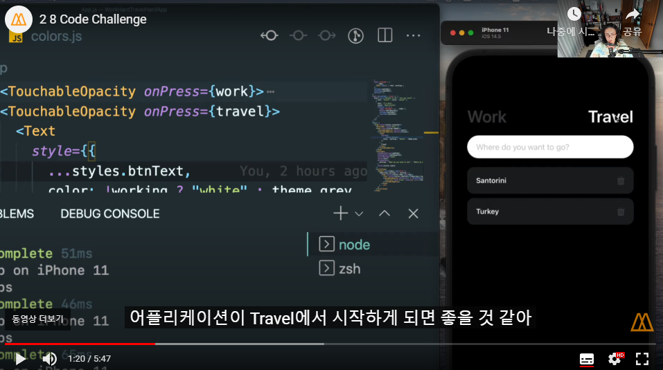

코드는 해당기능과 관련된 부분만 가져오겠습니다.

클릭한 부분에 bool값을 저장소에 저장해서 켰을때 값을 다시 불러오면됩니다.

```javascript
import React, { useState, useEffect } from 'react'
import { Text, StyleSheet, TouchableOpacity, Alert } from 'react-native'
import AsyncStorage from '@react-native-async-storage/async-storage'

const WORK_KEY = '@work'

export default function App() {
  const [working, setWorking] = useState(true)

  const travel = async () => {
    setWorking(false)
    await AsyncStorage.setItem(WORK_KEY, 'false') //AsyncStorage에 저장
  }

  const work = async () => {
    setWorking(true)
    await AsyncStorage.setItem(WORK_KEY, 'true') //AsyncStorage에 저장
  }

  const lodeToDos = async () => {
    try {
      const w = await AsyncStorage.getItem(WORK_KEY) // 저장 값을 불러옴
      if (w !== null) {
        setWorking(JSON.parse(w)) //문자열을 true로 변환한걸 setWorking
      }
    } catch (error) {
      Alert.alert('list error')
    }
  }
  useEffect(() => {
    lodeToDos()
  }, [])

  return (
    <TouchableOpacity onPress={work}>
      <Text style={{...styles.btnText, color: working ? "white" : theme.gray}}>Work</Text>
    </TouchableOpacity>
    <TouchableOpacity onPress={travel}>
      <Text style={{...styles.btnText, color: working ? theme.gray : "white"}}>Travel</Text>
    </TouchableOpacity>
  )
}

const styles = StyleSheet.create({
  btnText: {
    fontSize: 38,
    fontWeight: '600',
  },
});
```

코드 첼린지 완료 전체 소스 코드: https://snack.expo.dev/kM2BvKDZl?platform=ios

iOS환경에서 실행 후 R키를 누르면 앱을 껐다킵니다.

# Code Challenge 과제2

Todolist 완료 기능 만들기

추가) 완료 리스트는 삭제만 가능하게

## 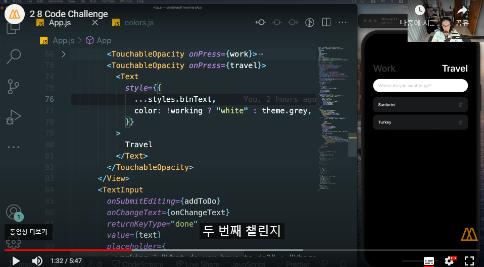

## 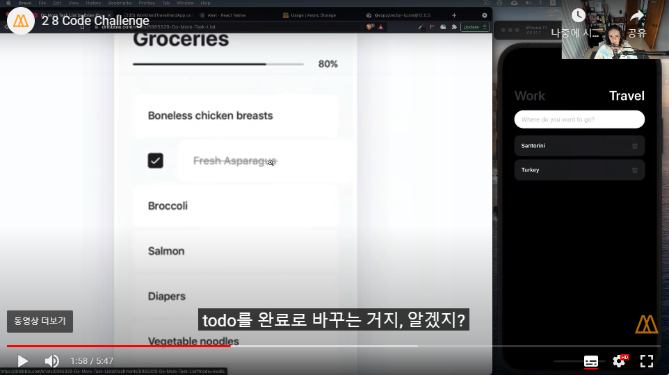

코드는 해당기능과 관련된 부분만 가져오겠습니다.

### App.js

```javascript
import React, { useState, useEffect } from 'react'
import {
  View,
  Text,
  StyleSheet,
  TouchableOpacity,
  TextInput,
  ScrollView,
  Alert,
} from 'react-native'
import AsyncStorage from '@react-native-async-storage/async-storage'
import Update from './update'

const STORAGE_KEY = '@toDos'

export default function App() {
  const [toDos, setToDos] = useState({})

  const saveToDos = async toSave => {
    await AsyncStorage.setItem(STORAGE_KEY, JSON.stringify(toSave)) //AsyncStorage에도 바뀐값 넣어줌
  }

  const completTodo = (key, complet) => {
    if (complet === false) {
      Alert.alert('할일을 완료하였습니까?', '확실합니까?', [
        { text: '취소' },
        {
          text: '확인',
          onPress: async () => {
            const newTodos = { ...toDos }
            newTodos[key].complet = true // 리스트 생성시 complet기본값은 false를 넣어줌
            setToDos(newTodos)
            await saveToDos(newTodos)
          },
        },
      ])
    } else {
      Alert.alert('이미 완료하셨습니다.')
    }
  }

  return (
    <ScrollView>
      {Object.keys(toDos).map(
        key =>
          toDos[key].work === working && (
            <View style={styles.toDo} key={key}>
              {toDos[key].update === false ? (
                <Text
                  style={{
                    ...styles.toDoText,
                    textDecorationLine: toDos[key].complet
                      ? 'line-through' //완료시 스타일
                      : 'none',
                    color: toDos[key].complet ? theme.gray : 'white',
                  }}
                >
                  {toDos[key].text}
                </Text>
              ) : (
                <Update
                  complet={toDos[key].complet}
                  prvioustext={toDos[key].text}
                  work={working}
                  toDos={toDos}
                  setToDos={setToDos}
                  saveToDos={saveToDos}
                  style={styles.buttoninput}
                  keys={key}
                />
              )}
              <Text>
                <TouchableOpacity
                  onPress={() => completTodo(key, toDos[key].complet)}
                >
                  <Text>✅</Text>
                </TouchableOpacity>
                <TouchableOpacity
                  onPress={() => updateTodo(key, toDos[key].complet)}
                >
                  <Text>✂</Text>
                </TouchableOpacity>
                <TouchableOpacity onPress={() => deleteTodo(key)}>
                  <Text>❎</Text>
                </TouchableOpacity>
              </Text>
            </View>
          ),
      )}
    </ScrollView>
  )
}

const styles = StyleSheet.create({
  buttoninput: {
    backgroundColor: 'white',
    fontSize: 18,
  },
  toDo: {
    backgroundColor: theme.toDoBg,
    marginBottom: 10,
    paddingVertical: 20,
    paddingHorizontal: 20,
    borderRadius: 15,
    flexDirection: 'row',
    alignItems: 'center',
    justifyContent: 'space-between',
  },
  toDoText: {
    color: 'white',
    fontSize: 18,
    fontWeight: '500',
  },
})
```

## 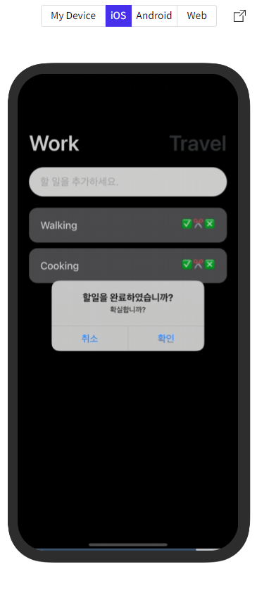

## 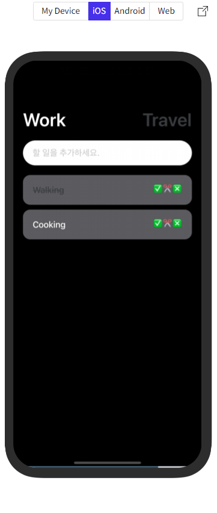

코드 첼린지 완료 전체 소스 코드: https://snack.expo.dev/kM2BvKDZl?platform=ios

v버튼 클릭시 완료

# Code Challenge 과제3

Todolist Text 수정 기능 만들기

추가) 현재 화면에서 TextInput 포커스가 벗어나면 이전값을 가지고있는 Text로처리

추가) TextInput 상태에서 다른 화면(Work,Travel)으로 이동시 이전값을 가지고있는 Text로처리

## 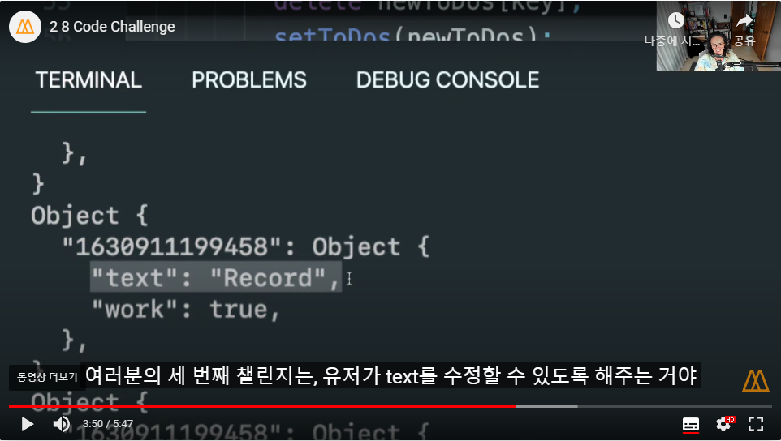

## 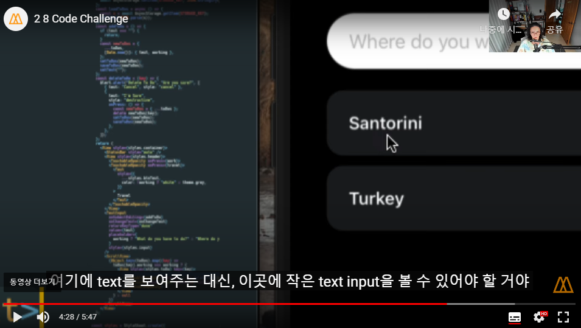

코드는 해당기능과 관련된 부분만 가져오겠습니다.

App.js에서 TextInput을 그냥 생성하고 진행했을떄 한글자 입력시 렌더링이 일어나기때문에

Update컴포넌트를 따로 만들어서 진행했습니다.

### App.js

```javascript
import React, { useState, useEffect } from 'react'
import {
  View,
  Text,
  StyleSheet,
  TouchableOpacity,
  TextInput,
  ScrollView,
  Alert,
} from 'react-native'
import AsyncStorage from '@react-native-async-storage/async-storage'
import Update from './update'

const WORK_KEY = '@work'

export default function App() {
  const [working, setWorking] = useState(true)
  const [toDos, setToDos] = useState({})

  const travel = async () => {
    inputCheck()
    setWorking(false)
    await AsyncStorage.setItem(WORK_KEY, 'false')
  }

  const work = async () => {
    inputCheck()
    setWorking(true)
    await AsyncStorage.setItem(WORK_KEY, 'true')
  }

  //텍스트 수정중인거 체크
  const inputCheck = () => {
    Object.keys(toDos).map(key => {
      if (toDos[key].update) {
        const newTodos = { ...toDos }
        newTodos[key].update = false
        setToDos(newTodos)
      }
    })
  }

  const updateTodo = (key, complet) => {
    if (complet === false) {
      Alert.alert('수정 작업을 진행하시겠습니까?', '확실합니까?', [
        { text: '취소' },
        {
          text: '확인',
          onPress: async () => {
            const newTodos = { ...toDos }
            newTodos[key].update = true
            setToDos(newTodos)
            await saveToDos(newTodos)
          },
        },
      ])
    } else {
      Alert.alert('이미 완료하여서 삭제만 가능합니다.')
    }
  }

  return (
    <TouchableOpacity onPress={work}>
      <Text style={{...styles.btnText, color: working ? "white" : theme.gray}}>Work</Text>
    </TouchableOpacity>
    <TouchableOpacity onPress={travel}>
      <Text style={{...styles.btnText, color: working ? theme.gray : "white"}}>Travel</Text>
    </TouchableOpacity>
    <ScrollView>
      {Object.keys(toDos).map(
        key =>
          toDos[key].work === working && (
            <View style={styles.toDo} key={key}>
              {toDos[key].update === false ? (
                <Text
                  style={{
                    ...styles.toDoText,
                    textDecorationLine: toDos[key].complet
                      ? 'line-through' //완료시 스타일
                      : 'none',
                    color: toDos[key].complet ? theme.gray : 'white',
                  }}
                >
                  {toDos[key].text}
                </Text>
              ) : (
                <Update //수정
                  complet={toDos[key].complet}
                  prvioustext={toDos[key].text}
                  work={working}
                  toDos={toDos}
                  setToDos={setToDos}
                  saveToDos={saveToDos}
                  style={styles.buttoninput}
                  keys={key}
                />
              )}
              <Text>
                <TouchableOpacity onPress={() => completTodo(key, toDos[key].complet)}>
                  <Text>✅</Text>
                </TouchableOpacity>
                <TouchableOpacity onPress={() => updateTodo(key, toDos[key].complet)}>
                  <Text>✂</Text>
                </TouchableOpacity>
                <TouchableOpacity onPress={() => deleteTodo(key)}>
                  <Text>❎</Text>
                </TouchableOpacity>
              </Text>
            </View>
          ),
      )}
    </ScrollView>
  )
}

const styles = StyleSheet.create({
  buttoninput: {
    backgroundColor: 'white',
    fontSize: 18,
  },
  toDo: {
    backgroundColor: theme.toDoBg,
    marginBottom: 10,
    paddingVertical: 20,
    paddingHorizontal: 20,
    borderRadius: 15,
    flexDirection: 'row',
    alignItems: 'center',
    justifyContent: 'space-between',
  },
  toDoText: {
    color: 'white',
    fontSize: 18,
    fontWeight: '500',
  },
})
```

### update.js

```javascript
import React, { useState } from 'react'
import { TextInput } from 'react-native'
function update(props) {
  const [updatetext, setupdateText] = useState('')

  const onChangeText2 = async payload => setupdateText(payload)

  const newTodos = { ...props.toDos }

  const updateToDO = async () => {
    if (updatetext === '') return
    newTodos[props.keys].text = updatetext
    common()
    await props.saveToDos(newTodos)
  }

  //포커스 벗어났을떄 처리
  const blur = () => {
    common()
  }

  const common = () => {
    newTodos[props.keys].update = false
    props.setToDos(newTodos)
    setupdateText('')
  }

  return (
    <TextInput
      onSubmitEditing={updateToDO}
      onChangeText={onChangeText2}
      returnKeyType="done"
      onBlur={blur}
      value={updatetext}
      placeholder={props.prvioustext}
      style={props.stylebtn}
    />
  )
}

export default update
```

## 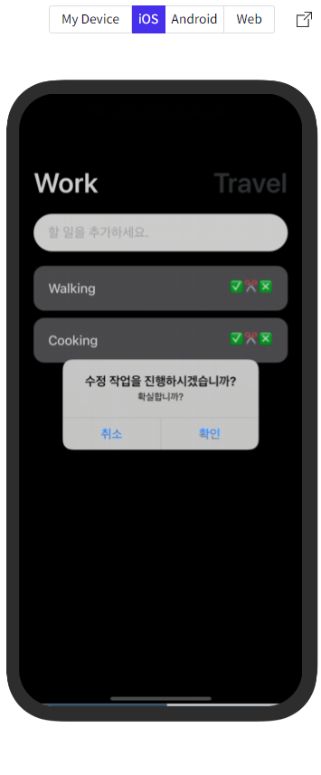

## 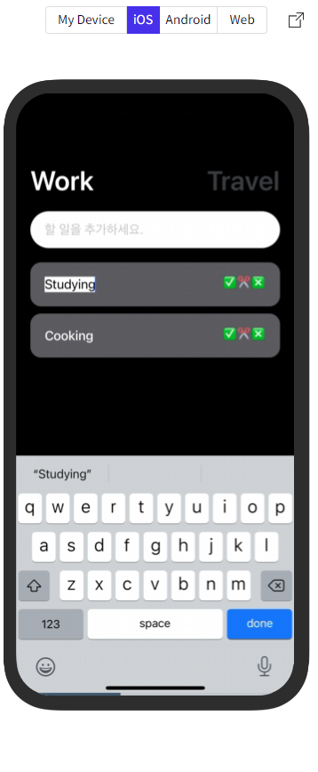

## 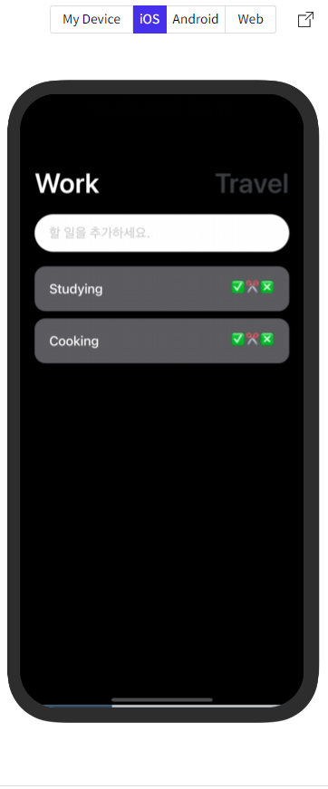

코드 첼린지 완료 전체 소스 코드: https://snack.expo.dev/kM2BvKDZl?platform=ios

가위버튼을 누르면 수정여부를 물어보고 확인시 입력하는 부분이 생김
