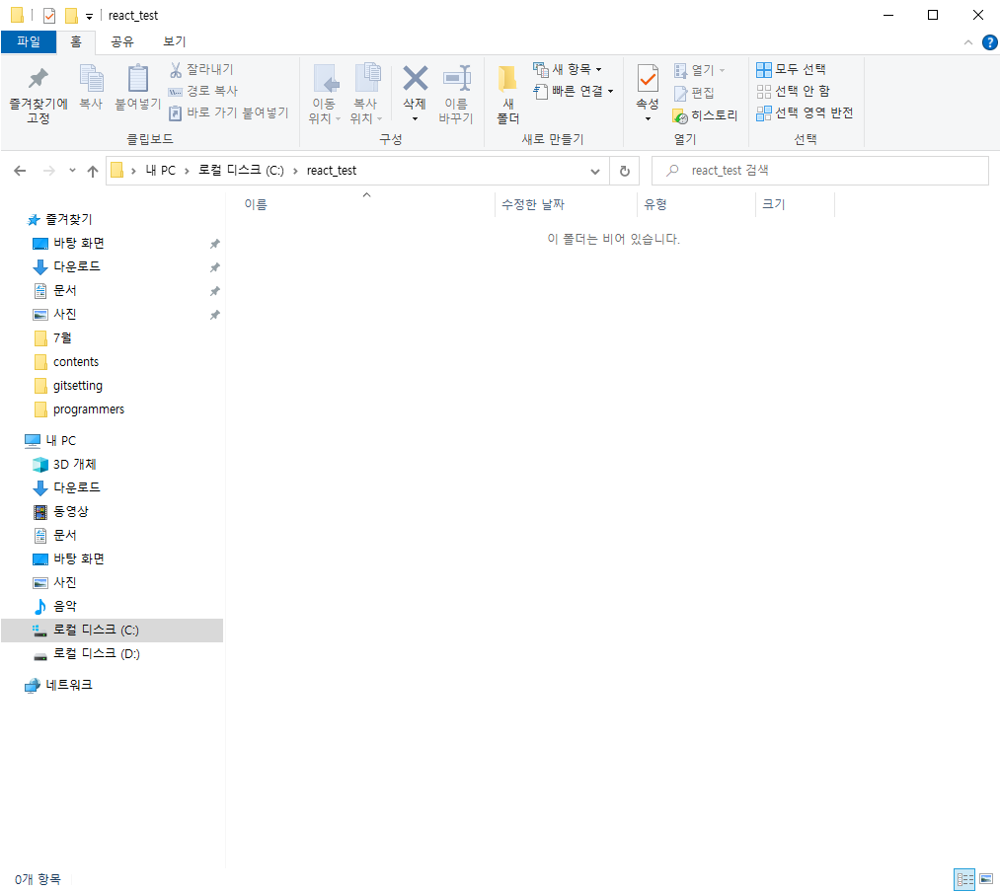
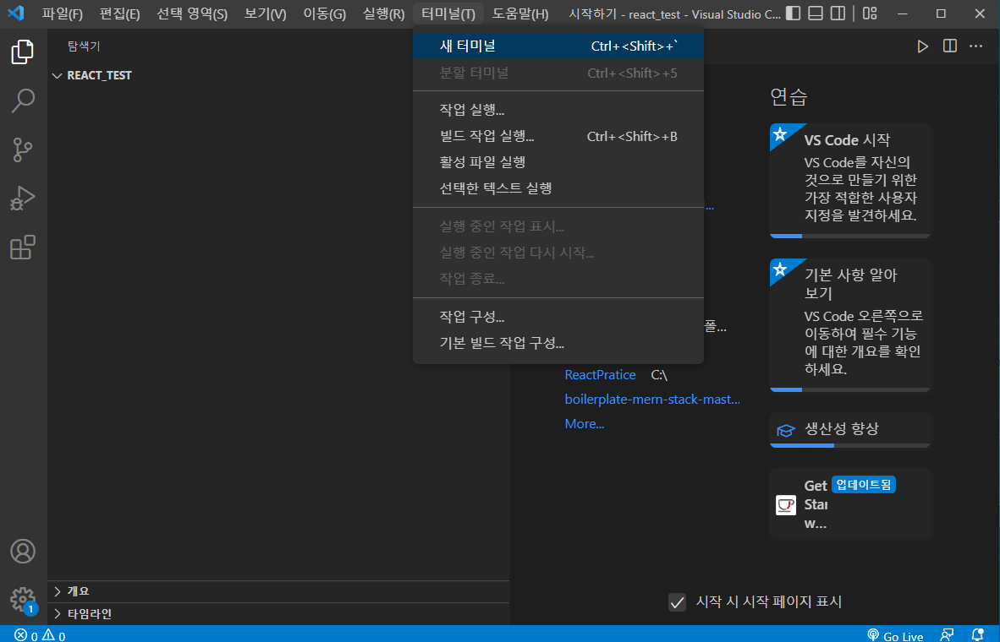
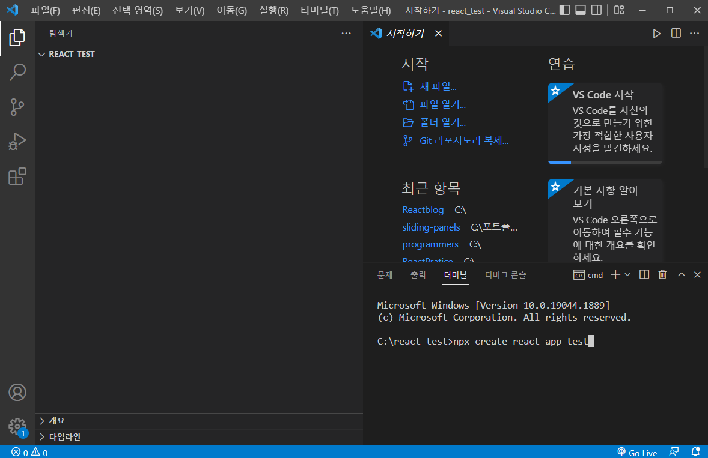
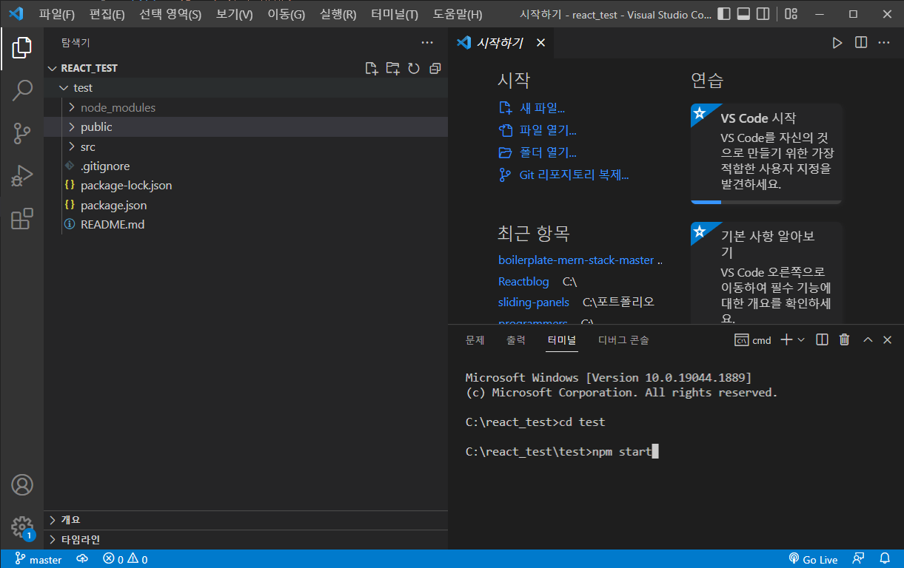
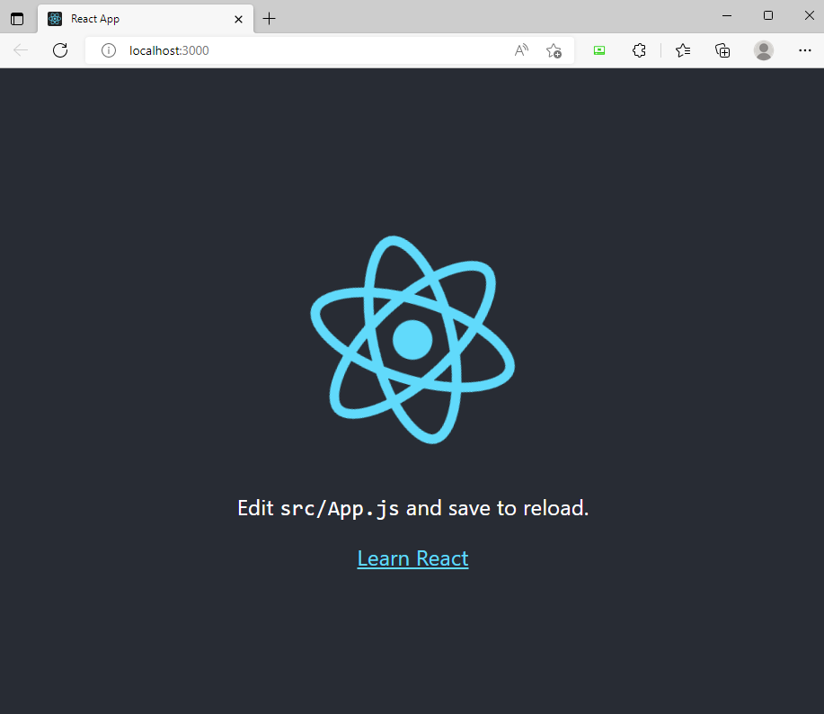

## 1. Node.js 설치

LTS라고 써있는 버전을 설치합니다.

설치 경로는 안바꾸는게 좋습니다.

https://nodejs.org/ko/

## 2. React 설치

## 

리액트 프로젝트에 사용할 폴더를 만듭니다.

## 

터미널 메뉴에서 새 터미널을 엽니다.

## 

npx create-react-app [프로젝트명] 을 입력하고 엔터를 눌러 패키지를 설치합니다.

## 

터미널에 cd [프로젝트명]으로 이동후 npm start

## 

잠시 기다리면 이렇게 localhost:3000이 열리게 됩니다.
