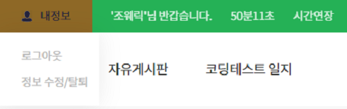

## 로그인 타이머

ToyProject에서 일반 로그인을 하면 쿠키에 로그인 정보

유효 기간을 기본 60분으로 설정해 놨습니다. 예를 들면

로그인 상태로 브라우저 종료 시에도 60분이 지나야 로그인 쿠키 정보를 삭제합니다.

쿠키정보는 새로 고침 시 다시 60분으로 초기화 시킵니다.

이번에 만들어볼 기능은 로그인 상태에서 헤더 부분에 60분 타이머를 보여주고

타이머 시간이 지나면 자동 로그아웃되면서 로그인 화면으로 바로 이동하는 기능과

로그인 시간 연장을 할 수 있는 기능을 구현하였습니다.

코드는 해당 기능 관련 부분만 수정해서 가져왔습니다.

```javascript
//Header admin.js
const Header = props => {
  const [timercheck, settimercheck] = useState(false) //카카오 로그인에서는 사용하지 않기 때문에

  const logout = async () => {
    await cookie.remove('userid', { path: '/' })
    await cookie.remove('username', { path: '/' })
    await cookie.remove('userpassword', { path: '/' })
    await persistor.purge() //저장소에 넣어둔 redux정보들 초기화
    window.location.href = '/login'
  }
  return (
    <header className="gnb_box">
      {timercheck && <LoginTimer logout={logout} mm={60} ss={0} />}
    </header>
  )
}
```

```javascript
//LoginTimer.js
import React, { useState, useEffect } from 'react'
import cookie from 'react-cookies'

const LoginTimer = ({ logout, mm, ss }) => {
  const [minutes, setMinutes] = useState(parseInt(mm))
  const [seconds, setSeconds] = useState(parseInt(ss))

  useEffect(() => {
    const countdown = setInterval(() => {
      if (parseInt(seconds) > 0) {
        setSeconds(parseInt(seconds) - 1)
      }
      if (parseInt(seconds) === 0) {
        if (parseInt(minutes) === 0) {
          clearInterval(countdown)
          logout()
        } else {
          setMinutes(parseInt(minutes) - 1)
          setSeconds(59)
        }
      }
    }, 1000)
    return () => clearInterval(countdown)
  }, [minutes, seconds])

  const timerInit = () => {
    let cookie_userid = cookie.load('userid')
    let cookie_usernm = cookie.load('username')
    let cookie_password = cookie.load('userpassword')

    const expires = new Date()
    expires.setMinutes(expires.getMinutes() + 60)

    cookie.save('userid', cookie_userid, { path: '/', expires })
    cookie.save('username', cookie_usernm, { path: '/', expires })
    cookie.save('userpassword', cookie_password, { path: '/', expires })

    setMinutes(60)
    setSeconds(0)
  }

  return (
    <>
      <div className="hd_right">
        <span>
          {minutes}분{seconds < 10 ? `0${seconds}` : seconds}초
        </span>
      </div>
      <div className="hd_right">
        <span onClick={timerInit} style={{ cursor: 'pointer' }}>
          시간연장
        </span>
      </div>
    </>
  )
}

export default LoginTimer
```

prop 값으로는 logout 함수, 분, 초 넘겨주고

setInterval을 사용하여 1초 간격으로 타이머를 구현하였습니다.

seconds, minutes가 0을 가리키면 Header admin.js logout() 호출하여

자동 로그아웃시키고 시간 연장을 누르면 쿠키 유효기간을 60분 추가

화면에 보여주는 분, 초를 초기화 시켰습니다.

## 
