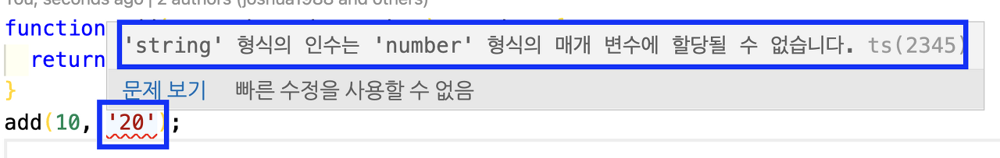

## Typescript란?

- js에 타입을 부여한 언어이다.
- 자바스크립트의 확장된 언어이다.
- ts는 브라우저에서 실행하기 위해 파일을 변환(컴파일)해 줘야 한다.

## Typescript를 써야하는 이유

js의 경우, 유효치 않은 값을 불러와도 undefined가 뜨면서 실행된다.

```javascript
function getData() {
  const user = {
    address: 'Kulas Light',
    company: { name: 'Romaguera-Crona' },
    id: 1,
    name: 'Leanne Graham',
  }
  const address = user.address.street //없는 속성을 불러온다
  return address
}

console.log(getData())
```

하지만 Typescript를 사용하게 되면, 이러한 문제를 미연에 방지할 수 있다.

유효한 속성인지 확인가능하다.

우리가 Typescript를 쓰면 해당 속성이 유효치 않은지 확인할 수 있다.

```javascript
function add(a, b) {
  return a + b
}
const result = add(10, '20')
console.log(result) //1020
```

js에서는 기본적으로 받는 인자가 any(어떤 타입이든 상관없음)이기 때문에

위와 같은 결과가 나오지만

Typescript는 자동 타입 체크가 가능하다.

## 타입스크립트의 경우

타입스크립트에서는 각각 인자, 리턴 값의 타입을 지정할 수 있다.

```typescript
//sample.ts

function add(a: number, b: number): number {
  return a + b
}
```

```typescript
add(10, '20') //두번째 인자는 number여야 하지만 string이 들어감
```

## 

이처럼 타입스크립트의 정의와 장점을 간단하게 알아보았다.
