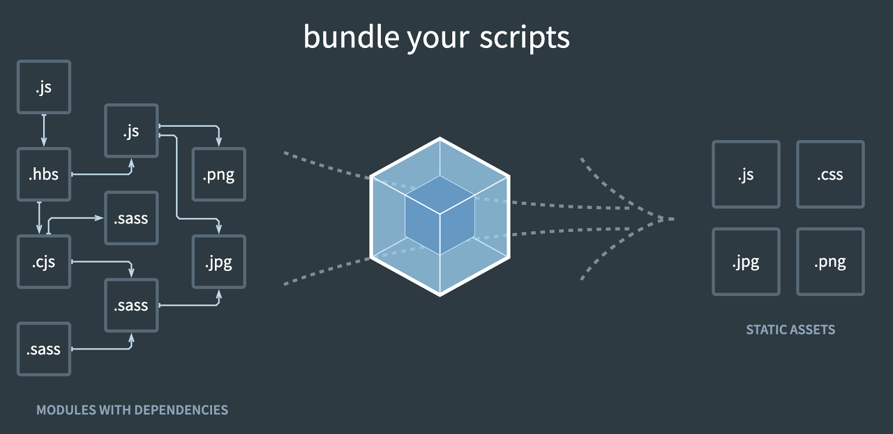
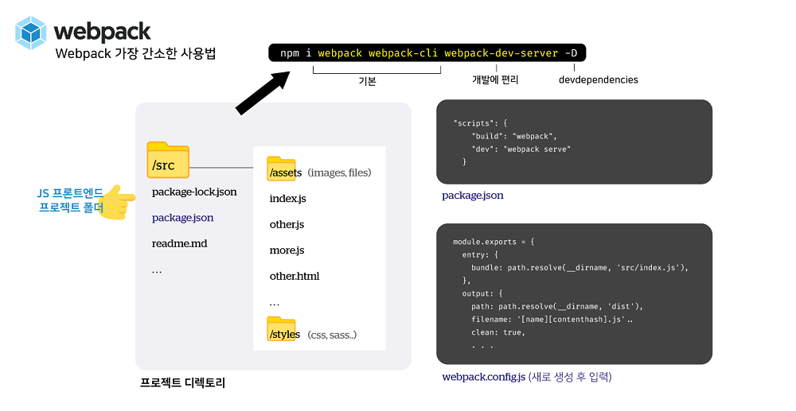
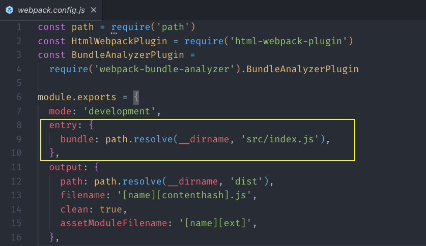
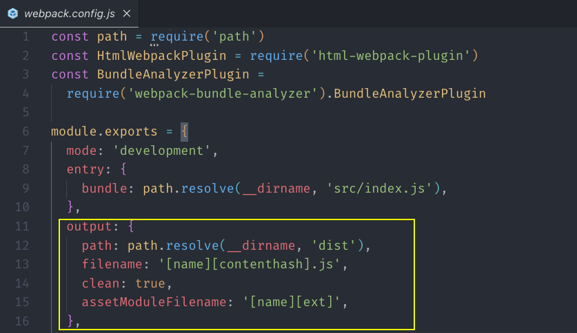
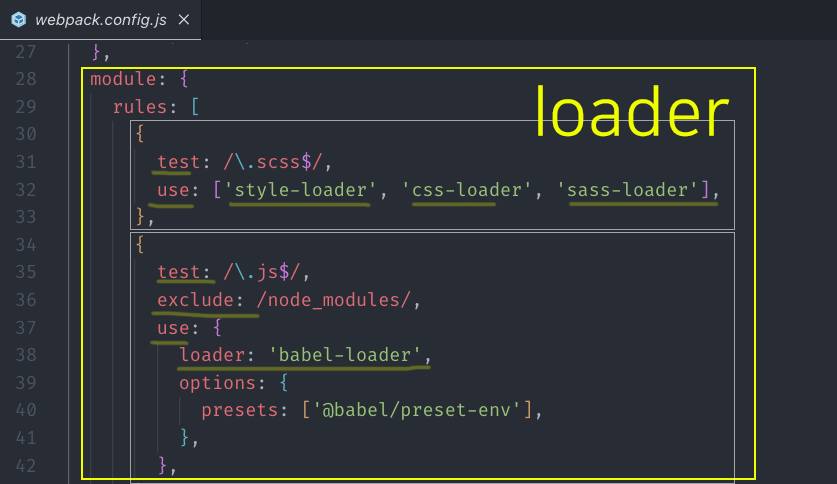
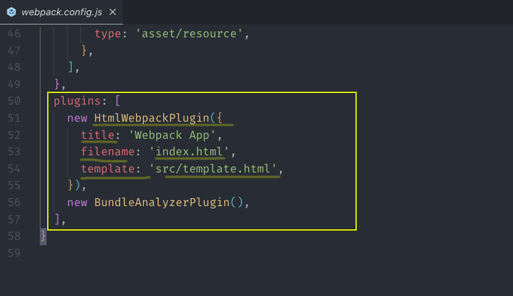

## JavaScript - Webpack

그림을 먼저 살펴보겠습니다.

## 

번들링 과정을 통하여 많은것들이 정리된 느낌입니다.

웹팩은 대표적인 모듈 번들러 라이브러리입니다.

모듈 번들러는 여러개의 나누어진 있는 파일들을 하나의 파일로 만들어주는 라이브러리입니다.

## 사용 이유

하나의 웹페이지가 로드될 때 여러개의 자바스크립트 파일들을 가져와서 우리앞에 나타납니다.(렌더링)

그래서 전역적으로 한꺼번에 많은 파일을 불러오면

충돌이 날 가능성이 높으며 속도 저하가 올 수 있습니다.

이를 해결하기 위해서 모듈 번들러 라는 아이가 등장하였습니다.

이 아이는 파일들의 관계(의존성)를 자동으로 파악하고

혹시라도 뭐가 안맞아서 뻑나지 않도록 그룹핑까지 해줍니다.

## 장점

- 속도가 빠릅니다

웹팩은 하나의 파일로 로드하기 때문에 로딩속도가 빠릅니다.

- 관리가 쉽습니다

웹팩은 Module 을 사용하여 매우 복잡하고 긴 코드를 작성할 때

사용 용도에 따라 파일 단위로 구분한 뒤, 다른 파일에서 해당 클래스나 함수가 필요할 때

가져와서 사용할 수 있도록 해줍니다. 외부 라이브러리의 의존성도 쉽게 관리할 수 있습니다.

## install

이것이 Webpack 인스톨의 가장 간소한 핵심입니다.

## 

## Webpack config 파일 구조 분석을 통한 4가지 주요 속성 이해

### Entry

## 

웹팩을 실행할 대상 파일, 그 진입점과 경로 정의합니다.

보통 웹 애플리케이션의 전반적인 구조와 내용이 들어있어 있는 메인 JS 파일을 지정합니다.

### Output

## 

웹팩을 실행 후 결과물의 파일 경로 — filename과 path 설정합니다.

### Loader

## 

loader는 특정 파일을 해석하고 변환하는 작업 담당입니다.

즉 HTML, CSS, 이미지나, font 같은 asset 파일들을 웹팩이 인식하고

할 수 있도록 해주는 것을 loader가 맡아서 해줍니다.

각 객체에는 적어도 2개의 속성을 입력합니다.

test: 로더를 적용할 “파일 유형” (CSS, JS..등등)

use: 로더 이름

참고로, 다수의 로더를 적용해야 할 때는 적용 법칙이 오른쪽에서 -> 왼쪽 순인 관계입니다.

(위의 예를 보자면, ‘sass-loader’, ‘css-loader’, ‘styles-loader’ 순으로 적용)

### Plugins

## 

웹팩 실행시 원하는 추가적인 기능을 추가 할 수 있는 옵션입니다.
