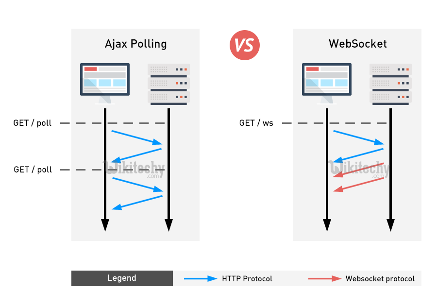

# Http

저희가 보통 기본적으로 알고있는 통신방법입니다.

Client의 요청(Request)이 있을 때만 서버가 응답(Response)하여

해당 정보를 전송하고 곧바로 연결을 종료하는 방식 (단방향적 통신)

즉, Server가 Client로 요청을 보낼수는 없습니다.

보통 필요한 경우에만 Server로 접근하는 콘텐츠 위주의 데이터를 사용할 때 용이합니다.

# WebSoket

Http 통신과 달리 Server와 Client가 특정 Port를 통해

연결을 성립하고 있어 실시간으로 양방향 통신을 하는 방식입니다.

Client만 필요한 경우에 요청을 보내는 Http 통신과 달리

Socket 통신은 Server 역시 Client로 요청을 보낼 수 있습니다.

계속 연결을 유지하는 연결지향형 통신이기 때문에

실시간 통신이 필요한 경우에 자주 사용됩니다.

예를 들면, 실시간 Streaming 중계나 실시간 채팅과 같이

즉각적으로 정보를 주고받는 경우에 사용합니다.

실시간으로 구현해야하는 서비스를 http 통신으로 구현한다면

계속해서 요청을 보내야해서 부하가 걸릴것입니다.

대표적인 프레임워크로는 Socket.io가 있습니다.

## 
