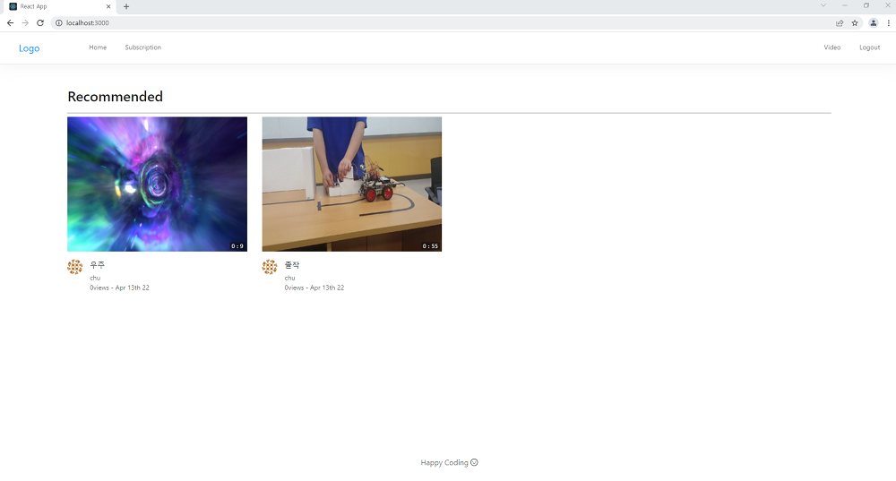
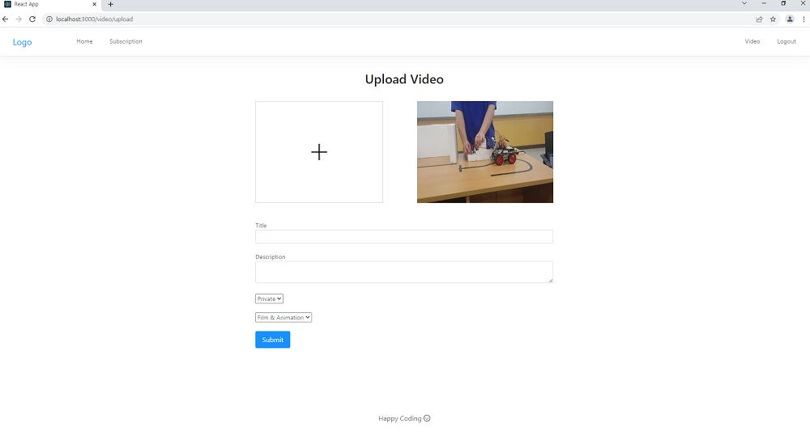
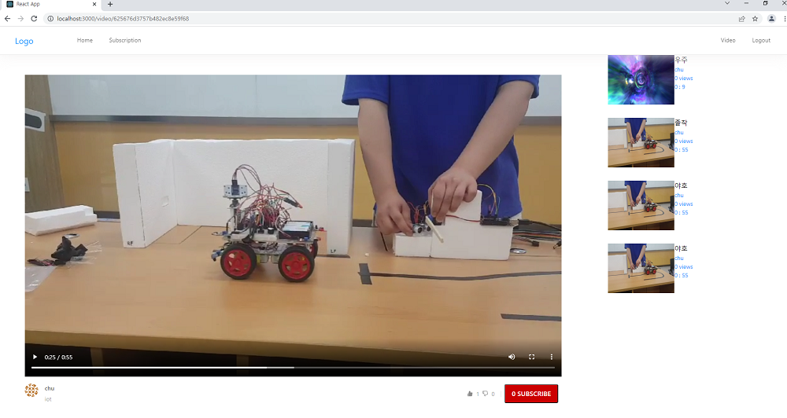
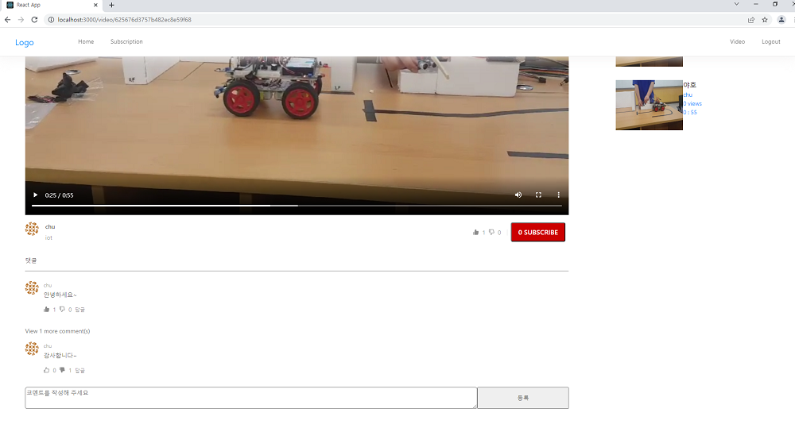

### Youtube CloneCoding

유튜브를 뒤져 보던 중 React를 사용하여 클론코딩한다는 제목이

저의 흥미를 끌어서 클릭하게되고 완강했습니다.

진행도중에 오류들이 나와서 어려움이 있었지만 (버전문제라던가 기타등등..)

오류들은 디버깅이라던가 구글링(god)으로 해결해나갔습니다.

이 강의를 들으므로 유튜브에 간단한 기능들을 어떻게 구현하는지에 포인트와

또 강의에는 안나오는 부분은 구글링(god)으로 궁금증을 해결하였습니다.

끝으로 React 함수형 컴포넌트, Redux기능등이 익숙해지는 좋은 경험이 됐습니다.

사용언어와 DB는 React,NodeJS,MongoDB를 사용했습니다.

다른분들도 이 강의를 완강해보시길 추천합니다. 👍👍

# 홈화면

## 

# 비디오 업로드

## 

# Main화면

## 

## 

---

강의 링크: https://www.youtube.com/watch?v=fM0Vj7dBcm8&list=PL9a7QRYt5fqnlSRu--re7N_1Ean5jFsh3&ab_channel=JohnAhn
